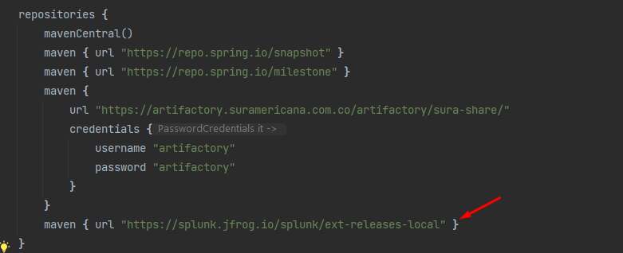
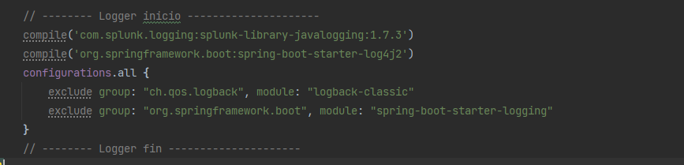
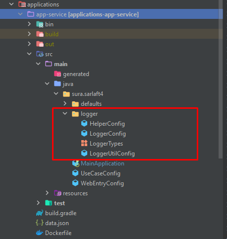
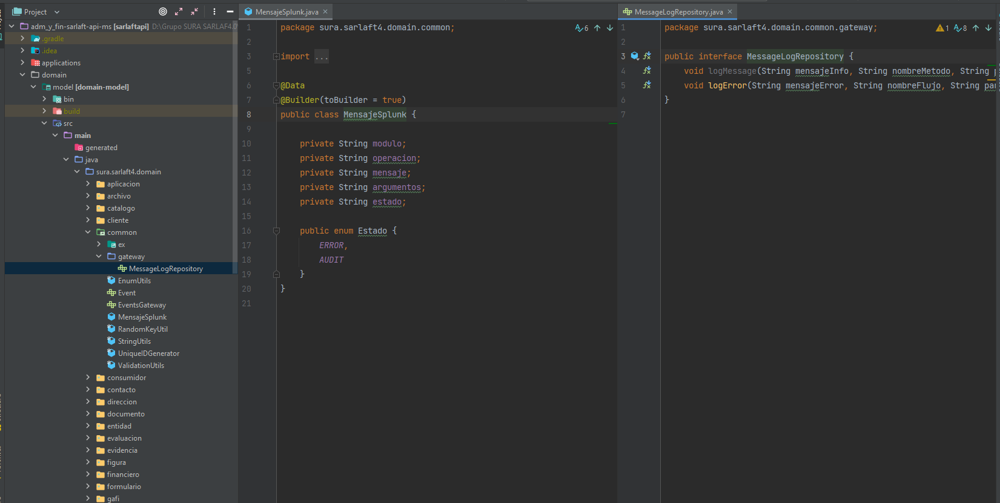
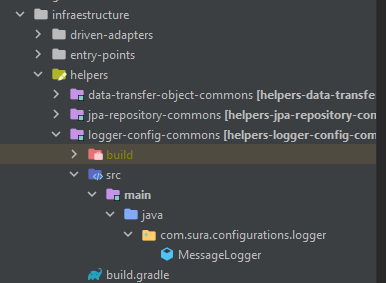
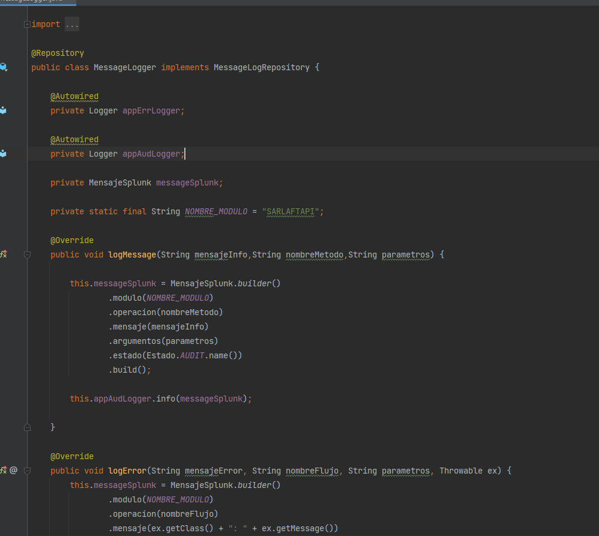

# Log Errores Splunk SarlaftApi

> **Fuente Confluence:** [Log Errores Splunk SarlaftApi](https://segurosti.atlassian.net/wiki/spaces/EPA/pages/2391769098)
> **Última modificación:** 2021-09-14 — Mateo Valencia Muriel (Unlicensed) · versión 1
> **Sección:** [Microservicio SarlaftAPI](./index.md)
Al microservicio de SarlaftApi se le implemento la funcionalidad de realizar el envio de logs a splunk.

Main.gradle:

Repositorio utilizado : `https://splunk.jfrog.io/splunk/ext-releases-local`

librería utilizada: `com.splunk.logging:splunk-library-javalogging:1.7.3`

`'org.apache.logging.log4j', name: 'log4j-core', version: '2.14.1'`

En el archivo de configuracion .yml Podemos visualizar los siguientes datos de configuracion:

En el modulo de application debemos de tener en cuenta las siguientes clases, La configuración y parametrización del log se encuentra en la clase `LoggerUtilConfig` ubicada en el paquete

`package sura.sarlaft4.logger;`

En el modulo de Domain se crea 1 clase `MensajeSplunk` y Una interfaz `MessageLogRepository`:

Adicional a esto se crea un modulo en infrastructura en el paquete de helpers:

La forma de implementar la escritura en splunk es:

