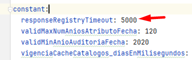

# Parametrización para tiempo de timeout consumo registraduria - sarlaftapi

> **Fuente Confluence:** [Parametrización para tiempo de timeout consumo registraduria - sarlaftapi](https://segurosti.atlassian.net/wiki/spaces/EPA/pages/3768090815)
> **Última modificación:** 2024-06-07 — Julián Andrés Curubo García · versión 4
> **Sección:** [Microservicio SarlaftAPI](./index.md)
Se parametriza el tiempo para el timeout de la respuesta de ws de registraduría.

En el proyecto `892-sarlaft-api-conf` → `application.yaml` por medio de la propiedad `timeout` se parametriza el tiempo en milisegundos que se considere se deba esperar la respuesta del ws de la registraduría antes de manejarse como un error por timeout:

Este nuevo parámetro se envía a la firma **`solicitarValidacionRegistraduriaSincrona`** de la interfaz **`ValidacionRegistraduraSincronaGateway`**:

