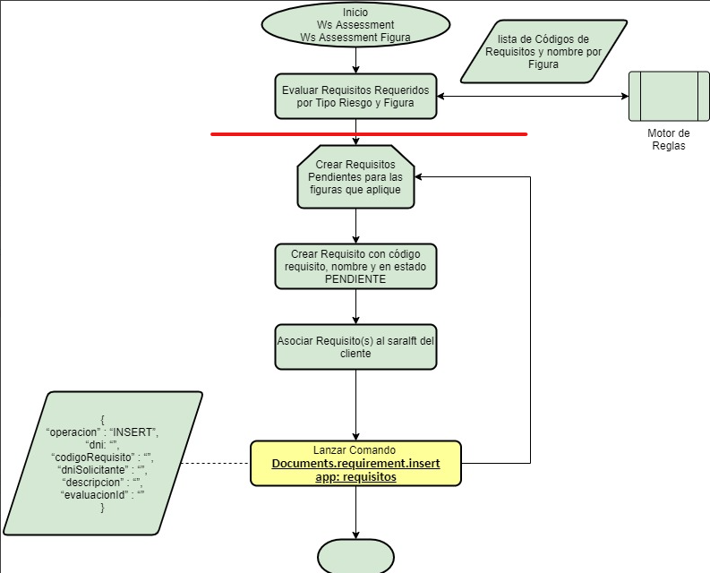
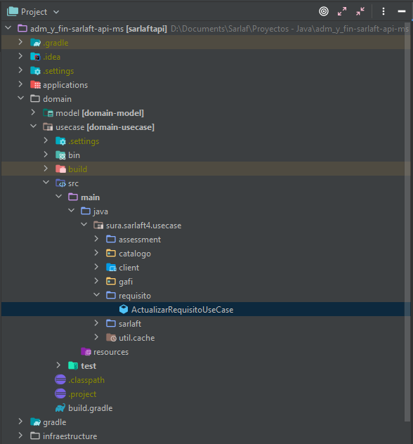

# Comunicación Requisitos

> **Fuente Confluence:** [Comunicación Requisitos](https://segurosti.atlassian.net/wiki/spaces/EPA/pages/2338947077)
> **Última modificación:** 2021-08-20 — Johnathan Monsalve Bello (Unlicensed) · versión 6
> **Sección:** [Proceso Evaluación](./index.md)
## Descripción — CrearRequisito

Se crea clase Adapter en el módulo **async-message-sender** para lanzar el comando **Documents.requirements.insert**, utilizado en los web services **wsAssesment** y **wsAdicionarFigura**.

Este comando es lanzado por la cantidad total de requerimientos en una evaluación: se toman todos los **sarlaft** de la evaluación, internamente se toman los **requisitos** y por cada uno se envía el comando anteriormente descrito.

Para más información verificar el link de HU y la descripción de Flujo (en el flujo esto se representa a partir de la **línea roja**).

**Referencia de HU:** [TSTAR-1453](https://jira.suramericana.com.co/browse/TSTAR-1453)

**Flujo de HU:**

---

## Ubicación en el Proyecto — CrearRequisito

### Adapter

- **Paquete:** sura.sarlaft4.reactive.adapter.requisito
- **Path:** infraestructure/driven-adapters/async-messages-senders/src/main/java/sura/sarlaft4/reactive/adapter/requisito/RequisitoAsyncAdapter.java

### Usecase

- **Package:** sura.sarlaft4.usecase.assessment.requisito
- **Path:** domain/usecase/src/main/java/sura/sarlaft4/usecase/assessment/requisito/CrearRequisitoUseCase.java

### Uso actual del Usecase

#### CrearEvaluacionUseCase

- **Paquete:** sura.sarlaft4.usecase.assessment
- **Path:** domain/usecase/src/main/java/sura/sarlaft4/usecase/assessment/CrearEvaluacionUseCase.java
- **Método llamado:** Mono<Evaluacion> ejecutarCrearRequisitos(Evaluacion evaluacion)

#### AgregarFiguraUseCase

- **Paquete:** sura.sarlaft4.usecase.assessment
- **Path:** domain/usecase/src/main/java/sura/sarlaft4/usecase/assessment/AgregarFiguraUseCase.java
- **Método llamado:** Mono<Tuple2<Evaluacion, Sarlaft>> ejecutarCrearRequisitos(Tuple2<Evaluacion, Sarlaft> tuple)

---

## Descripción — ActualizarRequisito

Se crea un entrypoint para recibir un requisito por comando. Al recibirlo se verifica el resultado de inserción con el campo `resultado`. Según esto se:

- Inserta reporte en la tabla `tsaf_notificacion`, o
- Procede con la actualización de estado del Requisito en la tabla `tsaf_requisito` y envío del comando `documents.requirements.update` (si el requisito tiene el campo `idGestionDocumental` diligenciado y es parte del primer flujo).

**Referencia de HU:** [TSTAR-1504](https://jira.suramericana.com.co/browse/TSTAR-1504)

**Flujo de HU-1504:**

**Referencia de HU:** [TSTAR-1505](https://jira.suramericana.com.co/browse/TSTAR-1505)

**Flujo de HU-1505:**

---

## Ubicación en Proyecto — ActualizarRequisito

### Handler

- **Paquete:** sura.sarlaft4.reactive.requisito
- **Path:** infraestructure/entry-points/async-command-handlers/src/main/java/sura/sarlaft4/reactive/requisito/AsyncCommandListenerConfigActualizarRequisito.java

### Usecase

- **Package:** sura.sarlaft4.usecase.requisito
- **Path:** domain/usecase/src/main/java/sura/sarlaft4/usecase/requisito/ActualizarRequisitoUseCase.java

---

## Clases Relacionadas

| Clase | Paquete | Path |
|-------|---------|------|
| NotificacionRepository (interface) | sura.sarlaft4.domain.requisito.gateway | domain/model/.../gateway/RequisitoRepository.java |
| RequisitoRepositoryAdapter | sura.sarlaft4.jpa.requerido | infraestructure/driven-adapters/jpa-repository/.../RequisitoRepositoryAdapter.java |
| RequisitoRepository (interface) | sura.sarlaft4.domain.requisito.gateway | domain/model/.../gateway/RequisitoRepository.java |
| RequisitoGateway (interface) | sura.sarlaft4.domain.requisito.gateway | domain/model/.../gateway/RequisitoGateway.java |
| RequisitoAsyncAdapter | sura.sarlaft4.reactive.adapter.requisito | infraestructure/driven-adapters/async-messages-senders/.../RequisitoAsyncAdapter.java |
