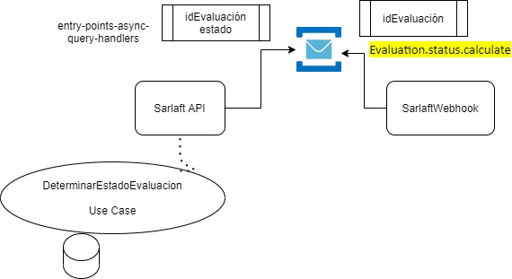

# Determinar Estado Evaluación

> **Fuente Confluence:** [Determinar Estado Evaluación](https://segurosti.atlassian.net/wiki/spaces/EPA/pages/2332327941)
> **Última modificación:** 2021-08-17 — Jose Daniel Salazar Mora (Unlicensed) · versión 3
> **Sección:** [Proceso Evaluación](./index.md)
## Descripción

- **Objetivo:** Esta funcionalidad permite definir el estado de una evaluación el cual puede ser: `FINALIZADO`, `FALLA TÉCNICA`, `RECHAZADO`, `PENDIENTE ACCION MANUAL` y `PENDIENTE`.

- **Descripción:** Estos estados son definidos a partir de los estados internos de los Sarlaft que posee la evaluación. Cada Sarlaft tiene como posible alguno de los siguientes estados: `RECHAZADO`, `PENDIENTE ACCIÓN MANUAL`, `FINALIZADO SIN CARGA`, `FINALIZADO` y `PENDIENTE`.

  Para esta funcionalidad se creó un caso de uso llamado **determinar estado de evaluación**, el cual se llama al final del ciclo de la evaluación y durante la validación de las evidencias (antes de validar requisitos).

  De igual forma, el caso de uso puede ser consumido por un entry point **async query handler** que espera el mensaje `"Evaluation.status.calculate"`. Este entry point recibe del microservicio Webhook un objeto JSON con el `id` de la evaluación, realiza la consulta de la evaluación por id y la pasa por el flujo completo del caso de uso. Una vez determinado el estado, se convierte a un objeto respuesta para el `SarlaftWebhook` con el id de la evaluación y su estado.

- **Endpoint:** `/sarlaftserv/assessment`

- **Perfil de Seus4:** `PF_CONSUMSERVSARLAFTAPI`

---

## Adjuntos de Ejemplo

| Archivo | Descripción |
| --------- | ------------- |
| [`EjemploDeterminarEstadoEvaluacionApi.json`](./attachments/EjemploDeterminarEstadoEvaluacionApi.json) | Ejemplo JSON Request SarlaftApi |
| [`EjemploDeterminarEstadoEvaluacionWebhook.json`](./attachments/EjemploDeterminarEstadoEvaluacionWebhook.json) | Ejemplo JSON Request SarlaftWebhook (mensaje RabbitMQ) |
| [`EjemploDeterminarEstadoEvaluacionWebhookResponse.json`](./attachments/EjemploDeterminarEstadoEvaluacionWebhookResponse.json) | Ejemplo JSON Response SarlaftWebhook |
| [`request_FindCatalogue.json`](./attachments/request_FindCatalogue.json) | Ejemplo JSON Request FindCatalogue |

---

## Dependencias

- Base de Datos Sarlaft
- Aplicaciones Externas
- RabbitMQ
- SarlaftWebhook

---

## Diagrama

> Diagrama de servicio que representa el consumo y respuesta del query handler.
