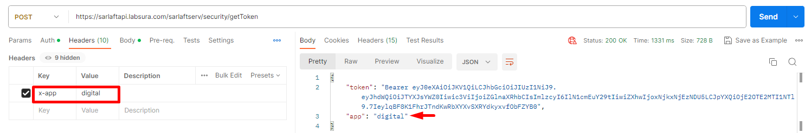
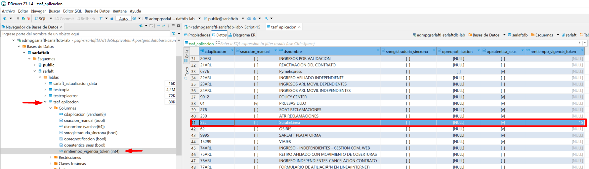
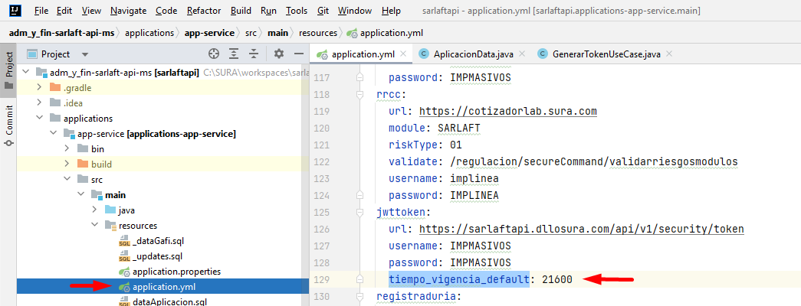
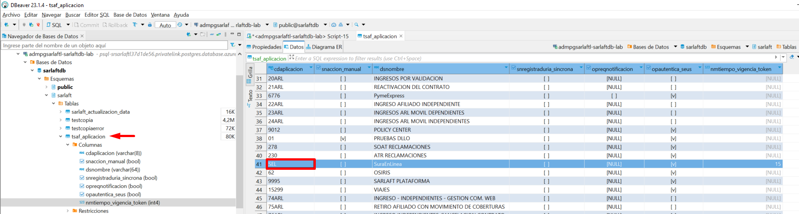
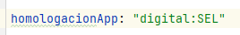
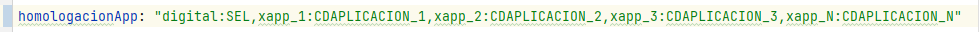

# ¿Cómo parametrizar tiempo de vida del token JWT?

> **Fuente Confluence:** [¿Cómo parametrizar tiempo de vida del token JWT?](https://segurosti.atlassian.net/wiki/spaces/EPA/pages/3289120955)
> **Última modificación:** 2023-08-09 — Julián Andrés Curubo García · versión 9
> **Sección:** [Parametrización token JWT](./index.md)
Para parametrizar el tiempo de vida del token JWT para un aplicativo que requiera consumir los servicios de sarlaftapi debe realizar los siguientes pasos:

## Pasos para parametrizar el tiempo de vida del token JWT

Para los siguientes pasos se tomó como ejemplo la parametrización realizada para el aplicativo SEL.

1. Identificar el código del aplicativo con el que se solicita el token a sarlaftapi.
   Entiéndase como código del aplicativo, aquel que se envía como valor al header **x-app** cuando se consume el servicio https://sarlaftapi.labsura.com/sarlaftserv/security/getToken.

   

2. Garantizar que el aplicativo se encuentre parametrizado en la tabla `TSAF_APLICACION` de la base de datos de sarlaft o en su defecto insertar el registro en la tabla `TSAF_APLICACION` con la información del aplicativo que desea parametrizar:

   ```sql
   INSERT INTO sarlaft.tsaf_aplicacion
   (cdaplicacion, snaccion_manual, dsnombre, snregistraduria_sincrona, opreqnotificacion, opautentica_seus, nmtiempo_vigencia_token)
   VALUES('SEL', false, 'SuraEnLinea', false, NULL, true, 15);
   ```

   En caso de que ya exista el aplicativo parametrizado en la tabla `TSAF_APLICACION` y se requiera asignar el valor para el campo `NMTIEMPO_VIGENCIA_TOKEN` puede ejecutar la siguiente sentencia SQL:

   ```sql
   UPDATE sarlaft.tsaf_aplicacion SET nmtiempo_vigencia_token=15 WHERE cdaplicacion='SEL';
   ```

   

   > **Info:** El valor para el campo `NMTIEMPO_VIGENCIA_TOKEN` debe ser en minutos.

   > **Nota:** Si el aplicativo que se parametriza en la tabla `TSAF_APLICACION` tiene como valor null para el campo `NMTIEMPO_VIGENCIA_TOKEN`, entonces se tomará como tiempo de vida del token JWT el valor por defecto parametrizado en la propiedad `tiempo_vigencia_default` (minutos) del `application.yml`

   

3. Identificar el código de la aplicación que se registró en la tabla `TSAF_APLICACION` en el campo `CDAPLICACION` (SEL).

   

4. En el microservicio de configuración de sarlaft api [adm_y_fin-sarlaft-api-conf](https://dev.azure.com/SuraColombia/Gerencia_Tecnologia/_git/adm_y_fin-sarlaft-api-conf), en el archivo `application.yml` identificar la propiedad `homologacionApp` y en ella establecer el valor de la siguiente manera:

   

   > **Info:** Este código se construye tomando el valor del **x-app** (digital) usado en el paso 1 y el código del aplicativo (SEL) del paso 3

   > **Info:** En caso de parametrizar varias aplicaciones el formato sería el siguiente:

   
