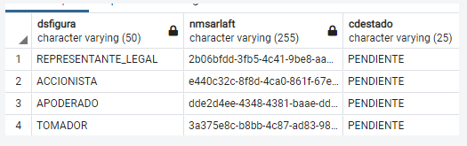

# Servicio Obtener Formulario

> **Fuente Confluence:** [Servicio Obtener Formulario](https://segurosti.atlassian.net/wiki/spaces/EPA/pages/2094006830)
> **Última modificación:** 2026-02-11 — Diana Muñoz · versión 12
> **Sección:** [Servicios Web](./index.md)
- **Objetivo:** Permite obtener el tipo de formulario y demás información relacionada a la evaluación.
- **Endpoint:** /sarlaftserv/assessment/getForm
- **Perfil de Seus4:** PF_CONSUMSERVSARLAFTAPI
- **Ejemplo Json Request:**

Caso 1

```json
    {
            "token": null,
            "evaluacionId": "c476527c-9b11-40ad-8532-8986f3bb730b",
            "idSarlaft": null
    }
```text

Caso 2

Cuando se quiera consultar por idSarlaft es necesario ingresar el Token o la EvaluacionId

```json
    {
            "token": null,
            "evaluacionId": "49dc9154-d1c2-460d-9052-8b76fd1fb7ba",
            "idSarlaft": "b807eb04-9f1b-4468-9f4c-d8fc07ca0dd5"
    }
```text

- **Ejemplo Json Response:**

Caso 1

[`response1.json`](./ServicioObtenerFormulario/response1.json)

Caso 2

[`response2.json`](./ServicioObtenerFormulario/response2.json)

Cuando el servicio detecta que el código de la aplicación consultada es SEL, permite realizar la consulta.

- **NOTA:**
  - Cuándo se trata de obtener información de una evaluación la cual es de de tipo de negocio **COLECTIVO** y es **CARGA MASIVA** se obtendrá como respuesta el sarlaft del **TOMADOR**. Adicional al sarlaft del tomador se obtendrá como respuesta el sarlaft del **APODERADO** en caso tal que la evaluación tenga apoderado, además, en caso que el **TOMADOR** tenga asociaciones, también se obtendrán en el response los sarlafts de cada uno de estos **ASOCIADOS** (sean socios, representantes legales o consorcios)
  - Ejemplo:
    Se tiene una evaluación de una póliza colectiva y de carga masiva con los siguientes sarlafts:

    

    Donde el tomador tiene como asociados un **ACCIONISTA** y un **REPRESENTANTE LEGAL**, además, la evaluación tiene un **APODERADO**, por lo tanto, al consultar la evaluación con id **cc02b2fd-8ff3-44a9-a0d5-186b9819c696** se obtendrá como respuesta lo siguiente:

  - Request:

    ```json
    {     
          "token": null,     
          "evaluacionId": "372d1c2d-5746-49d3-9bf3-01a7fd7f2e94",     
          "idSarlaft": null
    }
    ```text

  - Response:

    ```json
    {
        "formularioOpcional": false,
        "evaluacionId": "372d1c2d-5746-49d3-9bf3-01a7fd7f2e94",
        "codigoOperacion": "01",
        "codigoAplicacion": "6919",
        "controlesTomador": [],
        "relaciones": [
            {
                "relacionPeps": false,
                "tipo": "SOCIO",
                "parentescoPeps": null,
                "documento": {
                    "scanAvailable": true
                },
                "persona": {
                    "scanAvailable": true
                },
                "fechaCreacion": null,
                "ultimaActualizacion": null,
                "porcentajeParticipacion": null,
                "codigoRelacion": null
            }
        ],
        "respuestaRelacionesPeps": "Si",
        "sarlafts": [
            {
                "idSarlaft": "627a1e8f-f2e0-49bb-8da3-3e567e1d9c74",
                "estado": "PENDIENTE",
                "roles": ["ACCIONISTA"],
                "tipoIdentificacion": "P",
                "numeroIdentificacion": "1040181391",
                "tipoFormulario": null,
                "terminoFormulario": false,
                "validacionIdentidad": "PENDIENTE"
            }
        ],
        "codigoRamo": "040",
        "esCargaMasiva": false,
        "tipoDeNegocio": "INDIVIDUAL"
    }
    ```text

- Y si se consulta el servicio sólo para un sarlaft y este sarlaft tiene asociaciones, entonces, los sarlafts de cada asociación saldrán en el response del servicio.
  - Ejemplo:
    - Request:

      ```json
      {
         "token":null,
         "evaluacionId":"4800aab7-2d9e-4c63-8eee-9d566fb0e16b",
         "idSarlaft":"27606e34-1067-420f-8604-f040f6ce1405"
      }
      ```text

    - Response:

      ```json
      {
         "formularioOpcional":true,
         "evaluacionId":"4800aab7-2d9e-4c63-8eee-9d566fb0e16b",
         "codigoOperacion":"01",
         "controlesTomador":[],
         "relaciones":[],
         "respuestaRelacionesPeps":"No",
         "sarlafts":[
            {
               "estado":"PENDIENTE",
               "roles":["TOMADOR"],
               "tipoFormulario":"SIMPLIFICADO_PJ",
               "terminoFormulario":false,
               "validacionIdentidad":"NOAPLICA"
            }
         ],
         "codigoRamo":"041",
         "esCargaMasiva":false,
         "tipoDeNegocio":"COLECTIVO"
      }
      ```

- **Dependencias:**
  - Base de Datos Saralft
  - Aplicaciones Externas.
