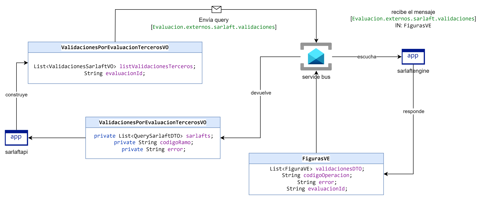
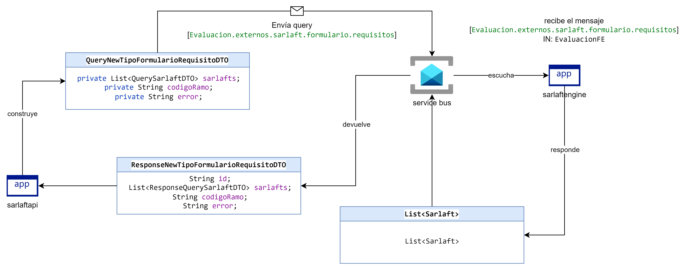
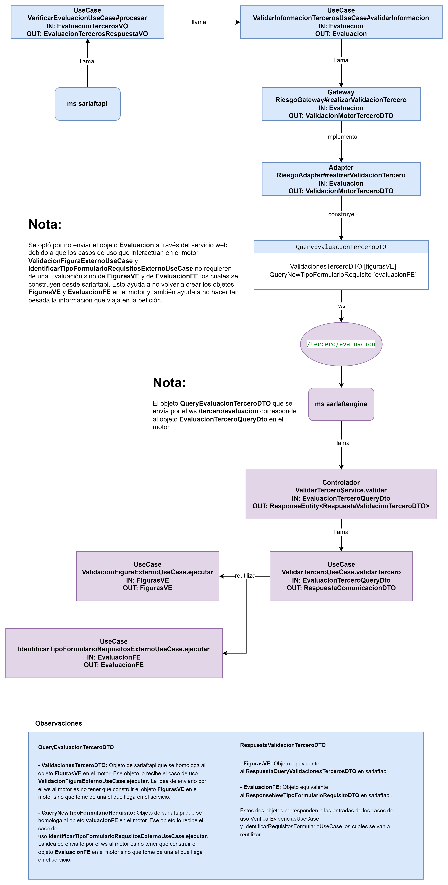

# Comunicación backend to backend con motor - sarlaftapi

> **Fuente Confluence:** [Comunicación backend to backend con motor - sarlaftapi](https://segurosti.atlassian.net/wiki/spaces/EPA/pages/3680927773)
> **Última modificación:** 2024-04-18 — Julián Andrés Curubo García · versión 3
> **Sección:** [Servicio Terceros](./index.md)
Este artículo describe el cambio de comunicación entre el microservicio de sarlaftapi y sarlaftengine (motor) el cual se venía realizando a través de la comunicación request reply que se tenía por medio del service bus, donde se integran las funcionalidades de los querys **Evaluacion.externos.sarlaft.formulario.requisitos** y **Evaluacion.externos.sarlaft.validaciones.**

La nueva forma de comunicación que se plantea es backend to backend con el fin de optimizar tiempos y de no ir dos veces al motor sino una sola.

A continuación se describe la antigua forma de comunicación request reply para el query **Evaluacion.externos.sarlaft.validaciones**:

A continuación se describe la antigua forma de comunicación request reply para el query **Evaluacion.externos.sarlaft.formulario.requisitos**:

Como se puede observar se necesitaban dos querys (uno por cada validación) que se enviaban al motor para que aplicara las reglas.

La nueva comunicación backend to backend que se plantea es la siguiente:

Con esta nueva forma de comunicación se busca que en una misma petición mediante ws al motor se obtenga de él ambas validaciones.

[`CambioComunicacionMotorSarlaftApiTerceros.drawio`](./ComunicacionBackendMotorSarlaftapi/CambioComunicacionMotorSarlaftApiTerceros.drawio)
