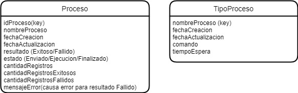

# Entidades Genericas

> **Fuente Confluence:** [Entidades Genericas](https://segurosti.atlassian.net/wiki/spaces/EPA/pages/2698608720/Entidades+Genericas)
> **Última modificación:** 2022-04-28 — Diana Muñoz · versión 2
> **Sección:** [Entidades](./index.md)

Entidades utilizadas de forma genérica para cualquier proceso

