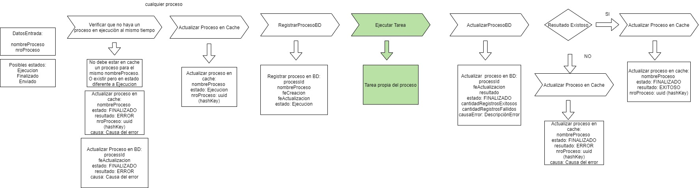

# Estructura Procesos

> **Fuente Confluence:** [Estructura Procesos](https://segurosti.atlassian.net/wiki/spaces/EPA/pages/2698444874/Estructura+Procesos)
> **Última modificación:** 2022-04-28 — Diana Muñoz · versión 3
> **Sección:** [Mircroservicio sarlaftBatch](./index.md)

Cualquier proceso que se deba ejecutar desde Tivoli o un aplicativo externo como el pipeline de DataFactory de Segmentación de Clientes, debe cumplir los siguientes pasos de implementación:

