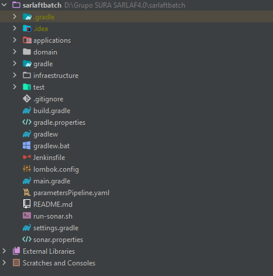
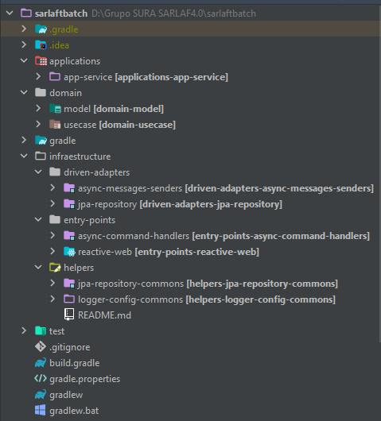

# Estructura del Proyecto - Microservicio sarlaftBatch

> **Fuente Confluence:** [Estructura del Proyecto - Microservicio sarlaftBatch](https://segurosti.atlassian.net/wiki/spaces/EPA/pages/2554691636/Estructura+del+Proyecto+-+Microservicio+sarlaftBatch)
> **Última modificación:** 2022-01-04 — Mateo Valencia Muriel · versión 3
> **Sección:** [Mircroservicio sarlaftBatch](./index.md)

El microservicio de Recomercial está construido a partir del generador de legos de Sura en su versión 0.0.21, se basa en arquitectura hexagonal, se aplica programación reactiva e implementación de seguridad a través de SEUS, generando los siguientes componentes (Figura 1):



El proyecto está dividido en los siguientes subproyectos (Figura 2):



1. **applications-app-service**: contiene configuraciones generales del aplicativo, importa los módulos de las otras capas que siguen la Clean Architecture (Dominio e Infraestructura). Es la encargada de la interacción con el framework utilizado, sus complementos y la configuración de la ejecución del microservicio.

   En el archivo de configuración `application.yaml` se encuentran los parámetros para consumir base de datos y seguridad SEUS.

2. **domain**: La capa de dominio es la capa más interna del proyecto y es la encargada de dar las directivas del proceso teniendo en cuenta la lógica de negocio:\
   **a.** **model**: representa los objetos de dominio (negocio) del aplicativo, sus características y comportamientos.\
   **b.** **use-case**: contiene los casos de uso (actividad) que se ejecuta en la aplicación desde el proxy de la capa de infraestructura. Interactúa con los modelos para la conversión de los datos de entrada para las operaciones.

3. **infrastructure**:\
   **c.** **jpa-repository:** aquí se encuentran las implementaciones para el control de persistencia de los objetos de domino, adicional de implementaciones concretas para consulta de información de base de datos.\
   **d.** **entry-points-reactive-web:** define los diferentes endpoints que se habilitarán en la aplicación, aquí se ubican los controlers que exponen los metodos de API Rest.\
   **e.** **logger-config-commons:** Modulo encargado de la configuración de Logs en Splunk.

**Configuración base de datos**

La configuración de base de datos del proyecto se realiza en base al archivo **_application.yml_** del proyecto **_applications-app-service_**.

```yaml
spring:
  application:
    name: sarlaftbatch

app:
  context: /sarlaftbatch
  #SELF_APP_CONFIGURATION_OPT

logger:
  escrituraBackup: /opt/app/shared/sarlaft4/splunk
  splunk: http://holmesdllo.suramericana.com.co:8088/
  configurationFile: classpath:splunk.xml
  Log4jContextSelector: org.apache.logging.log4j.core.async.AsyncLoggerContextSelector
  refreshInterval: 30000
  habilitarTrazaWS: true

logging:
  level:
    web: DEBUG

app-security:
  service: Sarlaft4Local
  sp_entity_id: Sarlaft4Local
  base_path: api
  enable: true
  auth_enable: false
  publicResources:
    - /public/health
    # Recursos para swagger
    - /documentation/swagger-ui/index.html
    - /api-docs/swagger-config
    - /swagger-ui.html
    - /documentation/swagger-ui/swagger-ui.css
    - /documentation/swagger-ui/swagger-ui-bundle.js
    - /documentation/swagger-ui/swagger-ui-standalone-preset.js
    - /documentation/swagger-ui/swagger-ui-standalone-preset.js
    - /api-docs
  cors:
    allowCredentials: true
    allowedOrigins:
      - local.suramericana.com.co
    allowedMethods:
      - POST
      - GET
      - HEAD
      - OPTIONS

ssosura:
  seus:
    configuration:
      serviceUrl: https://seusdllo.suranet.com/conf/configuration/sso-api
      ssoSecret: yY9dSJ2EuF3t[9SEXFGf9[FQmsRnQEI@gysMIXMCw0_gl9Ik7PUT]y_nHE>hHvUx

log4j2:
  formatMsgNoLookups: true

spring.datasource.url: jdbc:postgresql://psql-srsarlaftd12576809.postgres.database.azure.com:5432/sarlaftdb?currentSchema=sarlaft&sslmode=require
spring.datasource.username: xxxxxxxxxxxxxxxxx
spring.datasource.password: xxxxxxxxxxxxxxx
spring.jpa.database-platform: org.hibernate.dialect.PostgreSQLDialect
spring.jpa.database: POSTGRESQL
spring.jpa.show-sql: false
spring.jpa.generate-ddl: TRUE
spring.jpa.properties.hibernate.jdbc.lob.non_contextual_creation: true
```
