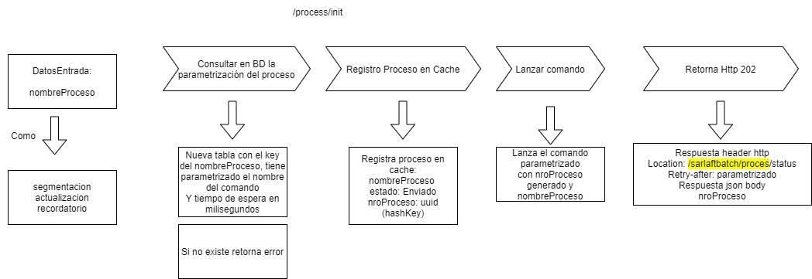
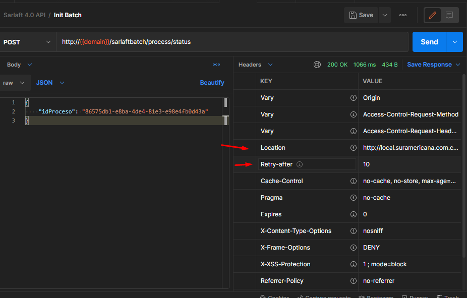
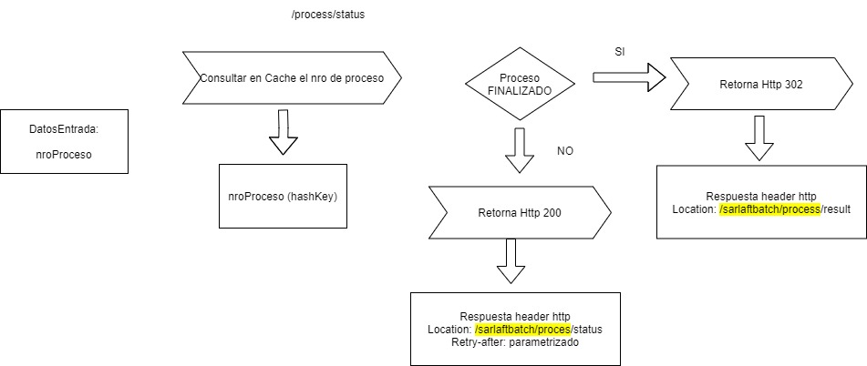
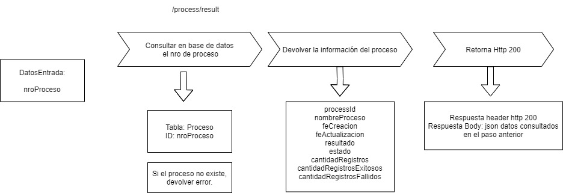

# Servicios Web para inicio y consulta de Proceso

> **Fuente Confluence:** [Servicios Web para inicio y consulta de Proceso](https://segurosti.atlassian.net/wiki/spaces/EPA/pages/2698739830/Servicios+Web+para+inicio+y+consulta+de+Proceso)
> **Última modificación:** 2022-05-12 — Mateo Valencia Muriel · versión 6
> **Sección:** [Mircroservicio sarlaftBatch](./index.md)

Para ejecutar un proceso se deben consumir los siguientes tres servicios:

Basado en el diseño: [Async Request-Reply pattern](https://docs.microsoft.com/en-us/azure/architecture/patterns/async-request-reply)

## 1. `/process/init`

Por medio de un identificador permite iniciar la ejecución de un proceso.



Request Entrada:

```json
{
    "nombreProceso": "SEGMENTACION"
}
```

Request Salida:

```json
{
    "idProceso": "984ded9d-30c2-4ff7-8aca-ca2c4c3b4059"
}
```

## 2. `/process/status`

Request Entrada:

```json
{
    "idProceso": "984ded9d-30c2-4ff7-8aca-ca2c4c3b4059"
}
```

Ejemplo Response: Body Empty



Consulta el estado del proceso en ejecución



## 3. `/process/result`

Datos de entrada:

```json
{
    "idProceso": "984ded9d-30c2-4ff7-8aca-ca2c4c3b4059"
}
```

Datos Salida:

```json
{
    "procesoId": "e876e8b2-33c5-48c7-b7e7-5e72f32d588d",
    "nombreProceso": "segmentacion",
    "feCreacion": "2022-04-30T21:17:56.667+00:00",
    "feActualizacion": "2022-04-30T21:18:17.080+00:00",
    "resultado": "EXITOSO",
    "estado": "FINALIZADO",
    "cantidadRegistros": 195,
    "cantidadRegistrosExitosos": 195,
    "cantidadRegistrosFallidos": null
}
```

Permite obtener el resultado del proceso


