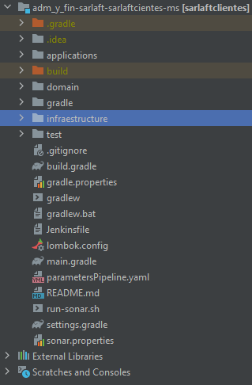
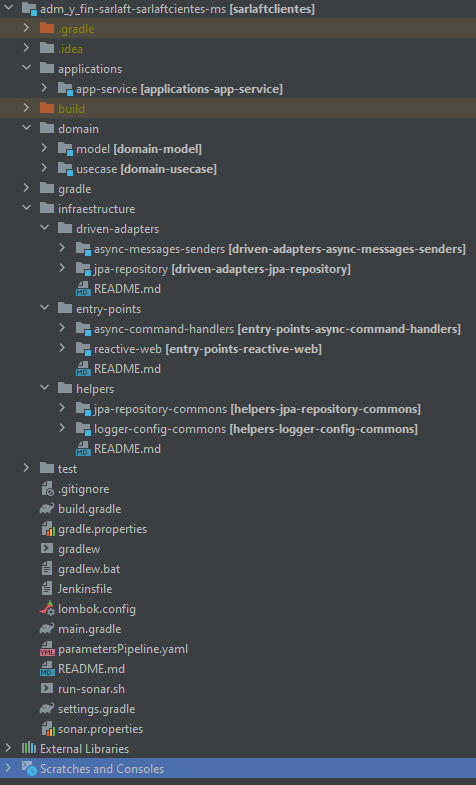

# Estructura del Proyecto - Microservicio SarlaftClientes

> **Fuente Confluence:** [Estructura del Proyecto - Microservicio SarlaftClientes](https://segurosti.atlassian.net/wiki/spaces/EPA/pages/2719285328)
> **Última modificación:** 2022-05-12 — Diana Muñoz · versión 3
> **Sección:** [Microservicio SarlaftClientesMS](./index.md)

El microservicio de SarlftClientes está construido a partir del generador de legos de Sura en su versión 0.0.21, se basa en arquitectura hexagonal, se aplica programación reactiva e implementación de seguridad a través de SEUS, generando los siguientes componentes (Figura 1):



El proyecto está dividido en los siguientes subproyectos (Figura 2):



1. **`applications-app-service`**: contiene configuraciones generales del aplicativo, importa los módulos de las otras capas que siguen la Clean Architecture (Dominio e Infraestructura). Es la encargada de la interacción con el framework utilizado, sus complementos y la configuración de la ejecución del microservicio.

   En el archivo de configuración `application.yaml` se encuentran los parámetros para consumir base de datos y seguridad SEUS.

2. **`domain`**: La capa de dominio es la capa más interna del proyecto y es la encargada de dar las directivas del proceso teniendo en cuenta la lógica de negocio:\
   **a.** **`model`**: representa los objetos de dominio (negocio) del aplicativo, sus características y comportamientos.\
   **b.** **`use-case`**: contiene los casos de uso (actividad) que se ejecuta en la aplicación desde el proxy de la capa de infraestructura. Interactúa con los modelos para la conversión de los datos de entrada para las operaciones.

3. **`infrastructure`**:\
   **a.** **`jpa-repository`:** aquí se encuentran las implementaciones para el control de persistencia de los objetos de domino, adicional de implementaciones concretas para consulta de información de base de datos.\
   **b.** **`async-messages-senders`:** adaptador que permite poner las respuestas que son procesadas por los casos de uso, una vez se termina el procesamiento de la lógica de negocio se notifica por medio de este adaptador a una cola en Service Bus.\
   **c.** **`async-command-handler`:** adaptador que permite el procesamiento del mensaje de entrada, en este punto se procesa el mensaje de entrada y se delega flujo de la lógica al caso de uso, generalmente en los casos de uso que procesan los mensajes de entrada se combina la interacción con base de datos, servicios externos y el envío de mensajes asíncronos al Service Bus.\
   **e.** **`entry-points-reactive-web`:** define los diferentes endpoints que se habilitarán en la aplicación, aquí se ubican los controllers que exponen los métodos de API Rest.\
   **f.** **`logger-config-commons`:** Módulo encargado de la configuración de Logs en Splunk.

**Configuración base de datos**

La configuración de base de datos del proyecto se realiza en base al archivo **`application.yml`** del proyecto **`applications-app-service`**.

Properties:

```yaml
spring:
  application:
    name: sarlaftclientes

server:
  port: 8091

azure:
  connection-string: Endpoint=sb://sb-sarlaft1c9fd789.servicebus.windows.net/;SharedAccessKeyName=RootManageSharedAccessKey;SharedAccessKey=XXXXXXX

app:
  context: /sarlaftclientes
  #SELF_APP_CONFIGURATION_OPT
  async:
    prefetchCount: 5000
    flux:
      maxConcurrency: 250
    global:
      autoDeleteOnIdle: 1440

logger:
  escrituraBackup: /opt/app/shared/sarlaft4/splunk
  splunk: http://holmesdllo.suramericana.com.co:8088/
  configurationFile: classpath:splunk.xml
  Log4jContextSelector: org.apache.logging.log4j.core.async.AsyncLoggerContextSelector
  refreshInterval: 30000
  habilitarTrazaWS: true

logging:
  level:
    web: DEBUG

app-security:
  service: Sarlaft4Clientes
  sp_entity_id: Sarlaft4Clientes
  base_path: api
  enable: true
  auth_enable: false
  publicResources:
    - /public/health
    # Recursos para swagger
    - /documentation/swagger-ui/index.html
    - /api-docs/swagger-config
    - /swagger-ui.html
    - /documentation/swagger-ui/swagger-ui.css
    - /documentation/swagger-ui/swagger-ui-bundle.js
    - /documentation/swagger-ui/swagger-ui-standalone-preset.js
    - /documentation/swagger-ui/swagger-ui-standalone-preset.js
    - /api-docs
  cors:
    allowCredentials: true
    allowedOrigins:
      - local.suramericana.com.co
    allowedMethods:
      - POST
      - GET
      - HEAD
      - OPTIONS

ssosura:
  seus:
    configuration:
      serviceUrl: https://seusdllo.sura.com/conf/configuration/sso-api
      ssoSecret: yY9dSJ2EuF3t[9SEXFGf9[FQmsRnQEI@gysMIXMCw0_gl9Ik7PUT]y_nHE>hHvUx

log4j2:
  formatMsgNoLookups: true

spring.datasource.url: jdbc:postgresql://psql-YYYYY.postgres.database.azure.com:5432/sarlaftdb?currentSchema=sarlaft&sslmode=require
spring.datasource.username: YYYYYY
spring.datasource.password: XXXXX
spring.jpa.database-platform: org.hibernate.dialect.PostgreSQLDialect
spring.jpa.database: POSTGRESQL
spring.jpa.show-sql: false
spring.jpa.generate-ddl: TRUE
spring.jpa.properties.hibernate.jdbc.lob.non_contextual_creation: true
```
