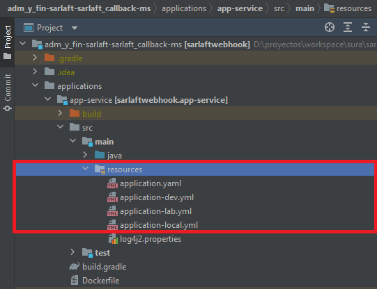
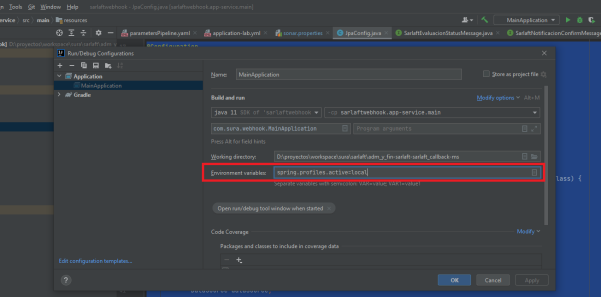

# Configuración Ambiente - Microservicio Webhook

> **Fuente Confluence:** [Configuración Ambiente - Microservicio Webhook](https://segurosti.atlassian.net/wiki/spaces/EPA/pages/2314174657/Configuraci%C3%B3n+Ambiente+-+Microservicio+Webhook)
> **Última modificación:** 2025-10-30 — Diana Muñoz · versión 6
> **Sección:** [Microservicio Webhook](./index.md)

**Requisitos:**

- Java 21
- Gradle `8.10.2`

**URL Repositorio:**

[https://dev.azure.com/SuraColombia/Gerencia_Tecnologia/_git/892-sarlaft_callback-ms](https://dev.azure.com/SuraColombia/Gerencia_Tecnologia/_git/892-sarlaft_callback-ms)

**URL Repositorio proyecto configuración:**

[https://dev.azure.com/SuraColombia/Gerencia_Tecnologia/_git/892-sarlaft_callback-conf](https://dev.azure.com/SuraColombia/Gerencia_Tecnologia/_git/892-sarlaft_callback-conf)

**URL Proyecto Pruebas SoapUI y JMeter:**

[https://dev.azure.com/SuraColombia/Gerencia_Tecnologia/_git/892-sarlaft_callback-pa](https://dev.azure.com/SuraColombia/Gerencia_Tecnologia/_git/892-sarlaft_callback-pa)

**Pipeline con template:**

[https://dev.azure.com/SuraColombia/Gerencia_Tecnologia/_build?definitionId=3477](https://dev.azure.com/SuraColombia/Gerencia_Tecnologia/_build?definitionId=3477)

**Sonarqube:**

[https://sonar.suramericana.com.co/dashboard?id=892-sarlaft_callback-ms](https://sonar.suramericana.com.co/dashboard?id=892-sarlaft_callback-ms)

Para la ejecución del proyecto desde el IntelliJ IDE se proveen tres archivos de configuración de perfilamiento para que se ejecute la aplicación con configuraciones de ambiente diferentes.

dev, lab y local los cuales van configurados segun las dependencias de su ambiente y los cuales defines al momento de la ejecución de la aplicación desde tu IDE

Solo basta definir la variable de entorno `spring.profiles.active=local`