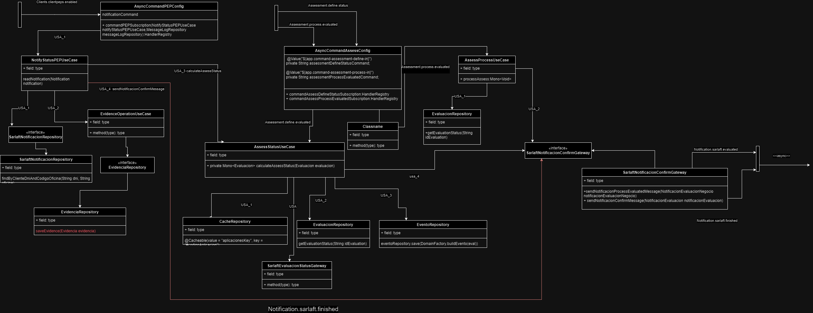
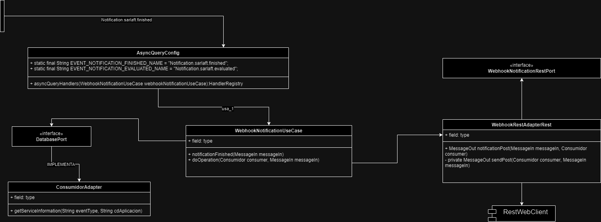

# Webhook - Sarlaft

> **Fuente Confluence:** [Webhook - Sarlaft](https://segurosti.atlassian.net/wiki/spaces/EPA/pages/3788439558/Webhook+-+Sarlaft)
> **Última modificación:** 2024-07-16 — Brayan Estiven Sepúlveda Quintero · versión 3
> **Sección:** [Microservicio Webhook](./index.md)

Los siguiente documentos buscan dar referencias de los cambios efectuados en los microservicios que de webhoook del sistema de sarlaft los cuales fueron modificados con el fin de realizar el ajuste en el json de notificación y respuesta REST o Queue para incluir los códigos de errores de la evidencia de `document_pn`.

[HISTORIA_WEBHOOK_AUDITORIA.pdf](./attachments/HISTORIA_WEBHOOK_AUDITORIA.pdf)

[HISTORIA_WEBHOOK.pdf](./attachments/HISTORIA_WEBHOOK.pdf)

Links asociados a la estructura de webhook.

- [7. Webhook (Assessment)](../DisenoArquitectura/DisenoFuncionalidades/07WebhookAssessment.md)
- [Estructura Proyecto - MicroServicio Webhook](./EstructuraProyecto.md)

Se agrega diagrama de clases basado en los microservicios de webhook llamadas `sarlaft_callback-ms` y `sarlaft-function_webhook-mi`.

`sarlaft_callback-ms`.

`sarlaft-function_webhook-mi`.

## Ajuste general al diccionario y flujos involucrados en el Webhook

[HU569973-Adicionar tipoCodigo, ajustar diccionario y responder codigoHomologado.pdf](./attachments/HU569973-AdicionarTipoCodigo.pdf)

[Diccionario_SARLAFT_webhook_V1_05072024.xlsx](./attachments/Diccionario_SARLAFT_webhook_V1_05072024.xlsx)