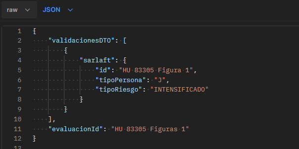
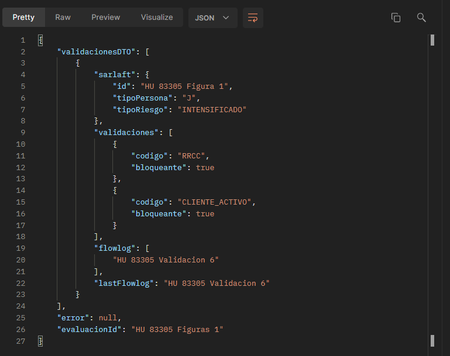

# Validación por figura | Proceso de actualización

> **Fuente Confluence:** [Validación por figura | Proceso de actualización](https://segurosti.atlassian.net/wiki/spaces/EPA/pages/2856812545)
> **Última modificación:** 2022-08-24 — Diego Alejandro Vélez González · versión 2
> **Sección:** [Actualización](./index.md)

- **Objetivo:** Proveer una conexión al motor de validaciones de figuras para una evaluación de actualización.
- **Query:** `Evaluacion.sarlaft.actualizacion.validaciones`
- **Nota:** los ejemplos a continuación se hicieron desde un proyecto sender que se comunicaba en la cola de service bus.

| Data Request | Data | Tipo | Observaciones/Valores |
| --- | --- | --- | --- |
| `sarlaft.tipoPersona` | **Requerido** | String | N → Persona Natural\J → Persona Jurídica |
| `sarlaft.tipoRiesgo` | **Requerido** | String | INTENSIFICADO\SIMPLIFICADO\ORDINARIO |
| `evaluacionId` | **Opcional** | String | dato para realizar traza a la petición - splunk |

| Data Response | Data | Tipo | Observaciones/Valores |
| --- | --- | --- | --- |
| `validaciones` | **Requerido** | List | validaciones que debe tener la figura |
| `validaciones[n].codigo` | **Requerido** | String | Nombre de la validación |
| `validaciones[n].bloqueante` | **Requerido** | Boolean | Indicador si es bloqueante en el proceso |
| `error` | **Requerido** | String | si retorna un mensaje diferente a null nos indica que ocurrió un error en el proceso de ejecutar las validaciones, o algún campo requerido no se envió |
| `flowlog` | **No Requerido** | List | permite ver las condiciones que cumplió la figura en proceso del motor, Dato técnico del proyecto |
| `lastflowlog` | **No Requerido** | String | Datos Técnico del proyecto |

- Error

**Query Request:**

📎 [Query-Request.json](./attachments/Query-Request.json)

**Query Response:**

📎 [Query-Reponse.json](./attachments/Query-Reponse.json)

**Query Error Response:**

📎 [Query-Error-Reponse.json](./attachments/Query-Error-Reponse.json)
