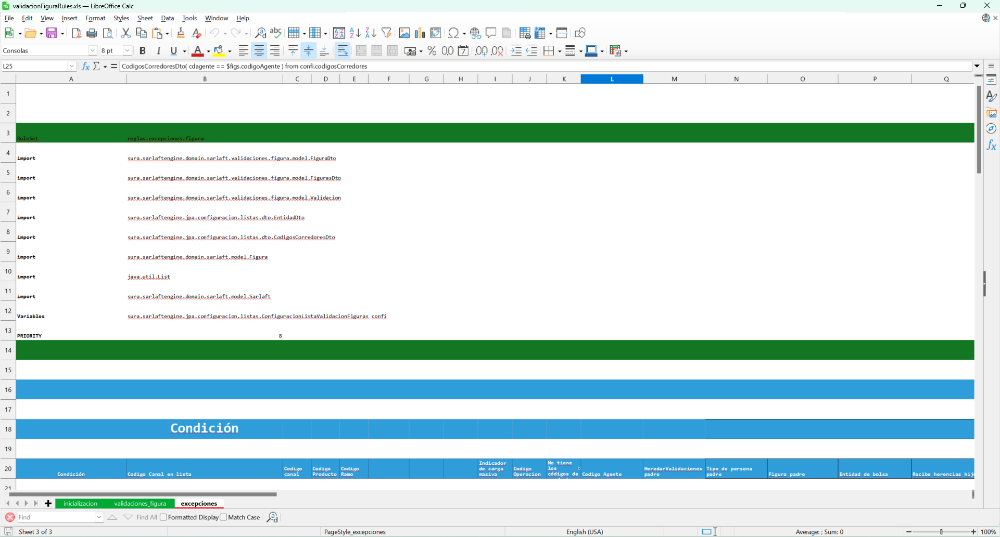
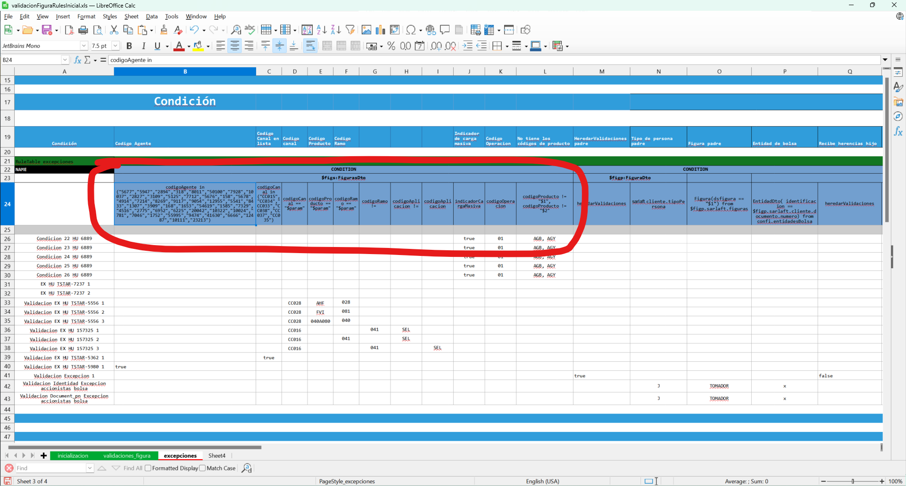
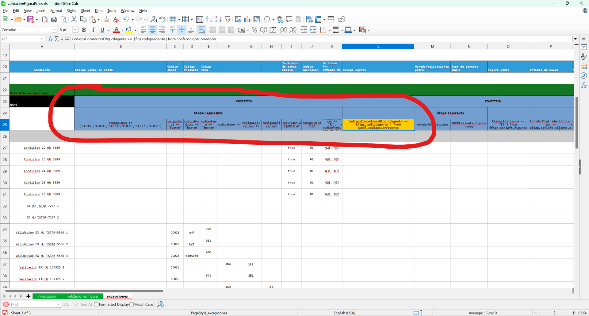
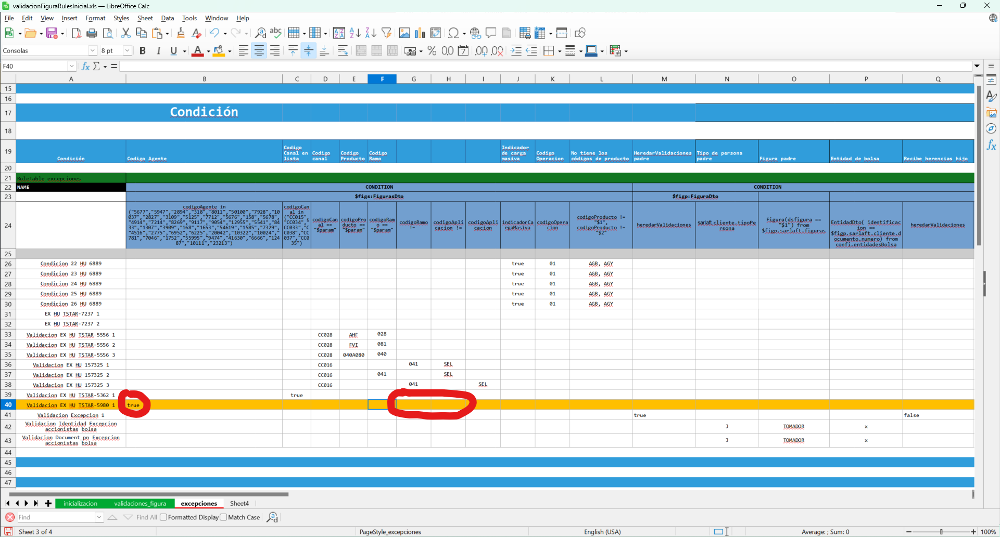
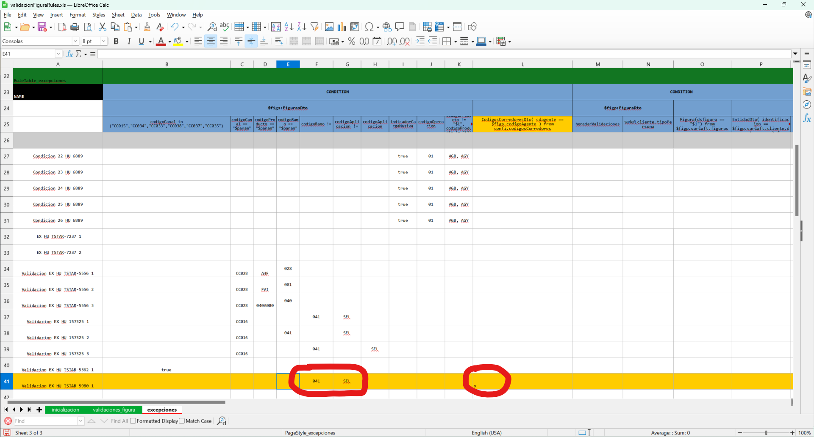

# Modificación de Agentes Corredores y Reglas de Negocio

> **Fuente Confluence:** [Modificación de Agentes Corredores y Reglas de Negocio](https://segurosti.atlassian.net/wiki/spaces/EPA/pages/3779330147)
> **Última modificación:** 2024-09-24 — Brayan Estiven Sepúlveda Quintero · versión 12
> **Sección:** [Motor de Evaluación](../index.md)

Se agregan las nuevas importaciones de clases de java que va a utilizar el motor:



Se modifico las condiciones de esto:



A esto:



De la forma anterior podemos recuperar y validar la lista de corredores a través de un objeto de java.

Adicional se modifica estas dos reglas, aquí podemos ver un antes y después respectivamente:





La lista de agentes corredores que se debe configurar en base de datos es la siguiente:

[Base corredores_julio2024.xlsx](./attachments/Base%20corredores_julio2024.xlsx)

```sql
INSERT INTO sarlaft.tsaf_agente (cdagente, tipoagente) VALUES ('158', 'CORREDOR') ON CONFLICT (cdagente) DO NOTHING;
INSERT INTO sarlaft.tsaf_agente (cdagente, tipoagente) VALUES ('168', 'CORREDOR') ON CONFLICT (cdagente) DO NOTHING;
INSERT INTO sarlaft.tsaf_agente (cdagente, tipoagente) VALUES ('318', 'CORREDOR') ON CONFLICT (cdagente) DO NOTHING;
INSERT INTO sarlaft.tsaf_agente (cdagente, tipoagente) VALUES ('781', 'CORREDOR') ON CONFLICT (cdagente) DO NOTHING;
INSERT INTO sarlaft.tsaf_agente (cdagente, tipoagente) VALUES ('1307', 'CORREDOR') ON CONFLICT (cdagente) DO NOTHING;
INSERT INTO sarlaft.tsaf_agente (cdagente, tipoagente) VALUES ('1470', 'CORREDOR') ON CONFLICT (cdagente) DO NOTHING;
INSERT INTO sarlaft.tsaf_agente (cdagente, tipoagente) VALUES ('1585', 'CORREDOR') ON CONFLICT (cdagente) DO NOTHING;
INSERT INTO sarlaft.tsaf_agente (cdagente, tipoagente) VALUES ('1653', 'CORREDOR') ON CONFLICT (cdagente) DO NOTHING;
INSERT INTO sarlaft.tsaf_agente (cdagente, tipoagente) VALUES ('1752', 'CORREDOR') ON CONFLICT (cdagente) DO NOTHING;
INSERT INTO sarlaft.tsaf_agente (cdagente, tipoagente) VALUES ('2775', 'CORREDOR') ON CONFLICT (cdagente) DO NOTHING;
INSERT INTO sarlaft.tsaf_agente (cdagente, tipoagente) VALUES ('2827', 'CORREDOR') ON CONFLICT (cdagente) DO NOTHING;
INSERT INTO sarlaft.tsaf_agente (cdagente, tipoagente) VALUES ('2894', 'CORREDOR') ON CONFLICT (cdagente) DO NOTHING;
INSERT INTO sarlaft.tsaf_agente (cdagente, tipoagente) VALUES ('3109', 'CORREDOR') ON CONFLICT (cdagente) DO NOTHING;
INSERT INTO sarlaft.tsaf_agente (cdagente, tipoagente) VALUES ('3560', 'CORREDOR') ON CONFLICT (cdagente) DO NOTHING;
INSERT INTO sarlaft.tsaf_agente (cdagente, tipoagente) VALUES ('3909', 'CORREDOR') ON CONFLICT (cdagente) DO NOTHING;
INSERT INTO sarlaft.tsaf_agente (cdagente, tipoagente) VALUES ('4516', 'CORREDOR') ON CONFLICT (cdagente) DO NOTHING;
INSERT INTO sarlaft.tsaf_agente (cdagente, tipoagente) VALUES ('4914', 'CORREDOR') ON CONFLICT (cdagente) DO NOTHING;
INSERT INTO sarlaft.tsaf_agente (cdagente, tipoagente) VALUES ('5125', 'CORREDOR') ON CONFLICT (cdagente) DO NOTHING;
INSERT INTO sarlaft.tsaf_agente (cdagente, tipoagente) VALUES ('5541', 'CORREDOR') ON CONFLICT (cdagente) DO NOTHING;
INSERT INTO sarlaft.tsaf_agente (cdagente, tipoagente) VALUES ('5676', 'CORREDOR') ON CONFLICT (cdagente) DO NOTHING;
INSERT INTO sarlaft.tsaf_agente (cdagente, tipoagente) VALUES ('5677', 'CORREDOR') ON CONFLICT (cdagente) DO NOTHING;
INSERT INTO sarlaft.tsaf_agente (cdagente, tipoagente) VALUES ('5678', 'CORREDOR') ON CONFLICT (cdagente) DO NOTHING;
INSERT INTO sarlaft.tsaf_agente (cdagente, tipoagente) VALUES ('5947', 'CORREDOR') ON CONFLICT (cdagente) DO NOTHING;
INSERT INTO sarlaft.tsaf_agente (cdagente, tipoagente) VALUES ('6185', 'CORREDOR') ON CONFLICT (cdagente) DO NOTHING;
INSERT INTO sarlaft.tsaf_agente (cdagente, tipoagente) VALUES ('6225', 'CORREDOR') ON CONFLICT (cdagente) DO NOTHING;
INSERT INTO sarlaft.tsaf_agente (cdagente, tipoagente) VALUES ('6666', 'CORREDOR') ON CONFLICT (cdagente) DO NOTHING;
INSERT INTO sarlaft.tsaf_agente (cdagente, tipoagente) VALUES ('6952', 'CORREDOR') ON CONFLICT (cdagente) DO NOTHING;
INSERT INTO sarlaft.tsaf_agente (cdagente, tipoagente) VALUES ('7214', 'CORREDOR') ON CONFLICT (cdagente) DO NOTHING;
INSERT INTO sarlaft.tsaf_agente (cdagente, tipoagente) VALUES ('7305', 'CORREDOR') ON CONFLICT (cdagente) DO NOTHING;
INSERT INTO sarlaft.tsaf_agente (cdagente, tipoagente) VALUES ('7329', 'CORREDOR') ON CONFLICT (cdagente) DO NOTHING;
INSERT INTO sarlaft.tsaf_agente (cdagente, tipoagente) VALUES ('7712', 'CORREDOR') ON CONFLICT (cdagente) DO NOTHING;
INSERT INTO sarlaft.tsaf_agente (cdagente, tipoagente) VALUES ('7802', 'CORREDOR') ON CONFLICT (cdagente) DO NOTHING;
INSERT INTO sarlaft.tsaf_agente (cdagente, tipoagente) VALUES ('7928', 'CORREDOR') ON CONFLICT (cdagente) DO NOTHING;
INSERT INTO sarlaft.tsaf_agente (cdagente, tipoagente) VALUES ('8011', 'CORREDOR') ON CONFLICT (cdagente) DO NOTHING;
INSERT INTO sarlaft.tsaf_agente (cdagente, tipoagente) VALUES ('8269', 'CORREDOR') ON CONFLICT (cdagente) DO NOTHING;
INSERT INTO sarlaft.tsaf_agente (cdagente, tipoagente) VALUES ('8433', 'CORREDOR') ON CONFLICT (cdagente) DO NOTHING;
INSERT INTO sarlaft.tsaf_agente (cdagente, tipoagente) VALUES ('9054', 'CORREDOR') ON CONFLICT (cdagente) DO NOTHING;
INSERT INTO sarlaft.tsaf_agente (cdagente, tipoagente) VALUES ('9117', 'CORREDOR') ON CONFLICT (cdagente) DO NOTHING;
INSERT INTO sarlaft.tsaf_agente (cdagente, tipoagente) VALUES ('10024', 'CORREDOR') ON CONFLICT (cdagente) DO NOTHING;
INSERT INTO sarlaft.tsaf_agente (cdagente, tipoagente) VALUES ('10037', 'CORREDOR') ON CONFLICT (cdagente) DO NOTHING;
INSERT INTO sarlaft.tsaf_agente (cdagente, tipoagente) VALUES ('10322', 'CORREDOR') ON CONFLICT (cdagente) DO NOTHING;
INSERT INTO sarlaft.tsaf_agente (cdagente, tipoagente) VALUES ('12176', 'CORREDOR') ON CONFLICT (cdagente) DO NOTHING;
INSERT INTO sarlaft.tsaf_agente (cdagente, tipoagente) VALUES ('12487', 'CORREDOR') ON CONFLICT (cdagente) DO NOTHING;
INSERT INTO sarlaft.tsaf_agente (cdagente, tipoagente) VALUES ('12955', 'CORREDOR') ON CONFLICT (cdagente) DO NOTHING;
INSERT INTO sarlaft.tsaf_agente (cdagente, tipoagente) VALUES ('19121', 'CORREDOR') ON CONFLICT (cdagente) DO NOTHING;
INSERT INTO sarlaft.tsaf_agente (cdagente, tipoagente) VALUES ('20042', 'CORREDOR') ON CONFLICT (cdagente) DO NOTHING;
INSERT INTO sarlaft.tsaf_agente (cdagente, tipoagente) VALUES ('20107', 'CORREDOR') ON CONFLICT (cdagente) DO NOTHING;
INSERT INTO sarlaft.tsaf_agente (cdagente, tipoagente) VALUES ('20512', 'CORREDOR') ON CONFLICT (cdagente) DO NOTHING;
INSERT INTO sarlaft.tsaf_agente (cdagente, tipoagente) VALUES ('20554', 'CORREDOR') ON CONFLICT (cdagente) DO NOTHING;
INSERT INTO sarlaft.tsaf_agente (cdagente, tipoagente) VALUES ('23209', 'CORREDOR') ON CONFLICT (cdagente) DO NOTHING;
INSERT INTO sarlaft.tsaf_agente (cdagente, tipoagente) VALUES ('23213', 'CORREDOR') ON CONFLICT (cdagente) DO NOTHING;
INSERT INTO sarlaft.tsaf_agente (cdagente, tipoagente) VALUES ('23276', 'CORREDOR') ON CONFLICT (cdagente) DO NOTHING;
INSERT INTO sarlaft.tsaf_agente (cdagente, tipoagente) VALUES ('30206', 'CORREDOR') ON CONFLICT (cdagente) DO NOTHING;
INSERT INTO sarlaft.tsaf_agente (cdagente, tipoagente) VALUES ('34382', 'CORREDOR') ON CONFLICT (cdagente) DO NOTHING;
INSERT INTO sarlaft.tsaf_agente (cdagente, tipoagente) VALUES ('41630', 'CORREDOR') ON CONFLICT (cdagente) DO NOTHING;
INSERT INTO sarlaft.tsaf_agente (cdagente, tipoagente) VALUES ('49165', 'CORREDOR') ON CONFLICT (cdagente) DO NOTHING;
INSERT INTO sarlaft.tsaf_agente (cdagente, tipoagente) VALUES ('50100', 'CORREDOR') ON CONFLICT (cdagente) DO NOTHING;
INSERT INTO sarlaft.tsaf_agente (cdagente, tipoagente) VALUES ('51266', 'CORREDOR') ON CONFLICT (cdagente) DO NOTHING;
INSERT INTO sarlaft.tsaf_agente (cdagente, tipoagente) VALUES ('52233', 'CORREDOR') ON CONFLICT (cdagente) DO NOTHING;
INSERT INTO sarlaft.tsaf_agente (cdagente, tipoagente) VALUES ('54090', 'CORREDOR') ON CONFLICT (cdagente) DO NOTHING;
INSERT INTO sarlaft.tsaf_agente (cdagente, tipoagente) VALUES ('54092', 'CORREDOR') ON CONFLICT (cdagente) DO NOTHING;
INSERT INTO sarlaft.tsaf_agente (cdagente, tipoagente) VALUES ('54619', 'CORREDOR') ON CONFLICT (cdagente) DO NOTHING;
INSERT INTO sarlaft.tsaf_agente (cdagente, tipoagente) VALUES ('55995', 'CORREDOR') ON CONFLICT (cdagente) DO NOTHING;
INSERT INTO sarlaft.tsaf_agente (cdagente, tipoagente) VALUES ('58785', 'CORREDOR') ON CONFLICT (cdagente) DO NOTHING;
INSERT INTO sarlaft.tsaf_agente (cdagente, tipoagente) VALUES ('58786', 'CORREDOR') ON CONFLICT (cdagente) DO NOTHING;
INSERT INTO sarlaft.tsaf_agente (cdagente, tipoagente) VALUES ('59142', 'CORREDOR') ON CONFLICT (cdagente) DO NOTHING;
INSERT INTO sarlaft.tsaf_agente (cdagente, tipoagente) VALUES ('83421', 'CORREDOR') ON CONFLICT (cdagente) DO NOTHING;
INSERT INTO sarlaft.tsaf_agente (cdagente, tipoagente) VALUES ('87282', 'CORREDOR') ON CONFLICT (cdagente) DO NOTHING;
INSERT INTO sarlaft.tsaf_agente (cdagente, tipoagente) VALUES ('97275', 'CORREDOR') ON CONFLICT (cdagente) DO NOTHING;
INSERT INTO sarlaft.tsaf_agente (cdagente, tipoagente) VALUES ('188876', 'CORREDOR') ON CONFLICT (cdagente) DO NOTHING;
INSERT INTO sarlaft.tsaf_agente (cdagente, tipoagente) VALUES ('1501002', 'CORREDOR') ON CONFLICT (cdagente) DO NOTHING;
INSERT INTO sarlaft.tsaf_agente (cdagente, tipoagente) VALUES ('2040007', 'CORREDOR') ON CONFLICT (cdagente) DO NOTHING;
INSERT INTO sarlaft.tsaf_agente (cdagente, tipoagente) VALUES ('2501001', 'CORREDOR') ON CONFLICT (cdagente) DO NOTHING;
INSERT INTO sarlaft.tsaf_agente (cdagente, tipoagente) VALUES ('2501002', 'CORREDOR') ON CONFLICT (cdagente) DO NOTHING;
INSERT INTO sarlaft.tsaf_agente (cdagente, tipoagente) VALUES ('2501003', 'CORREDOR') ON CONFLICT (cdagente) DO NOTHING;
INSERT INTO sarlaft.tsaf_agente (cdagente, tipoagente) VALUES ('3030010', 'CORREDOR') ON CONFLICT (cdagente) DO NOTHING;
INSERT INTO sarlaft.tsaf_agente (cdagente, tipoagente) VALUES ('3040051', 'CORREDOR') ON CONFLICT (cdagente) DO NOTHING;
INSERT INTO sarlaft.tsaf_agente (cdagente, tipoagente) VALUES ('3040159', 'CORREDOR') ON CONFLICT (cdagente) DO NOTHING;
INSERT INTO sarlaft.tsaf_agente (cdagente, tipoagente) VALUES ('3501001', 'CORREDOR') ON CONFLICT (cdagente) DO NOTHING;
INSERT INTO sarlaft.tsaf_agente (cdagente, tipoagente) VALUES ('3501005', 'CORREDOR') ON CONFLICT (cdagente) DO NOTHING;
```

Y la entidad que se configuró en el proyecto `892-sarlaft-api-ms` para configurar la tabla a través de JPA es la siguiente:

```java
package sura.sarlaft4.jpa.agente;

import lombok.Data;
import lombok.NoArgsConstructor;

import javax.persistence.Column;
import javax.persistence.Entity;
import javax.persistence.Id;
import javax.persistence.Table;

@Data
@Entity
@Table(name = "TSAF_AGENTE")
@NoArgsConstructor
public class AgenteData {
    @Id
    @Column(name = "CDAGENTE", nullable = false, length = 20)
    private String codigoAgente;

    @Column(name = "TIPOAGENTE", nullable = false, length = 20)
    private String tipoAgente;
}
```

# Escenarios Reglas de Negocio

## CRITERIOS PARA SOAT Y CORREDOR

**1-** Dado que se crea una evaluación de SOAT- 041

Y es un tomador y/o asegurado igual

Y es del aplicativo SEL

Cuando es asesor tipo corredor

Entonces se asigne la validación de identidad (EXPERIAN)

**2-** Dado que se crea una evaluación de SOAT- 041

Y es un tomador y/o asegurado igual

Y es del aplicativo SEL

Cuando es asesor diferente a corredor

Entonces se asigne la validación de identidad (EXPERIAN)

## CRITERIOS PARA RAMOS DISTINTOS A SOAT Y CORREDOR

**3-** Dado que se crea una evaluación del ramo 030- INCENDIO

Y es persona natural

Y es un PEP

Y es un tomador y/o asegurado igual

Y es del aplicativo 14280 - CORE

Cuando el asesor es tipo corredor

Entonces No se asigne la validación de identidad (EXPERIAN)

**4-** Dado que se crea una evaluación de ramo 080 - SOLICITUD VIDA INDIVIDUAL

Y la prima es de 8.000.000

Y es un tomador persona jurídica

Y es del aplicativo es 6919 - COTIZADOR

Cuando el asesor es tipo corredor

Entonces No se asigne la validación de identidad (EXPERIAN)

al representante legal persona natural

## CRITERIOS PARA RAMOS DISTINTOS A SOAT Y NO ES CORREDOR

**5-** Dado que se crea una evaluación del ramo 090- SALUD

Y es persona natural

Y es un PEP

Y es un tomador y/o asegurado igual

Y es del aplicativo 186 - GLOBAL WEB

Cuando el asesor es 6889

Entonces se asigne la validación de identidad (EXPERIAN)

**6-** Dado que se crea una evaluación de ramo 012 - CUMPLIMIENTO

Y el valor asegurado es de 200.000.000

Y es un tomador persona jurídica

Y es del aplicativo es 71 - CUMPLIMIENTO WEB

Cuando el asesor es 6889

Entonces se asigne la validación de identidad (EXPERIAN)

al representante legal persona natural

# Colección de Postman con Escenarios

A continuación se adjunta colección de Postman con cada uno de los escenarios o casos anteriores propuestos, ademas se adjuntan ambientes para desarrollo y laboratorio:

[Enlace a la colección](https://suramericana.sharepoint.com/:f:/r/sites/MESA7-CALIDADDEINFORMACIN/Shared%20Documents/General/Proyecto%20SARLAFT%204.0/DocumentacionDesarrollo/IniciativaSoat_2024/Documentos%20Complementarios%20SARLAFT/sarlaft/motor/validaciones?csf=1&web=1&e=WWHYxQ)

[Enlace a los ambientes](https://suramericana.sharepoint.com/:f:/r/sites/MESA7-CALIDADDEINFORMACIN/Shared%20Documents/General/Proyecto%20SARLAFT%204.0/DocumentacionDesarrollo/IniciativaSoat_2024/Documentos%20Complementarios%20SARLAFT/sarlaft?csf=1&web=1&e=JJ7Cu4)
