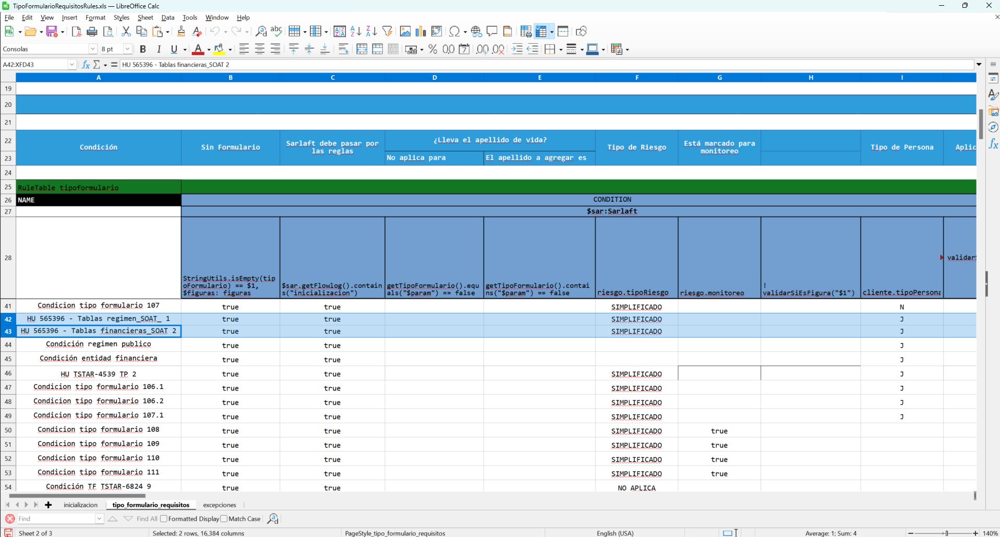

# Regla Tablas Paramétricas PJ_SOAT - Motor Evaluación Tipo Formulario

> **Fuente Confluence:** [Regla Tablas Paramétricas PJ_SOAT - Motor Evaluación Tipo Formulario](https://segurosti.atlassian.net/wiki/spaces/EPA/pages/3890151437)
> **Última modificación:** 2024-09-24 — Brayan Estiven Sepúlveda Quintero · versión 4
> **Sección:** [Motor de Evaluación](../index.md)

Se agregan dos nuevas reglas al motor de tipificación (formularios y requisitos), una para entidades de régimen y otra para entidades financieras:



Adjunto archivo con las nuevas reglas:

📎 [TipoFormularioRequisitosRules.xls](./attachments/TipoFormularioRequisitosRules.xls)

Adjunto colección de Postman con el caso de prueba para la regla de régimen y la regla de financieras:

[Enlace a la colección](https://suramericana.sharepoint.com/:f:/r/sites/MESA7-CALIDADDEINFORMACIN/Shared%20Documents/General/Proyecto%20SARLAFT%204.0/DocumentacionDesarrollo/IniciativaSoat_2024/Documentos%20Complementarios%20SARLAFT/sarlaft/motor/formularios?csf=1&web=1&e=5Ks2pT)

[Enlace a los ambientes](https://suramericana.sharepoint.com/:f:/r/sites/MESA7-CALIDADDEINFORMACIN/Shared%20Documents/General/Proyecto%20SARLAFT%204.0/DocumentacionDesarrollo/IniciativaSoat_2024/Documentos%20Complementarios%20SARLAFT/sarlaft?csf=1&web=1&e=JJ7Cu4)

Adicional se adjunta log de splunk para visualizar la regla que se ejecuta del motor:

```
index="idx_sarlaft4_*" message="*modulo=SARLAFTENGINE*" message="*response*" message="*252c3b83-a7bf-4932-b1f8-80637c3210c3*"
```

[Consulta Splunk](https://holmeslab.suramericana.com.co:9000/en-GB/app/group_center/search?earliest=-60m&latest=now&q=search%20index%3D%22idx_sarlaft4_*%22%20message%3D%22*modulo%3DSARLAFTENGINE*%22%20message%3D%22*response*%22%20message%3D%22*252c3b83-a7bf-4932-b1f8-80637c3210c3*%22&display.page.search.mode=fast&dispatch.sample_ratio=1&sid=1721221974.12532)
