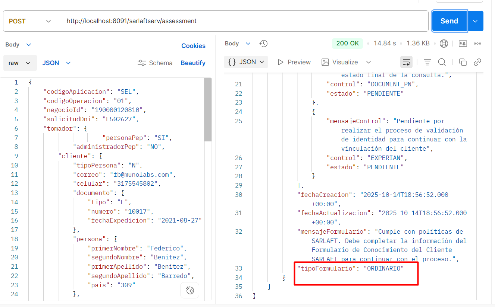

# Cómo desarrollar una HU para inclusión de reglas.

> **Fuente Confluence:** [Cómo desarrollar una HU para inclusión de reglas.](https://segurosti.atlassian.net/wiki/spaces/EPA/pages/5084020779)
> **Última modificación:** 2025-10-21 — Antiguo usuario (Deleted) · versión 6
> **Sección:** [Riesgo](./index.md)

Para el desarrollo de la HU es necesario tener configurado el [ambiente del motor](../ConfiguracionAmbienteMotorEvaluacion/index.md), también se recomienda por facilidad de pruebas tener configurado el [ambiente de SarlaftAPI](https://segurosti.atlassian.net/wiki/spaces/EPA/pages/1801159141/Configuraci%C3%B3n+Ambiente+-+SarlaftAPI).

Para el desarrollo de la HU ver los siguientes videos:

- [cómo se desarrolla una HU de inclusión de reglas](https://suramericana.sharepoint.com/sites/MESA7-CALIDADDEINFORMACIN/_layouts/15/stream.aspx?id=%2Fsites%2FMESA7%2DCALIDADDEINFORMACIN%2FShared%20Documents%2FGeneral%2FProyecto%20SARLAFT%204%2E0%2FDocumentacionDesarrollo%2FContextoAplicacion%2F15%5FSarlaft%204%2E0%20HU%5FReglasmotor%2Emp4&referrer=StreamWebApp%2EWeb&referrerScenario=AddressBarCopied%2Eview%2E96b11b24%2D94cd%2D4b18%2D9f4c%2D9a4f7456f04f) (parte 1).

- [cómo se desarrolla una HU de inclusión de reglas](https://suramericana.sharepoint.com/sites/MESA7-CALIDADDEINFORMACIN/_layouts/15/stream.aspx?id=%2Fsites%2FMESA7%2DCALIDADDEINFORMACIN%2FShared%20Documents%2FGeneral%2FProyecto%20SARLAFT%204%2E0%2FDocumentacionDesarrollo%2FContextoAplicacion%2F16%5FSarlaft%204%2E0%20HU%5FReglasmotor%20%2Emp4&referrer=StreamWebApp%2EWeb&referrerScenario=AddressBarCopied%2Eview%2Ed877be6c%2D356e%2D492a%2Dbd60%2D3232c46a681e) (parte 2).

Para realizar las pruebas de que todo corre según los criterios de aceptación de la historia de usuario(HU), se recomienda que leer [Servicio Evaluación](https://segurosti.atlassian.net/wiki/spaces/EPA/pages/3360751716/Servicio+Evaluaci%C3%B3n) y el body que puede colaborar es el siguiente:

```json
{
    "codigoAplicacion": "SEL",
    "codigoOperacion": "01",
    "negocioId": "190000120810",
    "solicitudDni": "E502627",
    "tomador": {
                    "personaPep": "SI",
            "administradorPep": "NO",
        "cliente": {
            "tipoPersona": "N",
            "correo": "fb@correo.com",
            "celular": "3103778293",
            "documento": {
                "tipo": "C",
                "numero": "78715719",
                "fechaExpedicion": "2021-08-27"
            },
            "persona": {
                "primerNombre": "Federico",
                "segundoNombre": "Benitez",
                "primerApellido": "Benitez",
                "segundoApellido": "Barredo",
                "pais": "309"
            },

            "relaciones": [
                {
                "relacionPeps": false,
                "tipo": "NINGUNO",
                "documento": {
                    "tipo": "",
                    "numero": ""
                },
                "persona": {
                    "primerNombre": "",
                    "primerApellido": ""
                }
                }
            ]
        }
    }
    ,
        "polizas": [
            {
                "codigoOficina": "22962",
                "codigoRamo": "190",
                "negocio": "INDIVIDUAL",
                "valorAsegurado": "6500000",
                "valorPrima": "1300000",
                "codigoCanal": "1",
                "codigoProducto": "1901",
                "codigoAgente": "57696"
            }
        ],
        "asegurados": [
            {
                "cliente": {
                    "tipoPersona": "N",
                    "correo": "fb@correo.com",
                    "celular": "3103778293",
                    "documento": {
                        "tipo": "E",
                        "numero": "502627",
                        "fechaExpedicion": "2021-08-27"
                    },
                    "persona": {
                        "primerNombre": "Federico",
                        "segundoNombre": "Yamandu",
                        "primerApellido": "Benitez",
                        "segundoApellido": "Barredo",
                        "pais": "309"
                    }
                },
                "personaPep": "No",
                "administradorPep": "No"
            }
        ]
}
```

Se debe evidenciar una respuesta similar a la de la Figura 1: respuesta Postman.



*Figura 1: respuesta Postman*
