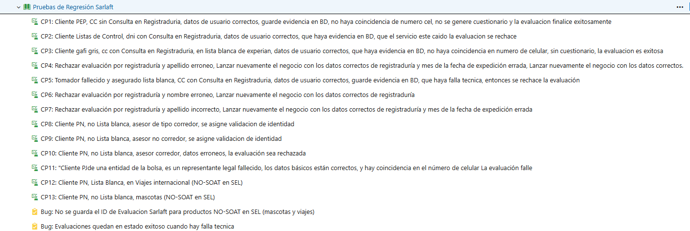

# Pruebas Orden Administrativa Soat / Frente Sarlaft

> **Fuente Confluence:** [Pruebas Orden Administrativa Soat / Frente Sarlaft](https://segurosti.atlassian.net/wiki/spaces/EPA/pages/3819175965/Pruebas+Orden+Administrativa+Soat+Frente+Sarlaft)
> **Última modificación:** 2024-06-19 — Natalia Sanchez Tangarife · versión 3
> **Sección:** Sarlaft 4.0 / Documentación Técnica
> **Estado:** En Construcción

Para la iniciativa se realizaron pruebas funcionales manuales en el cual el objetivo es validar que los desarrollos de validación de identidad, logs, mensajes de rechazo y actualización de asesores (adicionando los corredores al motor), no generaran hallazgos ni comportamientos inesperados al normal funcionamiento de esos flujos-.

Se realizaron los diferentes casos de prueba en las pruebas de regresión, los cuales se pueden encontrar en el siguiente enlace: [Historia 543866: Pruebas de Regresión Sarlaft - Boards (azure.com)](https://dev.azure.com/SuraColombia/Portafolios/_workitems/edit/543866)

