# Guía Básica Azure

> **Fuente Confluence:** [Guía Básica Azure](https://segurosti.atlassian.net/wiki/spaces/EPA/pages/2624749588)
> **Última modificación:** 2022-02-24 — Camila White (Unlicensed) · versión 2
> **Sección:** [Ingesta de datos Teradata](./index.md)

En este documento se realizará una explicación sencilla de como crear los elementos en los servicios de Azure usados para el transporte de información desde Azure PostgreSQL a Teradata.

### Azure Key Vault

Lo primero a tener en cuenta es la creación de un secreto desde Key Vault. Para esto, se requiere entrar al servicio, luego a la opción Secrets y seleccionar Generate/Import.

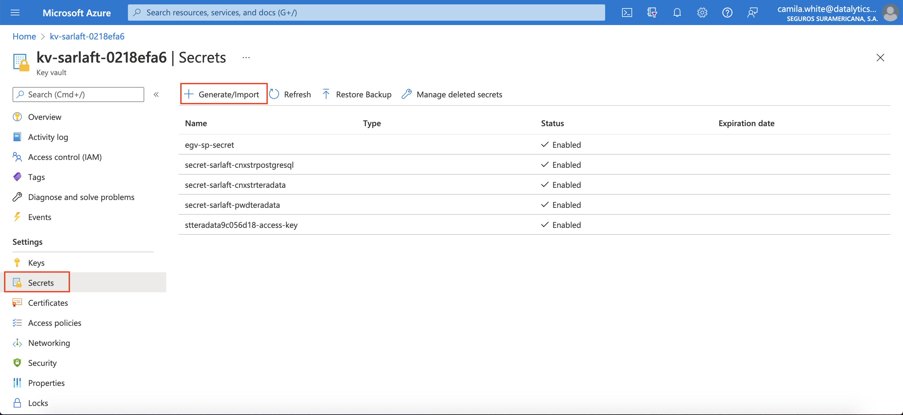

Ingresar el nombre del secreto que se desea crear, el valor a almacenar y por último dar click en crear.

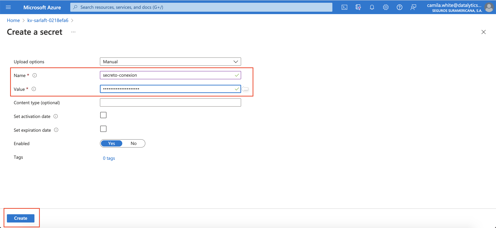

### Databricks

Para crear un notebook/directorio en databricks, dar click en alguna de las flechas seleccionadas (dependiendo de donde se desee crear)

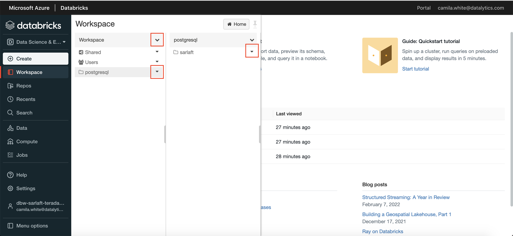

Y seleccionar del menú la opción deseada.

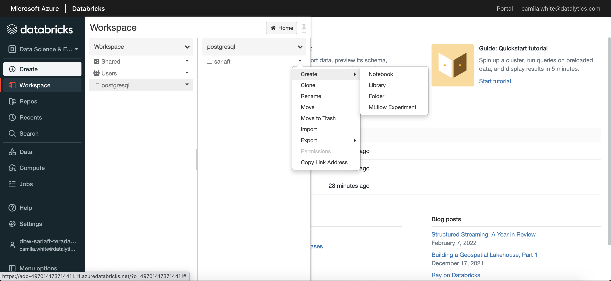

### Data Factory

Ingresar al servicio de Data Factory

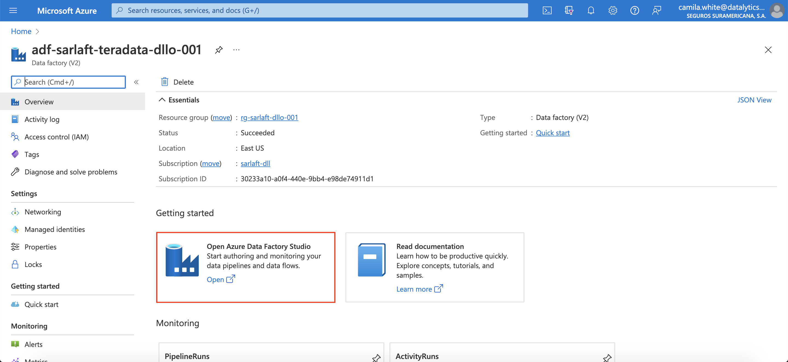

#### Linked Services

Lo primero a crear son los linked services necesarios para conectar Data Factory con otros servicios

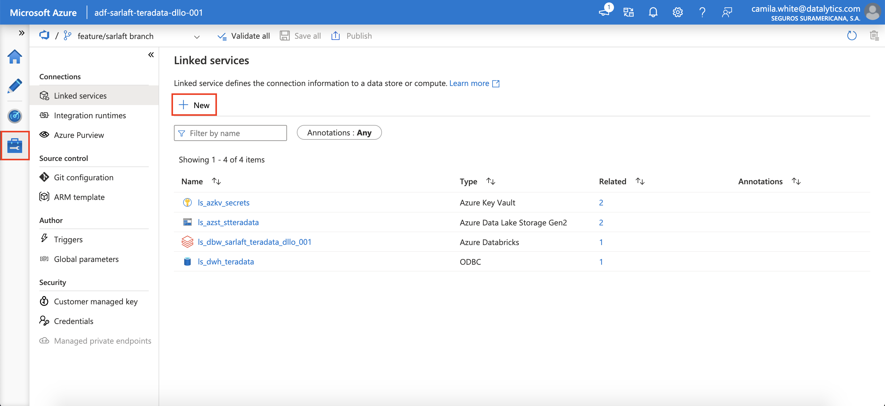

Seleccionar el servicio necesario, en este caso la demostración será con el servicio Azure Data Lake Storage.

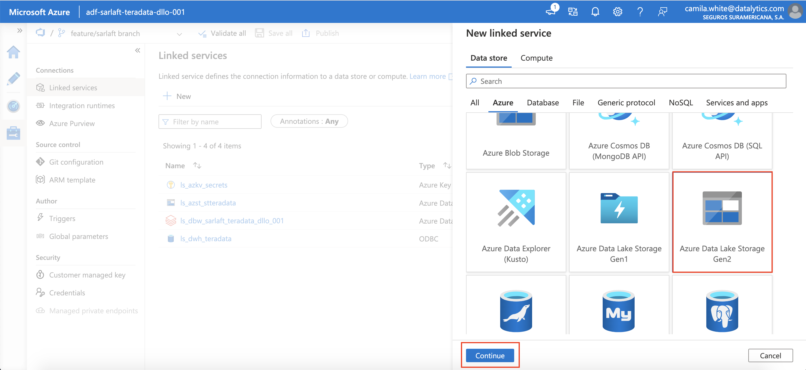

Ingresar los datos requeridos para la creación

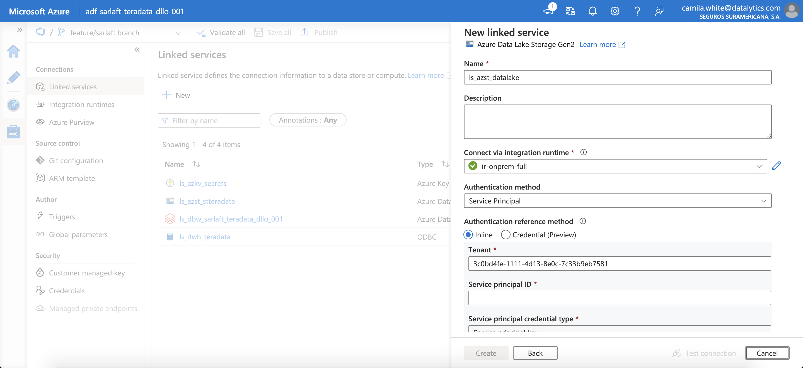

y luego dar click en crear.

#### Datasets

Ir a la vista de autor de Data Factory

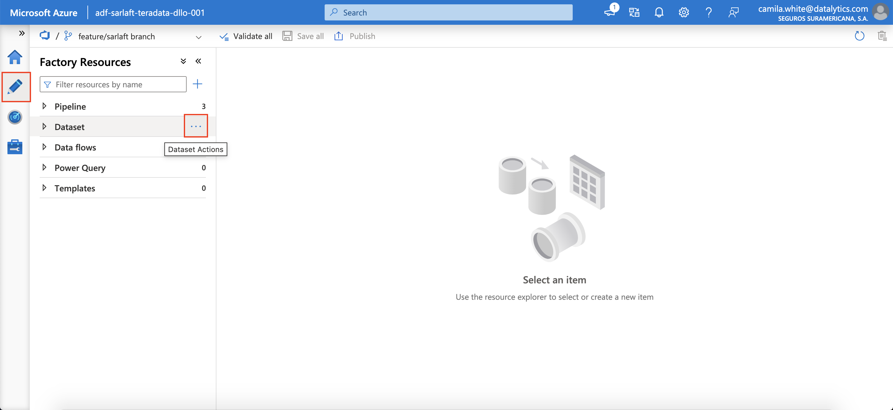

y crear un nuevo data set

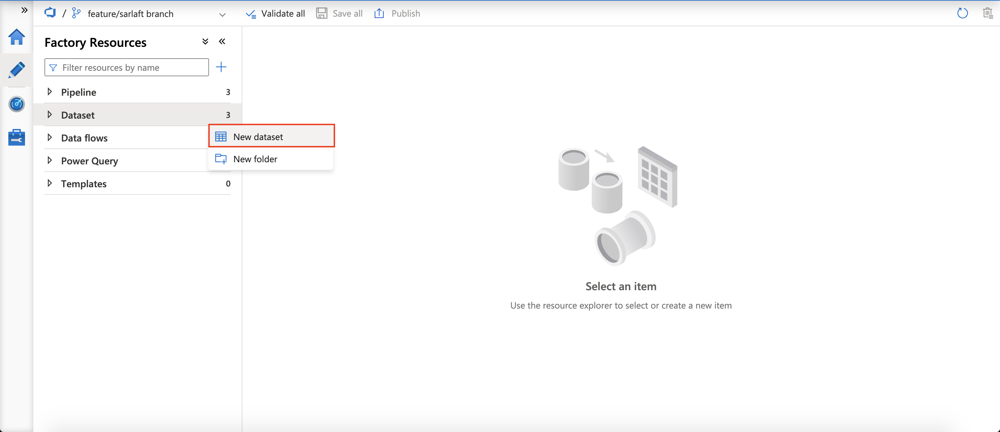

Seleccionar el servicio al que se le quiere crear el dataset y continuar

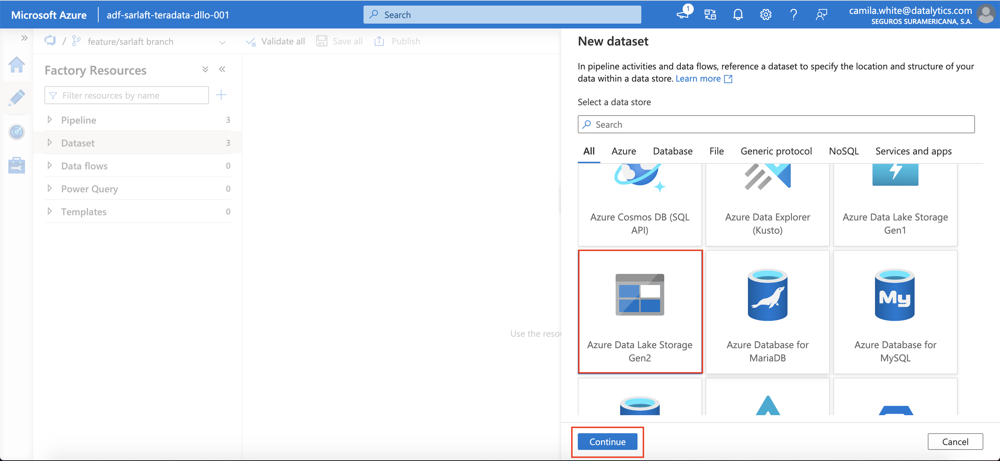

Ingresar el nombre del nuevo dataset y el linked service correspondiente

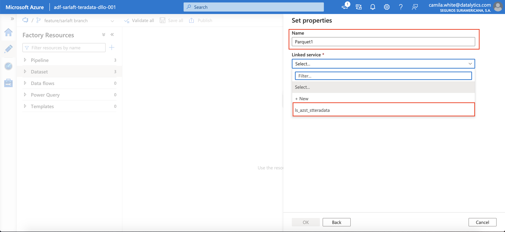
