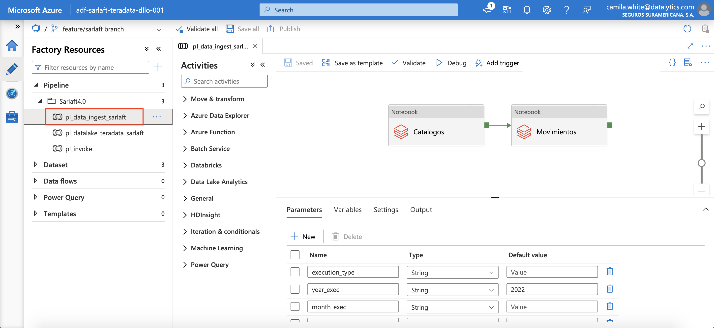

# Ingesta Databriks

> **Fuente Confluence:** [Ingesta Databriks](https://segurosti.atlassian.net/wiki/spaces/EPA/pages/2595258369)
> **Última modificación:** 2022-02-24 — Camila White (Unlicensed) · versión 6
> **Sección:** [Ingesta de datos Teradata](./index.md)

## Objetivo

Detallar el desarrollo técnico realizado en Azure para el EGV Administrativo y Financiero asociado a la orden administrativa SARLAFT.

La finalidad de esta fase del proceso es extraer la información almacenada en la base de datos de SARLAFT en PostgreSQL y almacenarla en formato parquet en un Storage Account.

## Recursos Utilizados

Para la implementación de esta solución se hizo uso de los siguientes recursos:

- Databricks: `dbw-sarlaft-teradata-dllo-001`.
- Storage Account: `stteradata9c056d18`.
- Key Vault: `kv-sarlaft-0218efa6`.
- Data Factory: `adf-sarlaft-teradata-dllo-001`.

## Descripción Solución

Para la implementación se hizo uso de Azure Key Vault para almacenar el secreto de conexión a la base de datos Sarlaft en PostgreSQL.

La fase se compone de dos elementos, la ingesta de catálogos y la de movimientos. La primera se maneja como carga full mientras que la segunda puede manejarse como carga full o delta por medio de un parámetro llamado `execution_type`.

Adicionalmente, se maneja unos utils los cuales son usados en todos los notebooks pertenecientes a este desarrollo.

#### Utils

Dentro de las utilidades se tienen los siguientes métodos, los cuales son usados en los demás notebooks pertenecientes a la implementación.

- `store_parquet`: Almacena la información contenida en un DataFrame como un parquet en el datalake.
- `generate_df`: Genera el DataFrame a almacenar como parquet en el Storage Account.
- `run_with_retry`: Corre un notebook de Databricks con reintentos.
- `get_df`: Obtiene un DataFrame a partir de un archivo ubicado en una ruta del Storage Account.
- `validation`: Compara el número de registros entre dos DataFrames.
- `insert_execution`: Para cada tabla a ingestar, se inserta la fecha maxima de actualización (o creación) que se tiene almacenada en el Storage Account y la fecha de ejecución.
- `get_max_date`: Obtiene la fecha máxima insertada en la tabla `executions` para el `table_name` ingresado.

#### Ingesta de Catálogos

En la ingesta de catálogos se manejan los parámetros de año, mes y día de ejecución, con el fin de almacenar el parquet generado en un directorio con la estructura

`consumption-zone-admin-financiero/sarlaft/catalogos/<año>/<mes>/<día>`

Adicionalmente, se realiza un query donde se obtiene la información de la tabla `tsaf_parametro` y `tsaf_aplicacion`; se almacena en un DataFrame y se almacena en el Storage Account.

#### Ingesta de Movimientos

En la ingesta de catálogos se manejan los parámetros de tipo de ejecución, año, mes y día de ejecución, con el fin de almacenar el parquet generado en un directorio con la estructura

`consumption-zone-admin-financiero/sarlaft/<nombre_tabla_ingestada>/<año>/<mes>/<día>`

Si el parámetro tipo de ejecución es true, se llama al notebook de Ingesta Movimientos Full que almacena la información del query de la tabla respectiva y lo almacena en el Storage Account, y adicional almacena en una tabla de Databricks (`sarlaft4_executions`) la fecha maxima de actualización para la tabla y la fecha en que se ejecuto el notebook.

Si el parámetro tipo de ejecución es false, se llama al notebook de Ingesta Movimientos Delta que almacena la información del query de la tabla respectiva donde se toman solo los datos desde la fecha maxima de actualización guardada en `sarlaft4_executions`, hasta la fecha actual; y lo almacena en el Storage Account, y adicional almacena en una tabla de Databricks la fecha maxima de actualización para la tabla y la fecha en que se ejecuto el notebook.

#### Pipeline Data Factory

Por ultimo, se realiza un pipeline en Data Factory donde se hace el llamado de los notebooks para correr la ingesta.

