# Trasporte Datafactory

> **Fuente Confluence:** [Trasporte Datafactory](https://segurosti.atlassian.net/wiki/spaces/EPA/pages/2595291151)
> **Última modificación:** 2022-02-17 — Camila White (Unlicensed) · versión 5
> **Sección:** [Ingesta de datos Teradata](./index.md)

## Objetivo

Detallar el desarrollo técnico realizado en Azure para el EGV Administrativo y Financiero asociado a la orden administrativa SARLAFT.

La finalidad del proceso es tomar la información de los archivos que se encuentran en formato parquet alojados en el Storage Account `stteradata9c056d18`, los cuales fueron generados por los procesos analíticos en Databricks y posteriormente ser cargados en Teradata.

Los archivos tienen las siguientes características:

- Formato del archivo: parquet.
- Incluye cabecera (nombre de las columnas de las tablas)

Y se encuentran almacenados en la ruta

**`consumption-zone-admin-financiero/sarlaft`**

- `consumption-zone-admin-financiero/sarlaft/catalogos/[YYYY]/[MM]/[DD]`
- `consumption-zone-admin-financiero/sarlaft/tsaf_asociacion/[YYYY]/[MM]/[DD]`
- `consumption-zone-admin-financiero/sarlaft/tsaf_cliente/[YYYY]/[MM]/[DD]`
- `consumption-zone-admin-financiero/sarlaft/tsaf_direccion/[YYYY]/[MM]/[DD]`
- `consumption-zone-admin-financiero/sarlaft/tsaf_entidad/[YYYY]/[MM]/[DD]`
- `consumption-zone-admin-financiero/sarlaft/tsaf_evaluacion/[YYYY]/[MM]/[DD]`
- `consumption-zone-admin-financiero/sarlaft/tsaf_evidencia/[YYYY]/[MM]/[DD]`
- `consumption-zone-admin-financiero/sarlaft/tsaf_figura/[YYYY]/[MM]/[DD]`
- `consumption-zone-admin-financiero/sarlaft/tsaf_financiero/[YYYY]/[MM]/[DD]`
- `consumption-zone-admin-financiero/sarlaft/tsaf_poliza/[YYYY]/[MM]/[DD]`
- `consumption-zone-admin-financiero/sarlaft/tsaf_relacion/[YYYY]/[MM]/[DD]`
- `consumption-zone-admin-financiero/sarlaft/tsaf_requisito/[YYYY]/[MM]/[DD]`
- `consumption-zone-admin-financiero/sarlaft/tsaf_riesgo/[YYYY]/[MM]/[DD]`
- `consumption-zone-admin-financiero/sarlaft/tsaf_sarlaft/[YYYY]/[MM]/[DD]`

Donde `[YYYY]` es el año de generación, `[MM]` el mes de generación y `[DD]` el día de generación del parquet.

La información de los parquet debe ser carga en las tablas de staging de Teradata:

- `BD_STAGING.T0138_CARACTERISTICAS_SARL`
- `BD_STAGING.T0240_REL_EMPRE_SARLAFT`
- `BD_STAGING.T0171_INFOBASICA_CLISARL`
- `BD_STAGING.T0171_INFOUBICACION_CLISARL`
- `BD_STAGING.T0198_ENTIDAD_SARLAFT`
- `BD_STAGING.T0187_EVALUACION_SARLAFT`
- `BD_STAGING.T0196_EVIDENCIA_SARLAFT`
- `BD_STAGING.T0241_ROL_FIGURA_SARLAFT`
- `BD_STAGING.T0240_DATOS_FINAN_SARLAFT`
- `BD_STAGING.T0242_NEGOCIO_SARLAFT`
- `BD_STAGING.T0240_RELS_PEPS_SARLAFT`
- `BD_STAGING.T0196_REQUISITO_SARLAFT`
- `BD_STAGING.T0243_RIESGO_SARLAFT`
- `BD_STAGING.T0197_FORM_SARLAFT`

## Recursos Utilizados

Para la implementación de esta solución se hizo uso de los siguientes recursos:

- Storage Account: `stteradata9c056d18`.
- Key Vault: `kv-sarlaft-0218efa6`.
- Data Factory: `adf-sarlaft-teradata-dllo-001`.

## Descripción Solución

#### Key Vault

Para la implementación se hizo uso de Azure Key Vault para almacenar el secreto de conexión a Teradata.

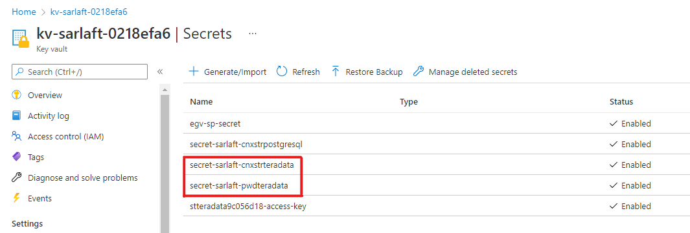

#### Linked Services

Luego se crearon los Linked Service necesarios para la conexión al Storage Account y Teradata.

- `lz_azkv_secrets`: es el linked service a Azure Key Vault que permite a Data Factory acceder a los secretos almacenados.
- `ls_azst_stteradata`: es el linked service a Storage Account que permite a Data Factory acceder a los parquet almacenados en `stteradata9c056d18`.
- `ls_dwh_teradata`: es el linked service que se conecta al Data Warehouse Teradata.

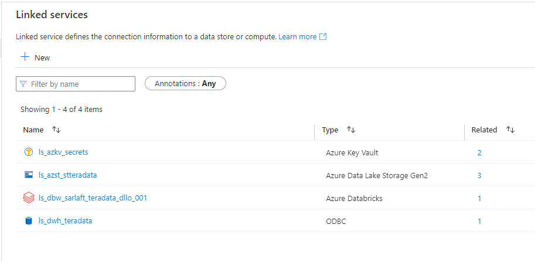

#### Datasets

Se creó el dataset de conexión al Storage Account y a Teradata.

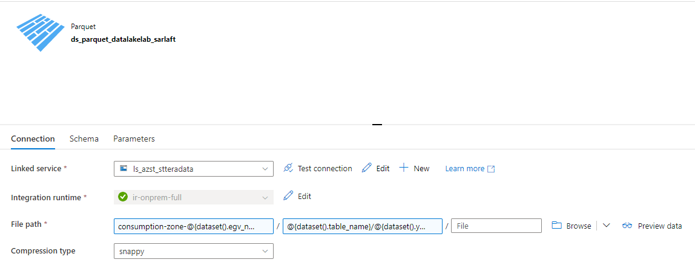

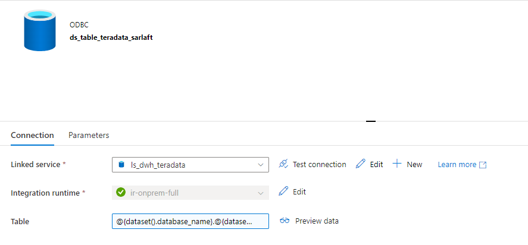

Adicionalmente, se creó un dataset que hace referencia a un archivo csv, el cual contiene el nombre de las tablas almacenadas en el Storage Account y Teradata.

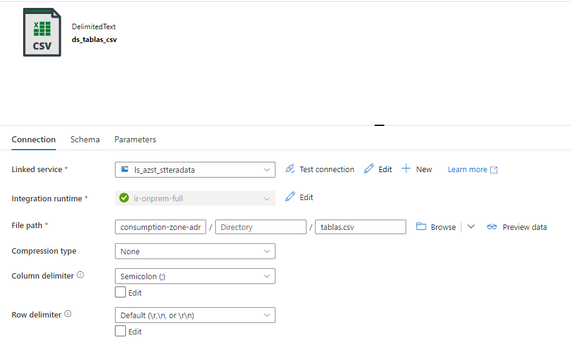

#### Pipeline base

Por último, se implementó el pipeline de transporte, el cual valida si en el Storage Account existe el archivo y si si existe, se hace la copia de los parquet desde fuente hasta las tablas de Teradata.

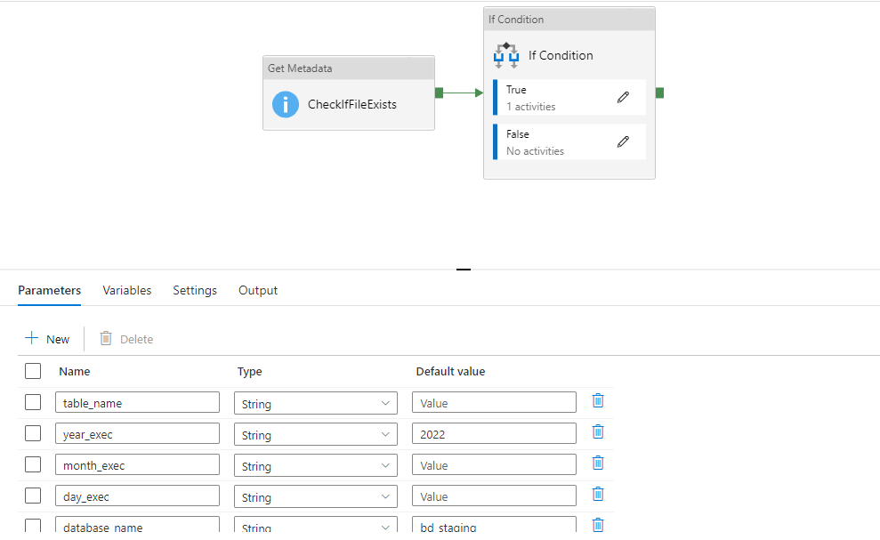

Dentro del If Condition, se encuentra la actividad de copiado de datos

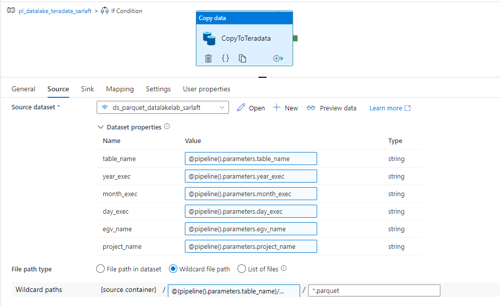

**Parámetros Fuente:**

- `table_name`: nombre de la tabla en el Storage Account.
- `year_exec`: Año que se quiere transportar a Teradata.
- `month_exec`: Mes que se quiere transportar a Teradata.
- `day_exec`: Día que se quiere transportar a Teradata.
- `egv_name`: Nombre del EGV, en este caso es `admin-financiero`.
- `project_name`: Nombre del proyecto, en este caso es `sarlaft`.

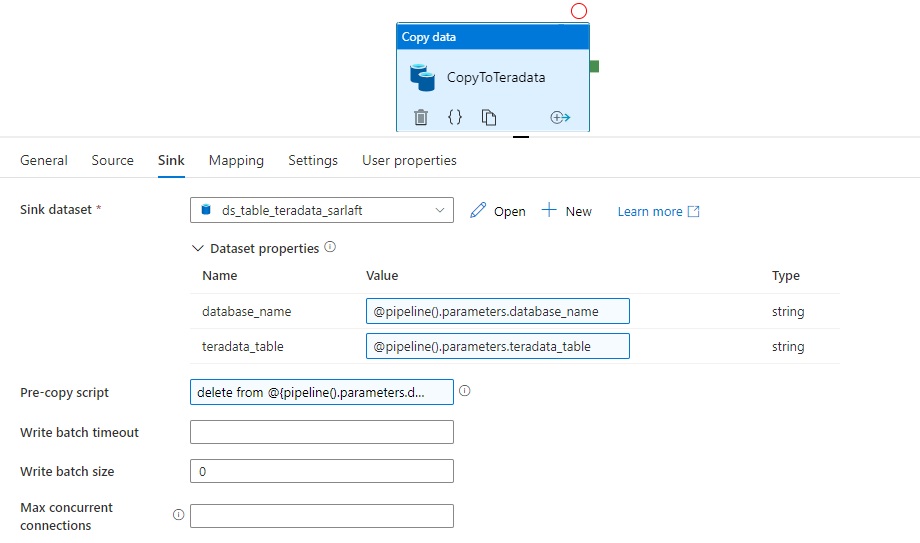

**Parámetros Destino:**

- `database_name`: Nombre del esquema de la base de datos donde están las tablas de staging, en este caso es `bd_staging`.
- `teradata_table`: Nombre de la tabla de staging donde se va a insertar la información.

Antes de realizar la copia de los datos a Teradata, se realiza un borre de la tabla de staging.

#### Pipeline principal

Por ultimo, se construye el pipeline principal que hace el llamado al pipeline de ingesta y al pipeline de transporte.

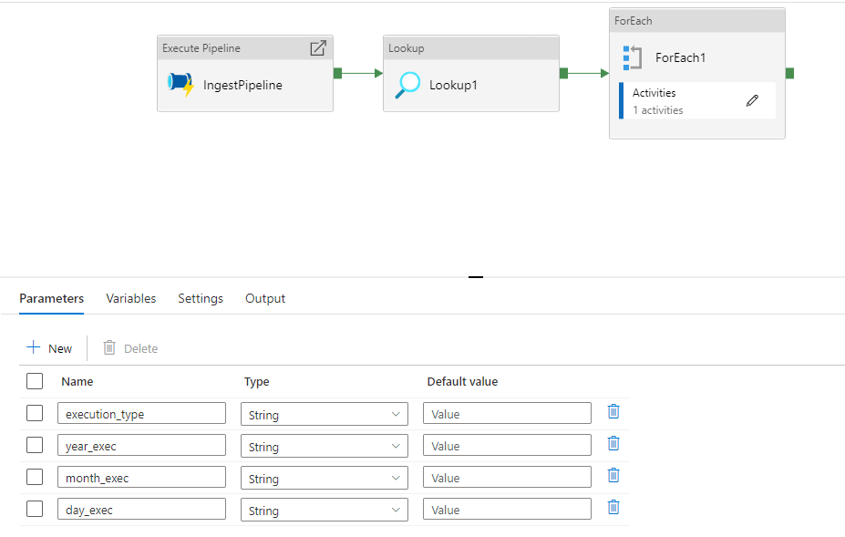

1. El paso uno del pipeline es ejecutar la ingesta, en el cual se llama el pipeline ya creado de ingesta de datos.
2. Luego se obtiene el csv que contiene los nombres de las tablas.
3. Por ultimo se itera sobre el archivo obtenido en el punto 2 y se llama al pipeline de transporte, pasándole el nombre de la tabla en el Storage Account y de la tabla de Teradata.

Este es el pipeline que debe ejecutarse, de la siguiente manera:

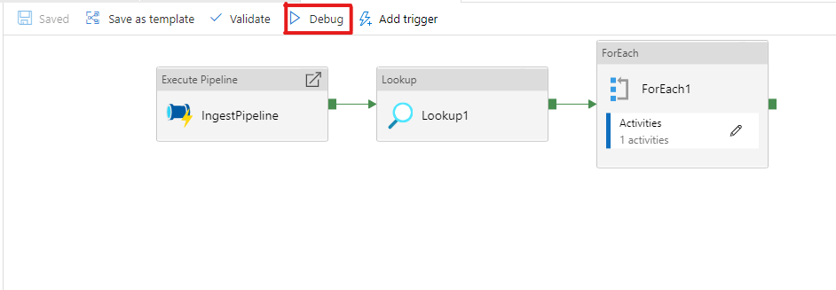

Ingresar los valores de los parámetros y luego darle ok.

- `execution_type`: se debe ingresar `true` si el tipo de ingesta es full; de lo contrario se ingresa `false` para hacer una carga delta.

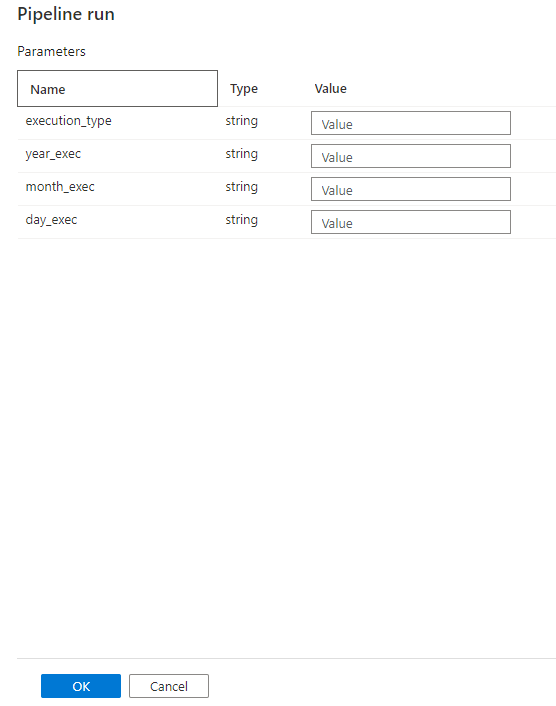
