# Solucion Datafactory

> **Fuente Confluence:** [Solucion Datafactory](https://segurosti.atlassian.net/wiki/spaces/EPA/pages/3715661855)
> **Última modificación:** 2024-06-04 — Mauricio Marin Martinez · versión 14
> **Sección:** [Proceso de Actualización](./index.md)

Debido a la necesidad de encontrar una solución mucho mas optima en la ejecución del query, ya que la cantidad de información alojada en las bases de datos es bastante pesada, se pensó en una solución que pudiera tomar dicho query y ejecutarlo en una herramienta de ETL Azure Datafactory y así evitar que la carga de procesamiento recaiga en el microservicio.

La solución se trata básicamente en ejecutar el query en un pipeline llamado `selectCandidatos`, que tome los datos del query y los almacene en archivos blob en formato `.parquet`.

## Origen

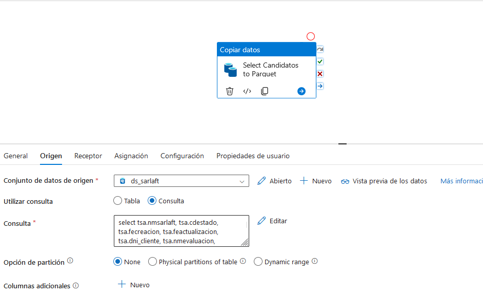

## Receptor

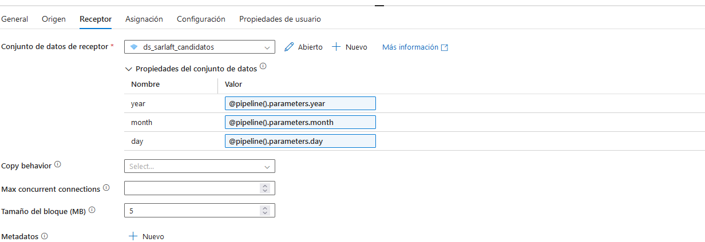

## Asignación

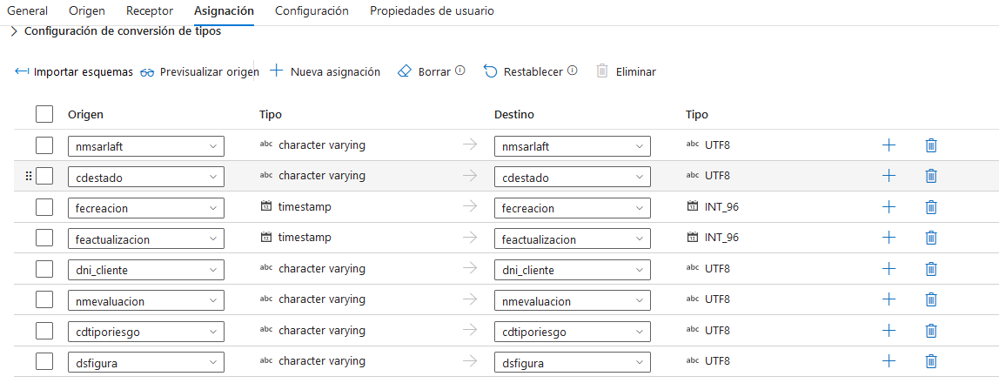

Los archivos quedarán guardados en el siguiente contenedor, por año, mes y día.

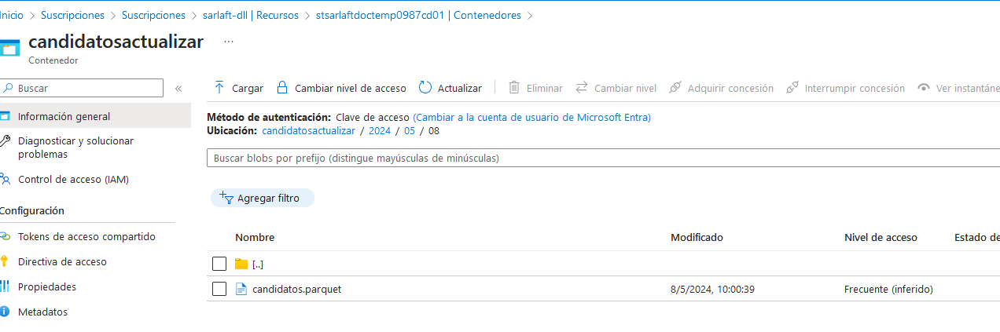

De esta manera, la información recopilada de la consulta, quedara almacenada en archivos `.parquet` que posteriormente van a ser leídos y procesados mediante el siguiente flujo de datos:

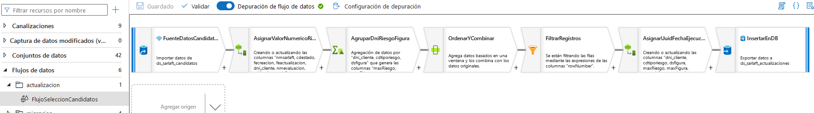

- **FuenteDatosCandidatos:** Importa los datos almacenados en los archivos `.parquet`. Es el conjunto de datos que va a ser procesado.
- **AsignarValorNumericoRiesgoYFigura**: Asigna valores numéricos de acuerdo a importancia o prioridad del riesgo y de las figuras con las siguientes expresiones:

RiesgoNumerico:

```csharp
iif(cdtiporiesgo=="NO_APLICA", 5, iif(cdtiporiesgo=="INTENSIFICADO_MONITOREO", 4, iif(cdtiporiesgo=="INTENSIFICADO", 3, iif(cdtiporiesgo=="ORDINARIO", 2, iif(cdtiporiesgo=="SIMPLIFICADO", 1, 0)))))
```

FiguraNumerico:

```csharp
iif(dsfigura=="TOMADOR", 5, iif(dsfigura=="ASEGURADO", 4, iif(dsfigura=="BENEFICIARIO", 3, iif(dsfigura=="AFIANZADO", 2, iif(dsfigura=="AFILIADO", 1, 0)))))
```

Teniendo como resultado dos nuevas columnas con valores numéricos para el riesgo y figura y así poder realizar operaciones con éstos.

- **AgruparDniRiesgoFigura:** Realiza la agrupación por `dni_cliente`, `cdtiporiesgo` y `dsfigura` de tal manera que podamos obtener las combinaciones agrupadas por estos campos, y adicional utilizar operaciones de agregación como `max(riesgoNumerico)` y `max(figuraNumerico)`. Esto se hace con el fin de eliminar duplicados y obtener los primeros registros que cumplan con los criterios de agrupación.
- **OrdenarYCombinar:** Es una función de ventana que permite a través de ciertos criterios, asignar un ordenamiento y darle un nivel a dicho ordenamiento. Para el caso particular de esta solución, el ordenamiento se hace en función del campo `dni_cliente`, se ordena por `maxRiesgo` y `maxfigura` de manera descendente y se asigna el valor del `rowNumber` para segregar estos ordenamientos para cada `dni_cliente`. De esta manera tendremos como el primer resultado el valor 1 para el registro que cumpla con las características de máximo riesgo y máxima figura.
- **FiltrarRegistros:** Se realiza el filtrado de la información basado en la expresión `rowNumber==1` con el fin de entregar como resultado las filas que cumplan con las características de máximo riesgo y máxima figura.
- **AsignarUuidFechaEjecucion:** Se asigna para cada registro un uuid único y se captura ya le fecha y hora actual en formato timestamp, tambien se crea una nueva columna llamada `cdestadoRegistro` para asignar estado `PENDIENTE` a cada registro. Estas son columnas adicionales.
- **InsertarEnDB**: Realiza la inserción hacia la base de datos, de acuerdo al siguiente mapeo:

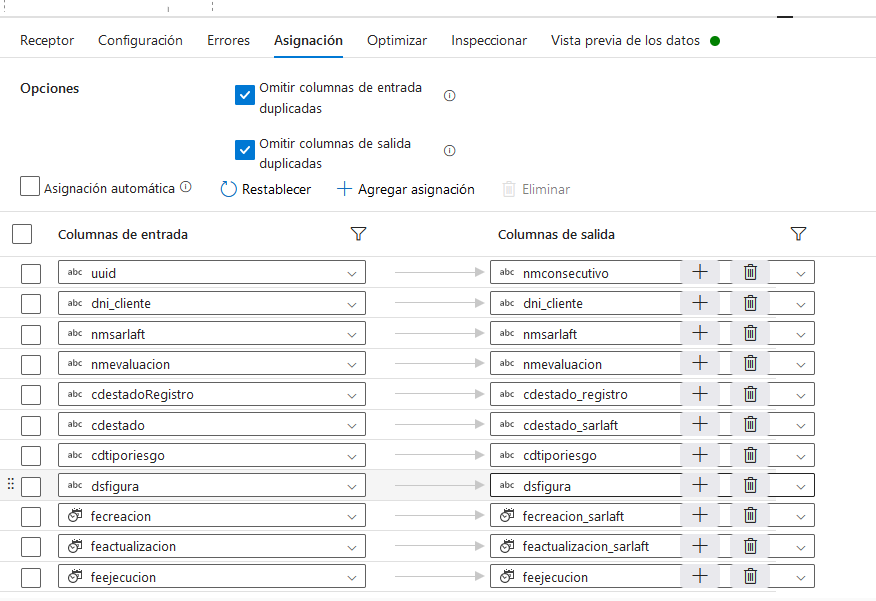

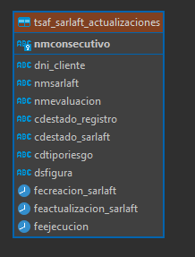

Nota: Con este procesamiento se realiza la selección de candidatos a actualizar y además la unificación del riesgo.

Finalmente se creó un pipeline llamado `procesarCandidatos` que se va a encargar de ejecutar el flujo de datos que procesa la información y la inserta en la base de datos:

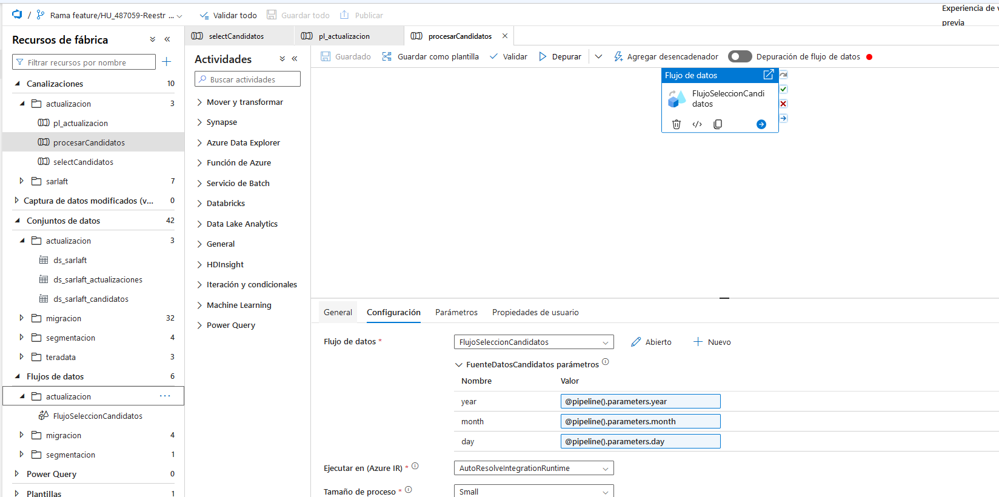

También se creó un nuevo pipeline llamado `pl_actualizacion` que se va a encargar de ejecutar el pipeline `selectCandidatos` y `procesarCandidatos` enviándole los parámetros necesarios:

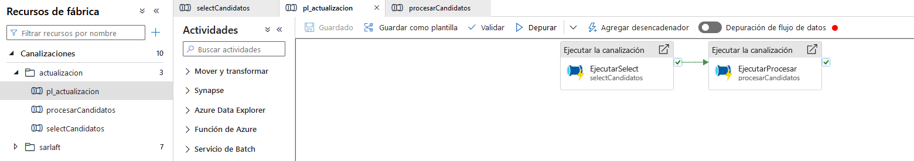

## Configuración del proyecto

Repositorio: <https://dev.azure.com/SuraColombia/Gerencia_Tecnologia/_git/892-sarlaft4_adm_y_fin_sarlaft-md>

Pipeline: <https://dev.azure.com/SuraColombia/Gerencia_Tecnologia/_build?definitionId=3799>

En la presente solución se encuentran configurados los siguientes linkedServices:

- **ls_sarlaft_db**: Conexión hacia la base de datos de escritura. La autenticación se hace mediante el keyvault y la cadena de conexión se encuentra protegida por el siguiente secretName: `s4sarlaftbdconn`
- **ls_sarlaft_db_read**: Conexión hacia la base de datos de solo lectura. La autenticación se hace mediante el keyvault y la cadena de conexión se encuentra protegida por el siguiente secretName: `s4sarlaftbdreadconn`
- **ls_st_sarlaft_storage**: Conexión hacia el contenedor de almacenamiento de Azure. La autenticación se hace mediante el keyvault y la cadena de conexión se encuentra protegida por el siguiente secretName: `s4stdoctempconn`

Nota: Dentro del recurso de almacenamiento debe crearse el contenedor **candidatosactualizar** ya que allí se van a almacenar los archivos `.parquet` por año, mes y día.

Luego de realizar el desarrollo de la solución en la rama feature, es necesario realizar un pull request hacia la rama master. Cuando los cambios ya se encuentran en la rama master, se deben publicar desde la misma herramienta de datafactory, ya que de esta manera se generan los archivos ARM que son los insumos para que el pipeline de Azure Devops despliegue en los diferentes ambientes.

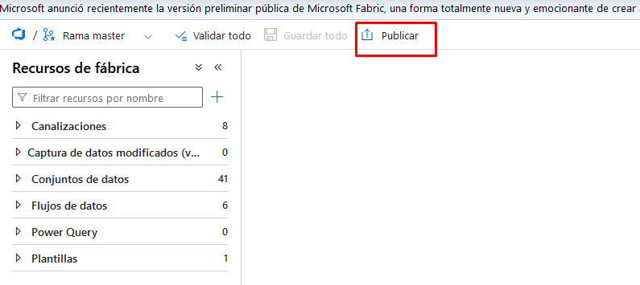

Luego de publicar, la rama `adf_publish` del mismo proyecto queda con la siguiente estructura:

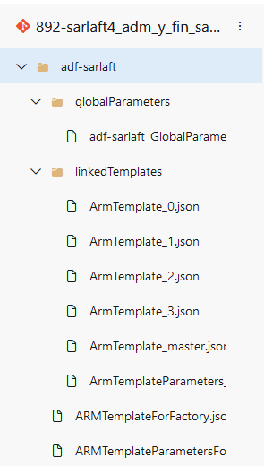

Como hay algunas propiedades que deben cambiarse por ambientes, se deben configurar los siguientes archivos:

Se toma como **ejemplo** el despliegue en lab

- **azure-pipelines.yaml:**

```yaml
trigger:
 branches:
   include:
     - adf_publish

resources:
 repositories:
   - repository: templates
     type: git
     ref: adf_publish
     name: Gerencia_Tecnologia/892-sarlaft4_adm_y_fin_sarlaft-md

jobs:
  - job: LimpiarJson
    displayName: 'Limpiar automaticamente para despliegue en laboratorio, modificacion de plantillas'
    pool:
      vmImage: 'ubuntu-latest'
    steps:
      - powershell: |
          # Referenciar el json

          $path = "$(Build.SourcesDirectory)/adf-sarlaft/ARMTemplateParametersForFactory.json"
          $templateParams = Get-Content -Path $path | ConvertFrom-Json
          # Realiza las modificaciones necesarias
          $templateParams.parameters.ls_oracle_pdn_connectionString.value = ''
          $templateParams.parameters.InitProcessBatchSarlaft_properties_typeProperties_url.value = 'https://sarlaftapi.labsura.com'
          $templateParams.parameters.InitProcessBatchSarlaft_properties_typeProperties_userName.value = 'IMPMASIVOS'
          $templateParams.parameters.ls_azst_datalakepdn_properties_typeProperties_url.value = ''
          $templateParams.parameters.ls_azst_saralftpdn_properties_typeProperties_url.value = 'https://stteradata9c056d18.dfs.core.windows.net/'
          # Verifica si la propiedad ir-onprem-full_properties_typeProperties_linkedInfo_resourceId existe antes de intentar eliminarla
           if ($templateParams.parameters.'ir-onprem-full_properties_typeProperties_linkedInfo_resourceId') {
            $templateParams.parameters.PSObject.Properties.Remove("ir-onprem-full_properties_typeProperties_linkedInfo_resourceId")
            }
          $templateParams | ConvertTo-Json  -Depth 100 | Set-Content -Path $path

          $factoryPath = "$(Build.SourcesDirectory)/adf-sarlaft/ARMTemplateForFactory.json"
          $templateParamsFactory = Get-Content -Path $factoryPath | ConvertFrom-Json

            $templateParamsFactory.resources | ForEach-Object {
                if ($_.type -eq "Microsoft.DataFactory/factories/integrationRuntimes") {
                    $_.properties.type = "Managed"
                    $_.properties.typeProperties.computeProperties.location = "AutoResolve"
                    if ($_.properties.typeProperties.linkedInfo) {
                        $_.properties.typeProperties.PSObject.Properties.Remove("linkedInfo")
                    }
                }
            }
            if ($templateParamsFactory.parameters.'ir-onprem-full_properties_typeProperties_linkedInfo_resourceId') {
            $templateParamsFactory.parameters.PSObject.Properties.Remove("ir-onprem-full_properties_typeProperties_linkedInfo_resourceId")
            }
            $templateParamsFactory | ConvertTo-Json  -Depth 100 | Set-Content -Path $factoryPath

        displayName: 'Limpiar automaticamente para despliegue en laboratorio, modificacion de plantillas, este paso solo es en laboratorio'
  

  - template: adf-sarlaft/template_adf_sarlaft_lab.yaml@templates
    parameters:
     pdnSubscriptionId:       'f6278fb3-d372-470e-b355-70025248eb80'
     labSubscriptionId:       '30233a10-a0f4-440e-9bb4-e98de74911d1'
     gitRepositoryName:       '892-sarlaft4_adm_y_fin_sarlaft-md'
     pdnManagerConnection:    'sarlaft-lab(f6278fb3-d372-470e-b355-70025248eb80)'
     labManagerConnection:    'sarlaft-dll(30233a10-a0f4-440e-9bb4-e98de74911d1)'
     serviceConnection:       'sarlaft-lab(f6278fb3-d372-470e-b355-70025248eb80)'
     storageAccountUrl:       'https://stsarlaftdoctempfbb19a58.dfs.core.windows.net/'
     labDatafactoryName:      'adf-sarlaft'
     pdnResourceGroupName:    'rg-sarlaft-lab-001'
     labResourceGroupName:    'rg-sarlaft-dllo-001'
     pdnDatafactoryName:      'adf-sarlaft-lab'
     pdnKeyvaultName:         'kv-sarlaft-ed0799da'
     pdnKeyvaultUrl:          'https://kv-sarlaft-ed0799da.vault.azure.net/'
     extraOverrideParameters: '-ls_keyvaul_sarlaft_properties_typeProperties_baseUrl "https://kv-sarlaft-ed0799da.vault.azure.net/"'
```

*Nota: El Job LimpiarJson solo aplica para el paso a Laboratorio, debido a que los archivos template generados contienen propiedades que aplican únicamente a produccion. Por tal motivo se sobreescriben ciertas propiedades, se eliminan y adicional se cambia la estrategia del Integration Runtime para que sea Auto Resolved.*

Los parametros aqui descritos describen el paso de dllo hacia lab.

En el parámetro `extraOverrideParameters` se pueden sobrescribir parámetros de los linkedServices que cambian por ambiente, en este caso la configuración del keyvault donde se encuentran las conexiones hacia los diferentes recursos.

Para el caso del paso a laboratorio se tiene: `-ls_keyvaul_sarlaft_properties_typeProperties_baseUrl "https://kv-sarlaft-ed0799da.vault.azure.net/"` Este parametro debe sobreeescribirse en el azure-pipelines que aplica ya que es diferente para cada ambiente. Para los secretName tambien se pueden sobreescribir en caso de que se creen con nombre diferentes entre ambientes.

- **template_adf_sarlaft_lab.yaml:** Archivo template donde se describen los diferentes jobs que se deben ejecutar en el pipeline de Azure Devops.

De esta manera quedaría listo para subir los cambios a la rama `adf_publish`, ejecutar el pipeline para realizar el despliegue a laboratorio.

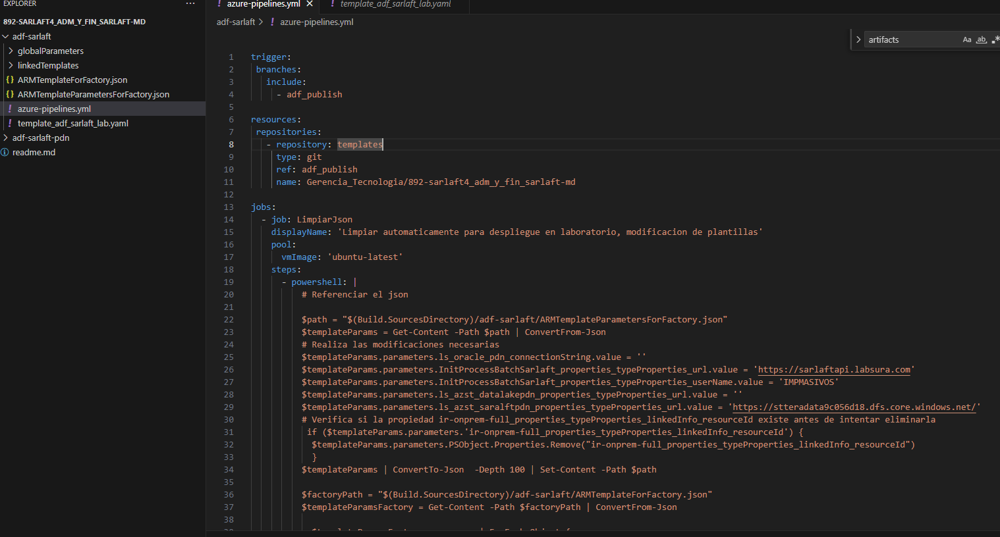

Referencia: [Pipeline y Despliegue Laboratorio](https://segurosti.atlassian.net/wiki/spaces/EPA/pages/3046277232)
