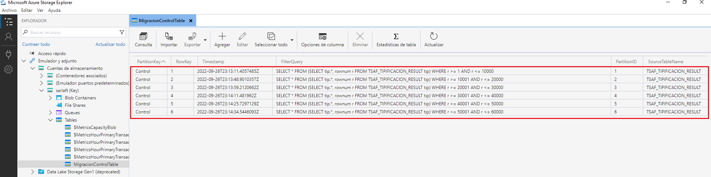
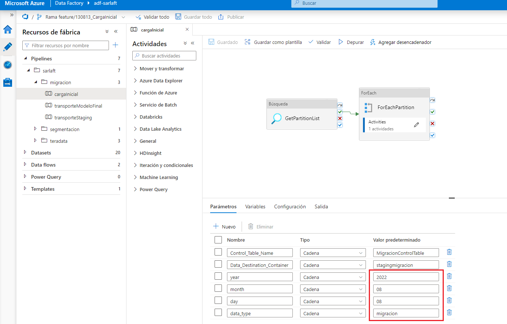
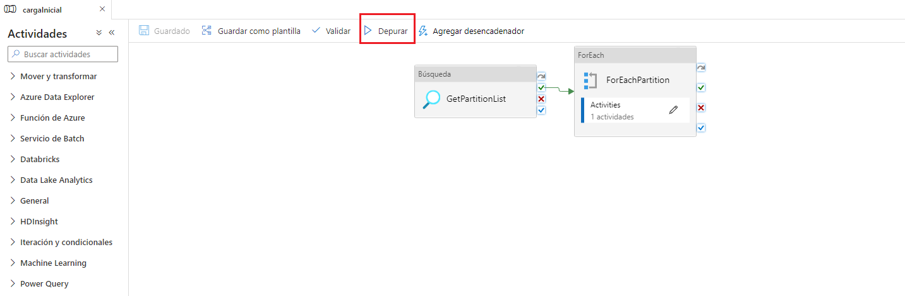
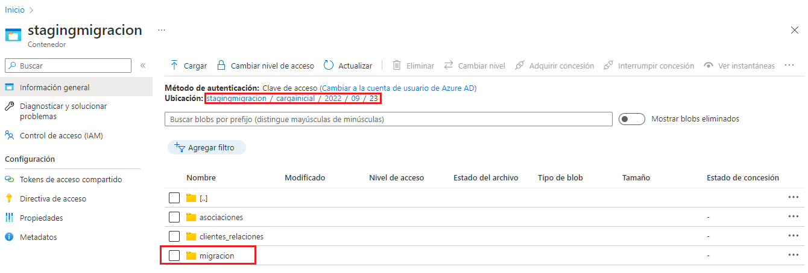
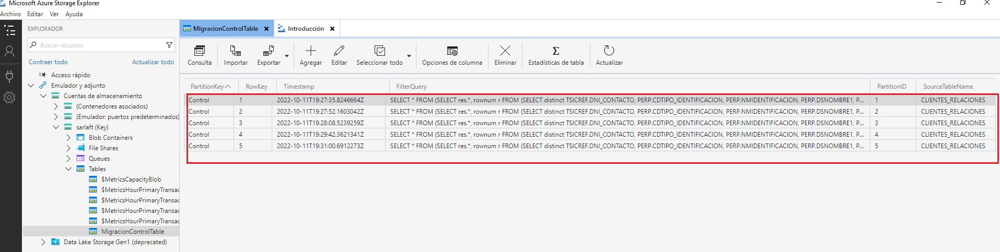
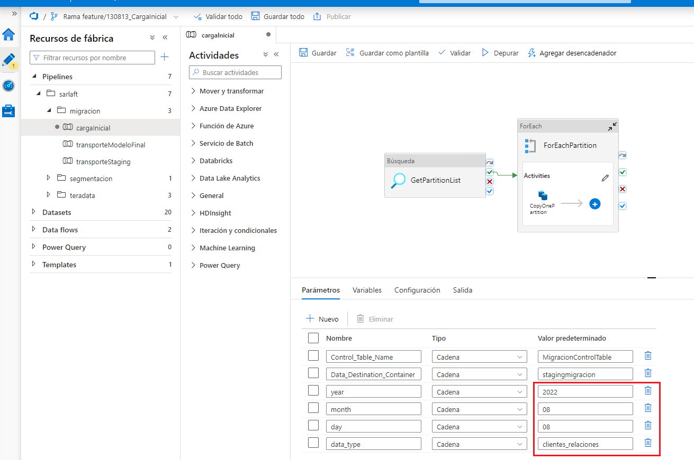
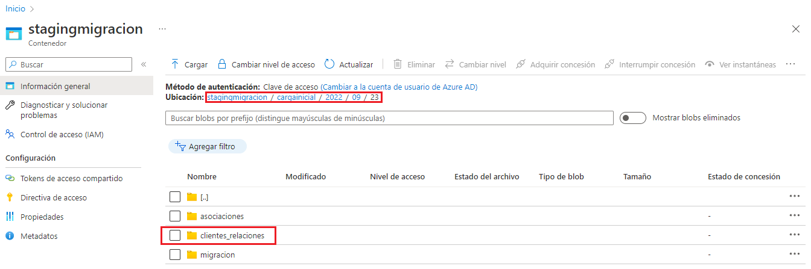
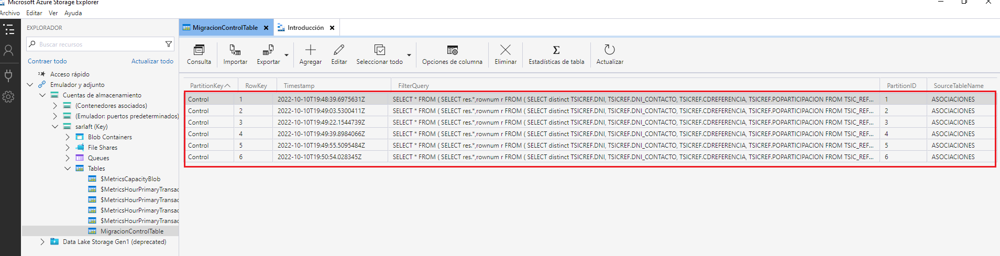
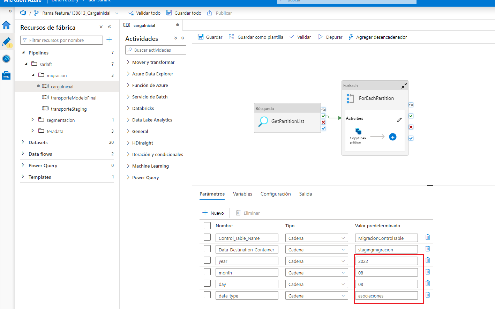
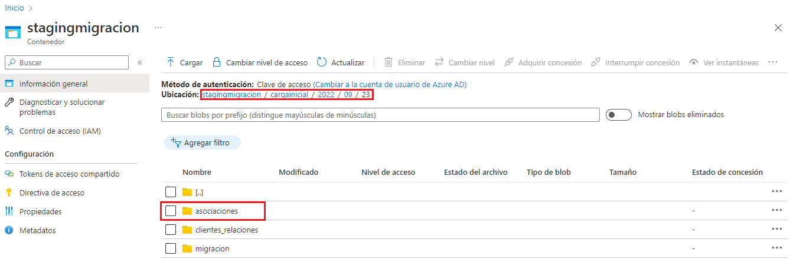

# Pipeline de carga inicial

> **Fuente Confluence:** [Pipeline de carga inicial](https://segurosti.atlassian.net/wiki/spaces/EPA/pages/2917892135/Pipeline+de+carga+inicial)
> **Última modificación:** 2022-10-11 — Diego Alejandro Vélez González · versión 6
> **Sección:** [Migración - Transporte Modelo Sarlaft 4.0](./index.md)

A continuación se ejemplifican los pasos que se deben ejecutar en la utilización del pipeline de carga inicial para obtener como resultado final los directorios que tendrán los archivos `.parquet` con la información migrada del modelo de oracle.

### 1. Correr el pipeline para tipificación

En la tabla de control `MigracionControlTable` en el storage account agregar el número de veces que sea necesario los queries correspondientes a los sarlafts a migrar.

Query base:

*SELECT \* FROM (SELECT tip.\*, rownum r FROM TSAF\_TIPIFICACION\_RESULT tip) WHERE r >= 1 AND r <= 10000*

En el query base anterior se utiliza una partición de 10000 registros para 6 particiones, queda pendiente definir la cantidad de registros y particiones que se van a utilizar en producción.

En el servicio de Data Factory, en el pipeline de `cargaInicial` asegurarse de ingresar los parámetros adecuados para la fecha actual (year, month, day). Para el campo `data_type` se debe ingresar el valor **migracion**.

Correr el pipeline de `cargaInicial` dando click en el botón depurar

Los archivos `.parquet` con los registros correspondientes a los queries corridos en el pipeline quedan alojados en el directorio **migracion** del contenedor *stagingmigracion* para la fecha actual.

### 2. Correr el pipeline para representantes legales y accionistas

En la tabla de control `MigracionControlTable` en el storage account eliminar los queries agregados anteriormente y agregar el número de veces que sea necesario los queries correspondientes a los clientes de tipo representante legal y accionistas a migrar.

Query base:

*SELECT \* FROM (SELECT res.\*, rownum r FROM (SELECT distinct TSICREF.DNI\_CONTACTO, PERP.CDTIPO\_IDENTIFICACION, PERP.NMIDENTIFICACION, PERP.DSNOMBRE1, PERP.DSNOMBRE2, PERP.DSAPELLIDO1, PERP.DSAPELLIDO2, PERP.DSCELULAR, PERP.DSE\_MAIL, PERP.FNACIM FROM TSIC\_REFERENCIA\_PERS TSICREF INNER JOIN PERSONAS PERP ON TSICREF.DNI\_CONTACTO = PERP.DNI AND TSICREF.CDREFERENCIA IN ('RL', 'CO') AND TSICREF.FEBAJA IS NULL INNER JOIN TSAF\_TIPIFICACION\_RESULT TIP ON TIP.DNI = TSICREF.DNI) res) WHERE r >= 1 AND r <= 50*

En el query base anterior se utiliza una partición de 50 registros para 5 particiones, queda pendiente definir la cantidad de registros y particiones que se van a utilizar en producción.

En el servicio de Data Factory, en el pipeline de `cargaInicial` asegurarse de ingresar los parámetros adecuados para la fecha actual (year, month, day). Para el campo `data_type` se debe ingresar el valor **clientes_relaciones**.

Correr de nuevo el pipeline de `cargaInicial` teniendo en cuenta que los archivos `.parquet` con los registros quedan alojados en el directorio **clientes_relaciones** del contenedor *stagingmigracion* para la fecha correspondiente.

### 2. Correr el pipeline para las asociaciones

En la tabla de control *MigracionControlTable* en el storage account eliminar los queries agregados anteriormente y agregar el número de veces que sea necesario los queries correspondientes a las asociaciones a migrar.

Query base:

SELECT \* FROM (SELECT res.\*,rownum r FROM (SELECT distinct TSICREF.DNI, TSICREF.DNI\_CONTACTO, TSICREF.CDREFERENCIA, TSICREF.POPARTICIPACION FROM TSIC\_REFERENCIA\_PERS TSICREF INNER JOIN PERSONAS PERP ON TSICREF.DNI\_CONTACTO = PERP.DNI AND TSICREF.CDREFERENCIA IN ('RL', 'CO') AND TSICREF.FEBAJA IS NULL INNER JOIN TSAF\_TIPIFICACION\_RESULT TIP ON TIP.DNI = TSICREF.DNI) res) WHERE r >= 1 AND r <= 60

En el query base anterior se utiliza una partición de 60 registros para 6 particiones, queda pendiente definir la cantidad de registros y particiones que se van a utilizar en producción.

En el servicio de Data Factory, en el pipeline de `cargaInicial` asegurarse de ingresar los parámetros adecuados para la fecha actual (year, month, day). Para el campo `data_type` se debe ingresar el valor **asociaciones**.

Correr de nuevo el pipeline de `cargaInicial` teniendo en cuenta que los archivos `.parquet` con los registros quedan alojados en el directorio **asociaciones** del contenedor *stagingmigracion* para la fecha correspondiente.

