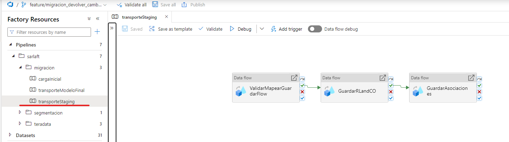
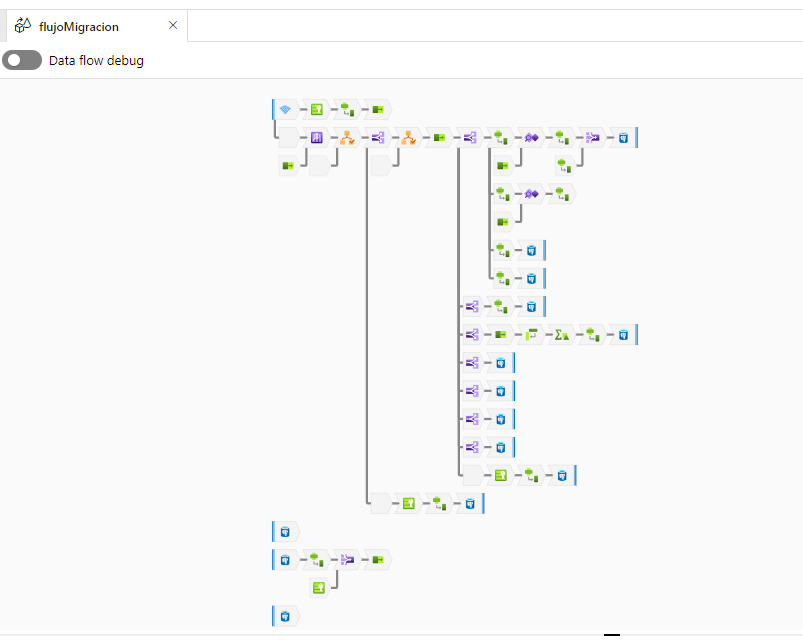
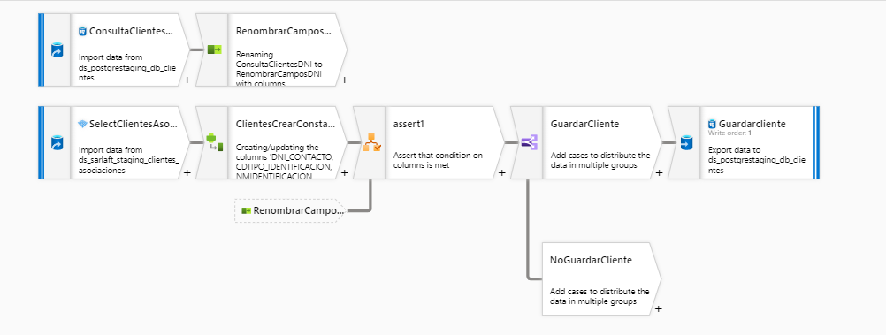
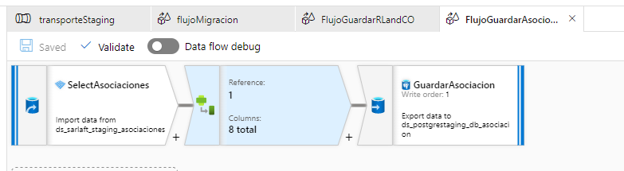
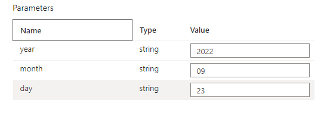

# Pipeline Migración

> **Fuente Confluence:** [Pipeline Migración](https://segurosti.atlassian.net/wiki/spaces/EPA/pages/2937520230/Pipeline+Migraci%C3%B3n)
> **Última modificación:** 2022-10-11 — Johnathan Monsalve Bello (Unlicensed) · versión 3
> **Sección:** [Migración - Transporte Modelo Sarlaft 4.0](./index.md)

A continuación se ejemplifican los pasos que se deben ejecutar en la utilización del pipeline de Migración para obtener como resultado final los registros en las respectivas tablas en el Schema **ESQSTAGINGLAB** de la base de datos de Sarlaft.

El pipeline se compone de 3 flujos de datos donde cada uno se encuentra en su respectivo Step del pipeline. Los 3 Steps del pipeline son:

1. `ValidarMapearGuardarDataFlow`
2. `GuardarRLAndCO`
3. `GuardarAsociaciones`

Con estos 3 Steps se logra obtener la información a migrar de los archivos `.parquet` anteriormente creados, transformar modelos, crear constantes, crear variables con información importante en base a información existente y guardar en las tablas de datos. A continuación se explicará cada uno de los dataflows:

**ValidarMapearGuardarDataFlow**

Este Step lanza el Dataflow llamado **flujoMigracion** que toma información desde los archivos …*/migracion/TSAF\_TIPIFICACION\_RESULT\_N\_/…/*.parquet

de donde obtiene la información de los sarlafts a migrar y además se hace uso de las diferentes tablas para validar la existencia de registros previamente, validaciones de paises gafi y validaciones de parametros (catalogos).

En este paso se llevan a cabo las siguientes actividades:

- Se crean constantes de fechas
- Se definen variables obligatorias como `nmsarlaft`, `nmevaluacion`, figuras a guardar, `tipoformulario`, `estadoevaluacion`, estado sarlaft, evidencias gafi, evidencias peps, evidencias identity, entre otras.
- Se valida previa existencia del cliente en base de datos.
- Se lleva a cabo validaciones de calidad según archivo en hu.
- Se guardan registros en las siguientes tablas:
  - `TSAF_RIESGO`
  - `TSAF_POLIZA`
  - `TSAF_ERROR`
  - `TSAF_EVIDENCIA`
  - `TSAF_FIGURA`
  - `TSAF_SARLAFT`
  - `TSAF_EVALUACION`
  - `TSAF_CLIENTE`

**GuardarRLAndCO**

Este Step lanza el Dataflow llamado **FlujoGuardarRLandCO** que toma información desde los archivos …*/clientes\_relaciones/CLIENTES\_RELACIONES\_N\_/…/*.parquet de donde obtiene información de las asociaciones a migrar pero no se guardan las asociaciones sino, se toma la información de los clientes guardados como Representante Legal y Accionista y se guardan en la tabla **TSAF\_CLIENTE** para posteriormente guardar la asociación y no tener errores por los constraints de la tabla asociaciones.

En este paso se valida que el cliente no se haya guardado anteriormente en la respectiva tabla y posteriormente se guarda en la tabla **TSAF\_CLIENTE**.

**GuardarAsociaciones**

Este Step lanza el Dataflow llamado **FlujoGuardarAsocioaciones** que toma información desde los archivos …*/asociaciones/ASOCIACIONES\_N\_/…/*.parquet de donde obtiene información de las asociaciones a migrar.

Este paso sólo obtiene información de las asociaciones a migrar y los guarda en la tabla **TSAF\_ASOCIACIONES.**

## PIPELINE TRANSPORTESTAGING

Este pipeline es el encargado de correr los anteriores pasos detallados.
Para esto, se hace manualmente ingresando las siguientes variables:

Estas variables indican de donde se obtendrán los archivos `.parquet` para la migración.

Al finalizar el recorrido del pipeline, este informa si se corrió exitosamente o si hubo algún error.
