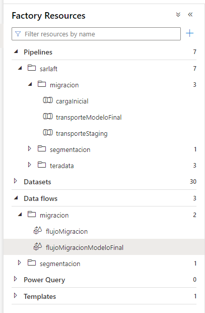
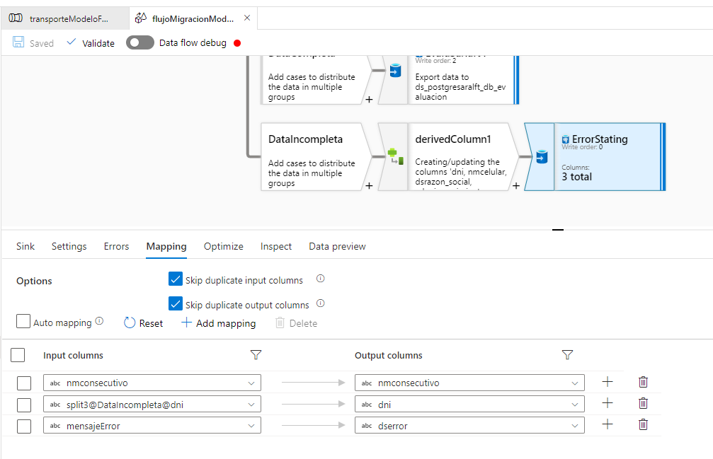

# Pipeline Migración Modelo Staging a Sarlaft 4.0

> **Fuente Confluence:** [Pipeline Migración Modelo Staging a Sarlaft 4.0](https://segurosti.atlassian.net/wiki/spaces/EPA/pages/2950168634/Pipeline+Migraci%C3%B3n+Modelo+Staging+a+Sarlaft+4.0)
> **Última modificación:** 2022-10-20 — Edwin Didier Méndez Rojas - Ceiba Software · versión 1
> **Sección:** [Migración - Transporte Modelo Sarlaft 4.0](./index.md)

El proceso de migración se valida que el cliente cuenta con la información necesaria para una evaluación y se procede a transportarla al modelo transaccional de sarlaft 4.0:

**Recurso en Datafactory:**

###### Mapping de las tablas de staging y Sarlaft 4.0

| **Staging** | **Sarlaft 4.0** |
|---|---|
| `"ESQSTAGINGLAB".tsaf_evaluacion` | `sarlaft.tsaf_evaluacion` |
| `"ESQSTAGINGLAB".tsaf_sarlaft` | `sarlaft.tsaf_sarlaft` |
| `"ESQSTAGINGLAB".tsaf_cliente` | `sarlaft.tsaf_cliente` |
| `"ESQSTAGINGLAB".tsaf_poliza` | `sarlaft.tsaf_poliza` |
| `"ESQSTAGINGLAB".tsaf_cliente` | `sarlaft.tsaf_cliente` |
| `"ESQSTAGINGLAB".tsaf_riesgo` | `sarlaft.tsaf_riesgo` |
| `"ESQSTAGINGLAB".tsaf_figura` | `sarlaft.tsaf_figura` |
| `"ESQSTAGINGLAB".tsaf_evidencia` | `sarlaft.tsaf_evidencia` |
| `"ESQSTAGINGLAB".tsaf_asociacion` | `sarlaft.tsaf_asociacion` |

En caso de no tener la información necesaria se ingresará un registro dentro de la tabla `"ESQSTAGINGLAB".tsaf_error`

Pasos a alto nivel del proceso en el pipeline:

1. Valida si el cliente se encuentra en sarlaft, sino existe lo ingresa en la tabla `sarlaft.tsaf_cliente`.
2. Valida si el cliente está migrado, consultando si se encuentra el `dni` en la tabla `"ESQSTAGINGLAB".tsaf_sarlaft`. De no estar migrado permitirá continuar con el flujo que tiene el pipeline.
3. Realiza la recolección de los datos de staging para la evaluación y valida que tenga lo necesario para poder crear la misma.
4. Después de la validación se procede a realizar los ingresos a dichas tablas.
5. Migra las asociaciones y valida que no exista una con los mismos datos.
