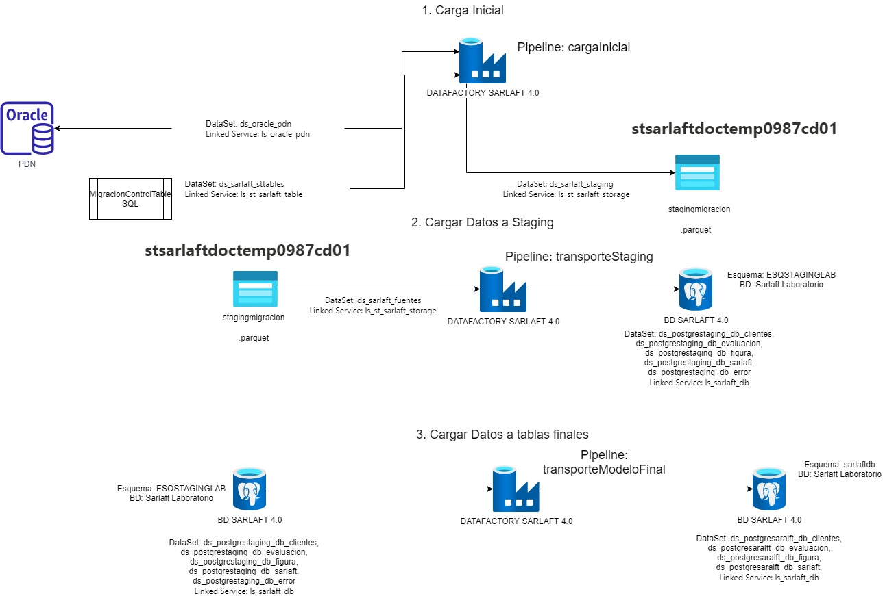
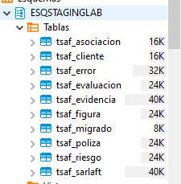
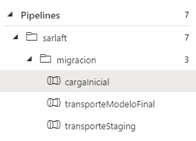

# Migración - Transporte Modelo Sarlaft 4.0

> **Fuente Confluence:** [Migración - Transporte Modelo Sarlaft 4.0](https://segurosti.atlassian.net/wiki/spaces/EPA/pages/2866249773/Migraci%C3%B3n+-+Transporte+Modelo+Sarlaft+4.0)
> **Última modificación:** 2022-10-11 — Diego Alejandro Vélez González · versión 6
> **Sección:** [Proceso de Migración](../index.md)

Esta etapa consiste en llevar los clientes del modelo de clientes de la instancia de Oracle PDN al modelo de clientes de sarlaft 4.0 junto con la tipificación de riesgo realizada en base de datos (por medio de un procedimiento almacenado).

HU Migración: [https://dev.azure.com/SuraColombia/Portafolios/_workitems/edit/53427](https://dev.azure.com/SuraColombia/Portafolios/_workitems/edit/53427)

Mapeo de campos origen (modelo cliente pdn) a modelo sarlaft 4.0 en postgresql en Azure, según HU.

NO se tienen en cuenta las direcciones por obtenerse posteriormente de Salesforce en el proceso de actualización. NO se tiene en cuenta la información financiera, dado que el modelo original no coincide con el modelo de sarlaft, donde en vez de códigos se reciben valores numéricos.

📎 [CamposMigracion_DataFactory.xlsx](./attachments/CamposMigracion_DataFactory.xlsx)

La herramienta seleccionada para la migración es Datafactory, donde se propone las siguientes etapas

1. **Carga Inicial:** corresponde a la carga de todos los datos fuente del modelo de oracle a Azure en formato `.parquet`, para este pipeline se utilizó el template "Bulk copy from a database" [https://docs.microsoft.com/en-us/azure/data-factory/solution-template-bulk-copy-with-control-table](https://docs.microsoft.com/en-us/azure/data-factory/solution-template-bulk-copy-with-control-table). Para este proceso se creó la tabla de control `MigracionControlTable` en un storage account, la cual permite indicar los querys correspondiente a la información a migrar.

2. **Cargar Datos a Staging:** corresponde a la carga de la información `.parquet`, resultado del paso 1 a la base de datos de staging de sarlaft, esquema creado con las mismas condiciones que el modelo transaccional, para detectar posibles fallas por calidad de información. En este paso se realiza la validación de calidad de datos y transformaciones necesarias, de tal forma que en el staging quede tal cual se cargará al modelo transaccional.

3. **Carga Datos a Tablas Finales:** corresponde al paso de información del modelo de staging al modelo transaccional de sarlaft 4.0. Debe dejar registro de los clientes migrados con éxito en la tabla `tsaf_migrado`

**Manejo de errores:**

Los errores se obtendrán por dos opciones: cliente ya existente o validación de datos, en ambos casos serán registrados en la tabla `tsaf_error` del modelo de staging. Los errores no controlados originarán una falla en el pipeline que deberá ser corregida.

**Resultado del proceso:**

El resultado del proceso de migración, será que los clientes de la compañía de seguros y ARL con vinculación activa, que se encuentran en el modelo de clientes, puedan ser tipificados y migrados al modelo transaccional de sarlaft. Esta parte del proceso de migración dejará dos tablas para seguimiento, la primera con los errores controlados presentados (tabla `tsaf_error`) y la segunda una tabla con los clientes que fueron migrados exitosamente (tabla `tsaf_migrado`).

**Repetición del proceso:**

Esta parte de transporte soporta repetir el proceso de migración, por alguna de las siguientes formas:

1. Pipeline de carga inicial, es posible correrlo varias veces para actualizar la información, el proceso creará tres directorios nuevos (`migracion`, `clientes_relaciones` y `asociaciones`) para el día de ejecución con los correspondientes archivos `.parquet`. Se debe analizar muy bien repetir el proceso por el costo de transporte de la información y su alojamiento, dado que son millones de registros. Para la creación de las 3 carpetas en un día específico se debe correr 3 veces el pipeline indicando el nombre de la carpeta y en cada caso con sus correspondientes queries en la tabla `MigracionControlTable`.

2. Pipeline de cargar datos a staging, es posible correrlo varias veces, teniendo en cuenta que el proceso validará no repetir el flujo para aquellos clientes que se encuentren ya migrados. (utilizando la tabla `tsaf_migrado`)

3. Pipeline de cargar información a modelo de sarlaft, es posible correrlo varias veces, teniendo en cuenta en el query de entrada no incluir aquellos clientes que se encuentren en el staging pero ya hayan sido migrados exitosamente (utilizando la tabla `tsaf_migrado`)

## Sub-páginas

| Sub-página | Enlace |
|---|---|
| Pipeline de carga inicial | [PipelineCargaInicial.md](./PipelineCargaInicial.md) |
| Pipeline Migración | [PipelineMigracion.md](./PipelineMigracion.md) |
| Pipeline Migración Modelo Staging a Sarlaft 4.0 | [PipelineMigracionStaging.md](./PipelineMigracionStaging.md) |
