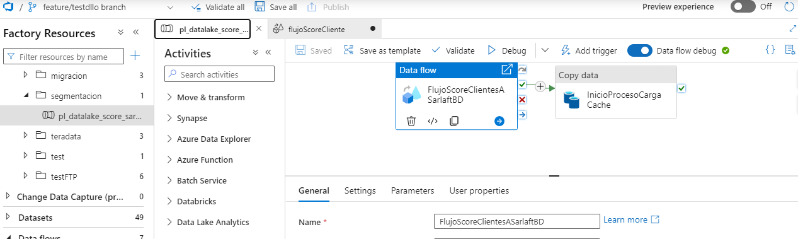
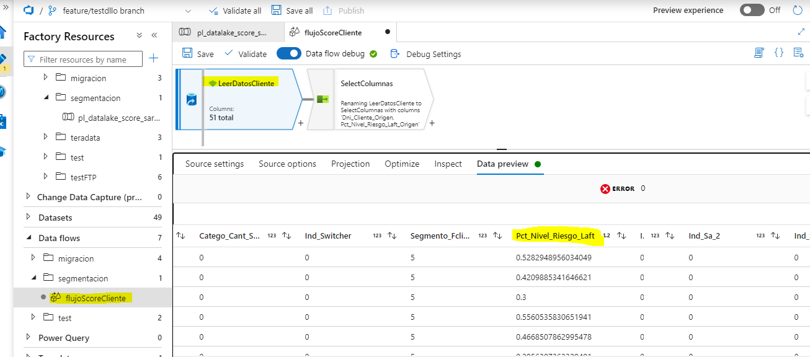
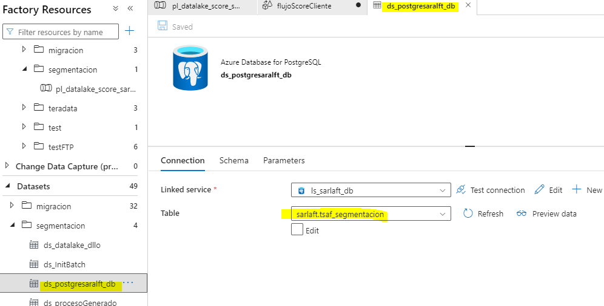

# Segmentacion Core

> **Fuente Confluence:** [Segmentacion Core](https://segurosti.atlassian.net/wiki/spaces/EPA/pages/2739077470)
> **Última modificación:** 2023-06-23 — Diana Muñoz · versión 3
> **Sección:** [Sarlaft 4.0](./index.md)

Ambiente en datafactory Desarrollo

El objetivo del proceso de segmentación es encontrar en el análisis trimestral de clientes, el score de riesgo de cada cliente, donde se busca filtrar aquellos que tengan un score o riesgo superior a 0.9, estos clientes son cargados en la tabla `tsaf_segmentacion` del modelo de sarlaft 4.0 para ser utilizados en la clasificación de riesgo de un cliente, donde si el cliente tiene un score alto representa un mayor riesgo.

Pipeline en datafactory:

Información de clientes a cargar:

En el proceso nos interesa la columna `Pct_Nivel_Riesgo_Laft`, para identificar los clientes que tengan igual o mas del 0.9

Este pipeline carga la información directamente en la tabla `tsaf_segmentacion` del modelo de base de datos de sarlaft

Dado que la información también debe actualizarse en cache, se utiliza un proceso batch del microservicio `sarlaftbatch` para cargar la información en azure redis cache, esta carga se hace por medio de un microservicio dado que Azure Datafactory no tiene conexión directa con Azure Redis Cache.

El proceso de segmentacion sigue el diseño de [Estructura Procesos](https://segurosti.atlassian.net/wiki/spaces/EPA/pages/2698444874/Estructura+Procesos) y el servicio utilizado en el pipeline de datafactory es `/process/init`, explicado en [Servicios Web para inicio y consulta de Proceso](https://segurosti.atlassian.net/wiki/spaces/EPA/pages/2698739830/Servicios+Web+para+inicio+y+consulta+de+Proceso)

El pipeline corre de forma trimestral a través de la corriente de tivoli: **21165**
