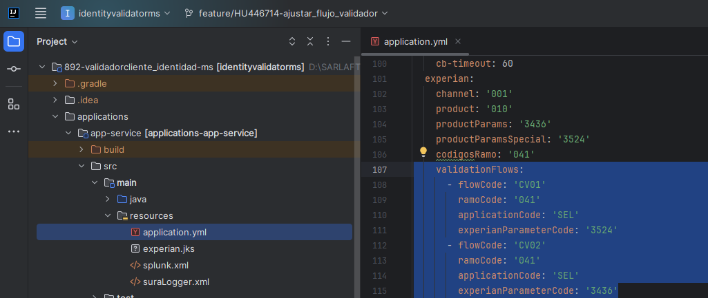

# Configuración de flujos con códigos de parametría de Experian

> **Fuente Confluence:** [Configuración de flujos con códigos de parametría de Experian](https://segurosti.atlassian.net/wiki/spaces/EPA/pages/3552673825)
> **Última modificación:** 2024-09-24 — versión 12
> **Sección:** [Integraciones - Validar identidad](./index.md)

Se configura parámetro llamado `validationFlows` en el archivo `application.yml` del proyecto [892-validadorcliente_identidad-ms](https://dev.azure.com/SuraColombia/Gerencia_Tecnologia/_git/892-validadorcliente_identidad-ms?path=%2Fapplications%2Fapp-service%2Fsrc%2Fmain%2Fresources%2Fapplication.yml&version=GBdevelop&_a=contents):



El parámetro `validationFlows` se utiliza para pasar una lista de flujos desde el `application.yml`, cada flujo esta compuesto por los parámetros: `flowCode`, `ramoCode`, `applicationCode` y `experianParameterCode`.

El validador de identidad consumiría las API de Experian asignando el código de parametría asociado al flujo respectivo, siempre y cuando haya coincidencia con alguno de los flujos de `validationFlows`.

Si no se configura el parámetro `validationFlows` el backend continuará funcionando como lo venia haciendo antes de la modificación, utilizando los códigos de parametría suministrados en los parámetros `productParams` y `productParamsSpecial`.

Los endpoints que se exponen por parte del validador de identidad que utilizan esta configuración de flujos se encuentran en la siguiente colección y ambiente de Postman:

📎 [API-identityvalidatorms-Experian.postman_collection.json](./attachments/API-identityvalidatorms-Experian.postman_collection.json)

Para descargar el ambiente de la colección apoyarse de los archivos complementarios adjuntos en el siguiente enlace:

[Carpeta Compartida](https://suramericana.sharepoint.com/:f:/s/MESA7-CALIDADDEINFORMACIN/EukvTImanzxCgkISya9Vm3sBvoF2-urCzU-zSpUZSL69hA?email=brayan.sepulveda%40ceiba.com.co&e=QiN7uH)

## Flujos para el Ambiente de Laboratorio

```yaml
app:
  experian:
    validationFlows:
      - flowCode: 'SOAT01'
        ramoCode: '041'
        applicationCode: 'SARLAFT'
        experianParameterCode: '3630'
      - flowCode: 'SOAT02'
        ramoCode: '041'
        applicationCode: 'SARLAFT'
        experianParameterCode: '3631'
      - flowCode: 'SOAT03'
        ramoCode: '041'
        applicationCode: 'SARLAFT'
        experianParameterCode: '3632'
```

## Flujos para el Ambiente de Producción

```yaml
app:
  experian:
    validationFlows:
      - flowCode: 'SOAT01'
        ramoCode: '041'
        applicationCode: 'SARLAFT'
        experianParameterCode: '3678'
      - flowCode: 'SOAT02'
        ramoCode: '041'
        applicationCode: 'SARLAFT'
        experianParameterCode: '3680'
      - flowCode: 'SOAT03'
        ramoCode: '041'
        applicationCode: 'SARLAFT'
        experianParameterCode: '3679'
```
