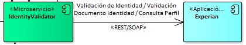

# IV006: Validación de Identidad - Verificar OTP

> **Fuente Confluence:** [IV006: Validación de Identidad - Verificar OTP](https://segurosti.atlassian.net/wiki/spaces/EPA/pages/2470609126)
> **Última modificación:** 2024-02-15 — versión 7
> **Sección:** [Integraciones - Validar identidad](./index.md)

## 1. Información del servicio

Este servicio verifica el código OTP (One Time Password) a través del proceso de Experian llamado Evidente Master.

El consumo de este servicio verifica el código OTP que se ingresa con el generado internamente por Experian.

## 2. Requerimientos Funcionales del Proceso

### Campos de Entrada

| **Campo** | **Tipo de dato** | **Longitud** | **Obligatorio** |
|---|---|---|---|
| `aplicacionOrigen` | String | 15 | SI |
| `codigoRamo` | String — Formato: Alfanumérico | 10 | SI |
| `codigoFlujo` | String — Formato: Alfanumérico | 10 | NO |
| `tipoDocumento` | String — **C** - Cédula de ciudadanía, **E** - Cédula de extranjería | 1-2 | SI |
| `numeroDocumento` | String | 3-16 | SI |
| `regValidacion` | String | 4-15 | SI |
| `idTransaccionOTP` | String | GUID | SI |
| `codigoOTP` | String | 6 dígitos | SI |

### Campos de Salida

| **Campo** | **Tipo de dato** | **Valores** |
|---|---|---|
| `resultadoValidacion` | String | 1 OTP Aprobado; 2 OTP No aprobado; 6 Codigo OTP expirado; 8 Transaccion invalidada por verificacion adicional |
| `mensajeValidación` | String | Mensaje de la verificación del código OTP |
| `codigoValido` | String | "true","false" |
| `estado` | Boolean | true, false |
| `mensajeEstado` | String | Mensaje general del proceso de verificar OTP |

## 3. Diseño Técnico

### 3.1. Diagrama de componentes



### 3.2. Diseño Consulta documento identidad en Registraduría expuesto por IdentityValidatorMS

**Origen:** Aplicación que requiera iniciar y generar un código OTP durante una validación de identidad con el proceso Evidente de Experian.

**Destino:** Micro-servicio IdentityValidator.

**POST**: `/api/v1/otp/verify`

```json
{
    "aplicacionOrigen": "SARLAFT",
    "tipoDocumento": "C",
    "numeroDocumento": "888888881",
    "numeroCelular": "3001234567",
    "regValidacion": "123456789",
	"idTransaccionOTP": "b35143fd-68bb-41c9-be50-8755ea4c3174",
	"codigoOTP": "153262",
	"codigoRamo": "041",
    "codigoFlujo": "CV01"
}
```

### 3.3. Diseño Consulta documento identidad en Registraduría expuesto por Data Credito Experian

**Origen:** Micro-servicio IdentityValidator

**Destino:** Data Credito Experian

Se realiza un consumo de un servicio REST de Data Crédito Experian de manera segura, con solicitud de token que debe ser generado previamente.

Adjunta documentación técnica entregada por Experian:

📎 [Manual_Implementacion_WS_Evidente_V5.PDF](./attachments/Manual_Implementacion_WS_Evidente_V5.PDF)

**Ejemplo de Mensaje ([Importante revisar Estrategia de seguridad en el punto 5](#5-estrategia-de-seguridad)):**

**POST**

DESARROLLO:

`https://sarlaftapi.dllosura.com/api/v1/otp/verify`

LABORATORIO:

`https://sarlaftapi.labsura.com/api/v1/otp/verify`

Mensaje de entrada:

```json
{
    "aplicacionOrigen": "SARLAFT",
    "tipoDocumento": "C",
    "numeroDocumento": "888888881",
    "numeroCelular": "3001234567",
    "regValidacion": "123456789",
	"idTransaccionOTP": "b35143fd-68bb-41c9-be50-8755ea4c3174",
	"codigoOTP": "153262",
	"codigoRamo": "041",
    "codigoFlujo": "CV01"
}
```

Mensaje de salida:

```json
{
  "resultadoValidacion": "1",
  "mensajeValidacion": "Validación del código OTP exitoso.",
  "codigoValido": "true",
  "estado": true,
  "mensajeEstado": "Validación OTP aprobado, continúa con el proceso"
}
```

## 4. Manejo de errores

En cuanto a excepciones, éxito y errores, el micro-servicio maneja los estados de respuesta HTTP:

- 1xx: Respuestas informativas
- 2xx: Peticiones correctas
- 3xx: Redirecciones
- 4xx: Errores del cliente
- 5xx: Errores de servidor

## 5. Estrategia de seguridad

Estándar para todas las integraciones:

- Uso de SEUS 4 (Ambiente de desarrollo y laboratorio se puede autenticar con usuario nombrado impmasivos)
- Adicional se cuenta con otro tipo de Autenticación muy conocida, llamado JSON Web Tokens (JWT), se ha convertido rápidamente en un estándar en la autenticación de aplicaciones. [Ver generación JWT](./IV002GenerarJWT.md)
