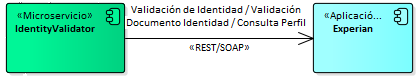

# IV009: Consultar perfil personal con Data Crédito Experian

> **Fuente Confluence:** [IV009: Consultar perfil personal con Data Crédito Experian](https://segurosti.atlassian.net/wiki/spaces/EPA/pages/2479816929)
> **Última modificación:** 2021-11-17 — versión 11
> **Sección:** [Integraciones - Validar identidad](./index.md)

## 1. Información del servicio

Este servicio permite consultar información sobre el perfil de un cliente, este servicio apoya el proceso de conocimiento del cliente en el momento de realizar la compra de alguno de nuestros servicios o pólizas, permitiendo obtener una visión integral de las personas naturales y jurídicas.

## 2. Requerimientos Funcionales del Proceso

### Campos de Entrada

| **Campo** | **Tipo de dato** | **Longitud** | **Obligatorio** |
|---|---|---|---|
| `tipoDocumento` | String — **C** - Cédula de ciudadanía, **A** - NIT, **F** - Identificación fiscal para extranjeros, **E** - Cédula de extranjería | 1-2 | SI |
| `numeroDocumento` | String | 3-16 | SI |
| `primerApellido` | String | 100 | SI |
| `aplicacionOrigen` | String | 15 | SI |

### Campos de Salida

| **Campo** | **Subcampo** | **Subcampo** | **Tipo de dato** | **Longitud/Comentario** |
|---|---|---|---|---|
| `fechaConsulta` | | | Date (Formato ISO8601) | |
| `codigoSeguridad` | | | String | 8-10 |
| `estadoConsulta` | | | Boolean | Si es **false**, algo no salió bien en la consulta |
| `mensajeEstadoConsulta` | | | String | Mensaje sobre el estado de la consulta |
| `informacionPersonal` | | | Object | |
| | `rut` | | Boolean | |
| | `tipoPersona` | | String — PERSONA NATURAL NACIONAL, PERSONA NATURAL EXTRANJERA, PERSONA JURIDICA NACIONAL, PERSONA JURIDICA EXTRANJERA | 24-27 |
| | `tipoDocumento` | | String — **C**, **A**, **F**, **E** | 1-2 |
| | `numeroDocumento` | | String | 3-16 |
| | `nombreCompleto` | | String | |
| | `nombres` | | String | |
| | `primerApellido` | | String | |
| | `segundoApellido` | | String | |
| | `codigoEstadoDocumento` | | String — 00 - 99 | 0-2 |
| | `estadoDocumento` | | String — VIGENTE, CANCELADA POR MUERTE O FALLECIDO, SUSPENDIDA, CANCELADA, NO EXPEDIDA, EN TRAMITE | |
| | `fechaExpedicion` | | Date (Formato ISO8601) | |
| | `ciudadExpedicion` | | String | |
| | `departamentoExpedicion` | | String | |
| | `nacionalidad` | | String | |
| | `fechaNacimiento` | | Date (Formato ISO8601) | |
| | `estadoCivil` | | String — CASADA, VIUDA, MUJER, HOMBRE | 5-6 |
| | `genero` | | String — MUJER, HOMBRE | 5-6 |
| | `rangoEdad` | | String — Ej: 29-35 | |
| `localizacion` | | | Object | |
| | `direccion` | | Object | |
| | | `direccionCompleta` | String | |
| | | `codigoPais` | String (Ej: CO) | |
| | | `codigoDepartamento` | String | Código DANE |
| | | `nombreDepartamento` | String | |
| | | `codigoCiudad` | String | Código DANE |
| | | `nombreCiudad` | String | |
| | | `codigoSectorLocalidad` | String | Código complementario DANE |
| | | `estrato` | String | Estrato socioeconómico |
| | | `fechaActualizacion` | Date (Formato ISO8601) | |
| | | `tipoResidencial` | Boolean | |
| | | `tipoLaboralComercial` | Boolean | |
| | | `tipoCorrespondencia` | Boolean | |
| | | `zona` | String — U: URBANA, R: RURAL | |
| | `telefono` | | Object | |
| | | `numeroTelefono` | String | |
| | | `indicativoPais` | String | |
| | | `codigoArea` | String | |
| | | `nombreDepartamento` | String | |
| | | `nombreCiudad` | String | |
| | | `fechaActualizacion` | Date (Formato ISO8601) | |
| | | `tipoResidencial` | Boolean | |
| | | `tipoLaboralComercial` | Boolean | |
| | `celular` | | String | |
| | `correo` | | String | |
| `informacionAdicional` | | | Object | |
| | `ingresoEstimado` | | String | BigDecimal en cadena |
| | `egresoEstimado` | | String | BigDecimal en cadena |
| | `porcentajeEgresoIngreso` | | String | |

## 3. Diseño Técnico

### 3.1. Diagrama de componentes



### 3.2. Diseño Consulta perfil expuesto por IdentityValidatorMS

**Origen:** Aplicación que requiera consultar información de perfil del cliente, por ejemplo SARLAFT

**Destino:** Micro-servicio IdentityValidator

**POST**: `/api/v1/profile/personal`

```json
{
    "tipoDocumento": "C",
    "numeroDocumento": "888888881",
    "primerApellido": "PRUEBAS",
    "aplicacionOrigen": "SARLAFT"
}
```

### 3.3. Diseño Consulta perfil expuesto por Data Credito Experian

**Origen:** Micro-servicio IdentityValidator

**Destino:** Data Credito Experian

Se realiza un consumo de un servicio SOAP de Data Crédito Experian de manera segura, con firma y cifrado de información de punta a punta.

Para temas internos de Sura:

- Se requiere de un certificado digital emitido por una CA (Certificate Authority) reconocida, no se admiten certificados autofirmados, su vigencia mínima debe ser de 1 año y su clave privada debe cumplir con un tamaño mínimo de 2048 bits.
- Enviar su llave pública a Experian, para su posterior registro
- Crear un llavero o KEYSTORE, que contenga la llave pública y privada (Para consumo y descripción del servicio), se debe instalar en la máquina con el asistente para instalar certificados de Windows (Formato .p12)
- Para uso dentro de una aplicación JAVA, se debe crear el llavero o KEYSTORE en formaro .jks, adicional al paso anterior se debe importar dentro del llavero el certificado del servicio SOAP de Experian.
- Los consumos deberán realizarse agregando los certificados, y headers de seguridad sobre este servicio (Timestamp, username, Signature)

Adjunta documentación técnica entregada por Experian:

📎 [1.1. Instructivo Conectividad SOAP DataCredito Experian v1.2.pdf](./attachments/1.1.%20Instructivo%20Conectividad%20SOAP%20DataCredito%20Experian%20v1.2.pdf)

**Ejemplo de Mensaje ([Importante revisar Estrategia de seguridad en el punto 5](#5-estrategia-de-seguridad)):**

**POST**

DESARROLLO:

`https://sarlaftapi.dllosura.com/api/v1/profile/personal`

LABORATORIO:

`https://sarlaftapi.labsura.com/api/v1/profile/personal`

Mensaje de entrada:

```json
{
    "tipoDocumento": "C",
    "numeroDocumento": "888888881",
    "primerApellido": "PRUEBAS",
    "aplicacionOrigen": "SARLAFT"
}
```

Mensaje de salida:

```json
{
    "fechaConsulta": "2021-11-16T22:13:34",
    "codigoSeguridad": "A0S6696",
    "estadoConsulta": true,
    "mensajeEstadoConsulta": "Consulta realizada correctamente",
    "informacionPersonal": {
        "rut": true,
        "tipoPersona": "PERSONA NATURAL NACIONAL",
        "tipoDocumento": "C",
        "numeroDocumento": "7174646",
        "nombreCompleto": "SUPELANO GARCIA MARIO ALFONSO",
        "nombres": "MARIO ALFONSO",
        "primerApellido": "SUPELANO",
        "segundoApellido": "GARCIA",
        "codigoEstadoDocumento": "00",
        "estadoDocumento": "VIGENTE",
        "fechaExpedicion": "1996-09-23T00:00:00",
        "ciudadExpedicion": "TUNJA",
        "departamentoExpedicion": "BOYACA",
        "nacionalidad": "",
        "fechaNacimiento": null,
        "estadoCivil": "",
        "genero": "HOMBRE",
        "rangoEdad": "36-45"
    },
    "localizacion": {
        "direccion": {
            "direccionCompleta": "CL 109 17 36",
            "codigoPais": "CO",
            "codigoDepartamento": "11",
            "nombreDepartamento": "BOGOTA. D.C.",
            "codigoCiudad": "11001",
            "nombreCiudad": "BOGOTA. D.C.",
            "codigoSectorLocalidad": "000",
            "estrato": "6",
            "fechaActualizacion": "2021-05-31T00:00:00",
            "tipoResidencial": true,
            "tipoLaboralComercial": true,
            "tipoCorrespondencia": true,
            "zona": "U"
        },
        "telefono": {
            "numeroTelefono": "4857884",
            "indicativoPais": "57",
            "codigoArea": "0",
            "nombreDepartamento": "BOGOTA. D.C.",
            "nombreCiudad": "BOGOTA. D.C.",
            "fechaActualizacion": "2020-09-30T00:00:00",
            "tipoResidencial": true,
            "tipoLaboralComercial": true
        },
        "celular": "",
        "correo": "qyp42hy@hotmail.com"
    },
    "informacionAdicional": {
        "ingresoEstimado": "12857000.0",
        "egresoEstimado": "3226000.0",
        "porcentajeEgresoIngreso": "25"
    }
}
```

**NOTA:** En caso en el que la consulta no encuentre información, es decir, el servicio de perfil de DataCrédito Experian entrega una respuesta "NO existe este número de identificación en los archivos de validación de la base de datos", el objeto de respuesta del servicio será la siguiente:

```json
{
    "fechaConsulta": "2021-11-16T22:18:25",
    "codigoSeguridad": "0XW6935",
    "estadoConsulta": false,
    "mensajeEstadoConsulta": "No hay información registrada para este documento",
    "informacionPersonal": null,
    "localizacion": null,
    "informacionAdicional": null
}
```

## 4. Manejo de errores

En cuanto a excepciones, éxito y errores, el micro-servicio maneja los estados de respuesta HTTP:

- 1xx: Respuestas informativas
- 2xx: Peticiones correctas
- 3xx: Redirecciones
- 4xx: Errores del cliente
- 5xx: Errores de servidor

## 5. Estrategia de seguridad

Estándar para todas las integraciones:

- Uso de SEUS 4 (Ambiente de desarrollo y laboratorio se puede autenticar con usuario nombrado impmasivos)
- Adicional se cuenta con otro tipo de Autenticación muy conocida, llamado JSON Web Tokens (JWT), se ha convertido rápidamente en un estándar en la autenticación de aplicaciones. [Ver generación JWT](./IV002GenerarJWT.md)

## 6. Configuración opciones JVM

Es importante esta configuración para que este servicio pueda funcionar correctamente, es decir, se realice la comunicación segura entre el microservicio identityValidatorMS y Data crédito Experian. [Ver configuración ejecución local](../MicroservicioIdentityValidator/ConfiguracionAmbiente.md)
