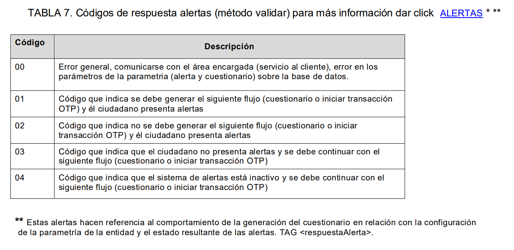

# Validaciones Alertas Método Validar Identificación

> **Fuente Confluence:** [Validaciones Alertas Método Validar Identificación](https://segurosti.atlassian.net/wiki/spaces/EPA/pages/3969810510)
> **Última modificación:** 2024-08-15 — versión 5
> **Sección:** [Integraciones - Validar identidad](./index.md)

## Reglas de Negocio

A continuación se describe el comportamiento configurado en el proyecto de validación de identidad según el valor devuelto por Experian en el atributo:

```java
@JsonProperty("respuestaAlerta")
private String alertResponse;
```

Imagen de la documentación de Experian donde se evidencia el flujo a seguir según el campo *respuestaAlerta*:



*Códigos de respuesta alertas*

A continuación se muestra una combinación entre la tabla de códigos de respuesta que se evidencia en la imagen anterior y se especifica en la columna decisión en que estado debe quedar la evidencia de Experian según el código de respuesta alerta recibido y si continua o no con el flujo:

| Código | Descripción | Decisión |
|---|---|---|
| 00 | Error general, comunicarse con el área encargada (servicio al cliente), error en los parámetros de la parametría (alerta y cuestionario) sobre la base de datos. | Evidencia EXPERIAN en FALLA TÉCNICA. |
| 01 | Código que indica se debe generar el siguiente flujo (cuestionario o iniciar transacción OTP) y él ciudadano presenta alertas | Continuar con el flujo de validación de identidad |
| 02 | Código que indica no se debe generar el siguiente flujo (cuestionario o iniciar transacción OTP) y él ciudadano presenta alertas | Evidencia EXPERIAN en FALLIDO. No continua con el flujo de validación de identidad |
| 03 | Código que indica que el ciudadano no presenta alertas y se debe continuar con el siguiente flujo (cuestionario o iniciar transacción OTP) | Continuar con el flujo de validación de identidad |
| 04 | Código que indica que el sistema de alertas está inactivo y se debe continuar con el siguiente flujo (cuestionario o iniciar transacción OTP) | Continuar con el flujo de validación de identidad |
| Otro | Códigos inesperados | Evidencia EXPERIAN en estado FALLA TÉCNICA. |

Se adjunta enlace a la historia de usuario 588340 asociada a esta validación, donde se evidencian los proyectos impactados y pull requests para conocer detalladamente los cambios efectuados en el código:

[https://dev.azure.com/SuraColombia/Portafolios/_workitems/edit/588340](https://dev.azure.com/SuraColombia/Portafolios/_workitems/edit/588340)

---

## Página relacionada

[IV004: Validación de Identidad - Validar Identificación](./IV004ValidarIdentificacion.md)
