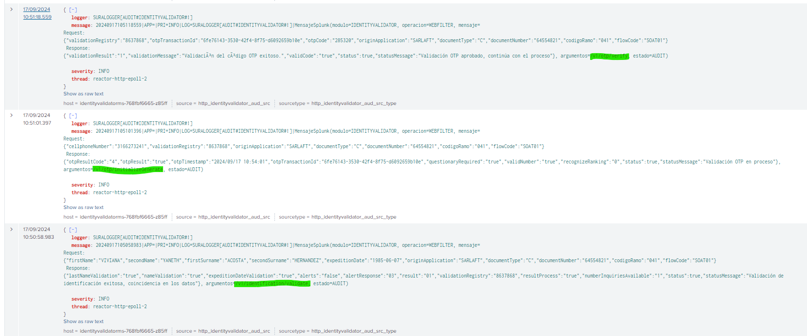
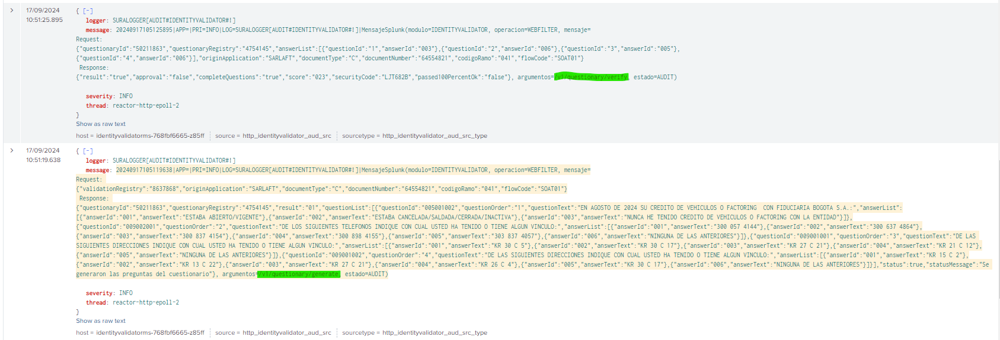

# Logs Endpoints Validador Identidad para Experian

> **Fuente Confluence:** [Logs Endpoints Validador Identidad para Experian](https://segurosti.atlassian.net/wiki/spaces/EPA/pages/4048158761/Logs+Endpoints+Validador+Identidad+para+Experian)
> **Última modificación:** 2024-09-17 — Brayan Estiven Sepúlveda Quintero · versión 1
> **Sección:** [Documentación técnica](./index.md)

Para visualizar los logs de los endpoints asociados a los flujos de validación de identidad de Experian se debe utilizar el siguiente filtro en Splunk:

```splunk-spl
index="idx_identityvalidator_aud" message="*WEBFILTER*"
```

Adjunto URL del filtro en ambiente de laboratorio:\
[Filtro en Lab](https://holmeslab.suramericana.com.co:9000/en-GB/app/group_center/search?earliest=%40d&latest=now&q=search%20index%3D%22idx_identityvalidator_aud%22%20message%3D%22*WEBFILTER*%22%20%22*64554821*%22%20%22**%22&display.page.search.mode=fast&dispatch.sample_ratio=1&sid=1726597307.143703)

Estos son las capturas de los logs asociados a cada endpoint que consume el front del validador de identidad asociados a Experian. En cada endpoint se aprecia el request, response y la url asociada (que es la que se resalta en las imágenes):





## Resumen Endpoints Auditados

- `/v1/identification/validate`
- `/v1/otp/initialize`
- `/v1/otp/generate`
- `/v1/otp/initializeGenerate`
- `/v1/otp/verify`
- `/v1/questionary/generate`
- `/v1/questionary/verify`
