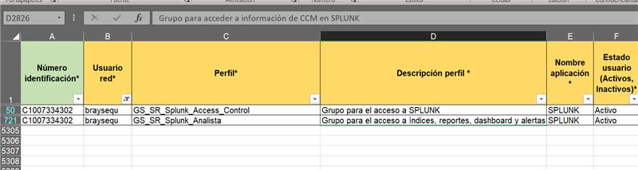
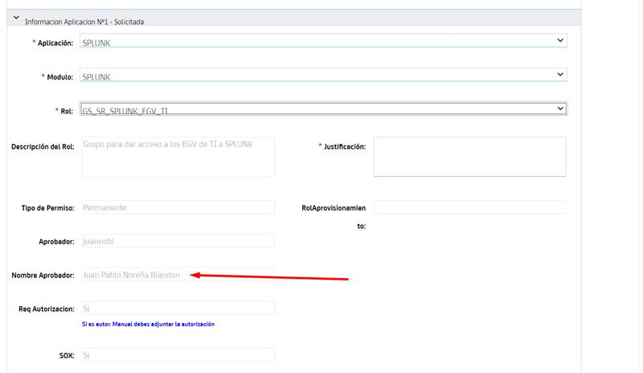

# Logs de Experian en Splunk

> **Fuente Confluence:** [Logs de Experian en Splunk](https://segurosti.atlassian.net/wiki/spaces/EPA/pages/3641311258/Logs+de+Experian+en+Splunk)
> **Última modificación:** 2024-09-24 — Brayan Estiven Sepúlveda Quintero · versión 20
> **Sección:** [Documentación técnica](./index.md)

| **Servicio** | **Filtro de Splunk para Request** | **Filtro de Splunk para Response** | **Filtro de Splunk para Error** |
| --- | --- | --- | --- |
| Validar Identidad Experian | `index="idx_identityvalidator_aud" message="*mensaje=Auditoria Experian Request*" message="*operacion=validateIdentification*"` | `index="idx_identityvalidator_aud" message="*mensaje=Auditoria Experian Response*" message="*operacion=validateIdentification*"` | `index="idx_identityvalidator_err" "operacion=validateIdentification"` |
| Inicializar OTP Experian | `index="idx_identityvalidator_aud" message="*mensaje=Auditoria Experian Request*" message="*operacion=initializeOTP*"` | `index="idx_identityvalidator_aud" message="*mensaje=Auditoria Experian Response*" message="*operacion=initializeOTP*"` | `index="idx_identityvalidator_err" "operacion=initializeOTP"` |
| Generar OTP Experian | `index="idx_identityvalidator_aud" message="*mensaje=Auditoria Experian Request*" message="*operacion=generateOTP*"` | `index="idx_identityvalidator_aud" message="*mensaje=Auditoria Experian Response*" message="*operacion=generateOTP*"` | `index="idx_identityvalidator_err" "operacion=generateOTP"` |
| Verificar OTP Experian | `index="idx_identityvalidator_aud" message="*mensaje=Auditoria Experian Request*" message="*operacion=verifyOTP*"` | `index="idx_identityvalidator_aud" message="*mensaje=Auditoria Experian Response*" message="*operacion=verifyOTP*"` | `index="idx_identityvalidator_err" "operacion=verifyOTP"` |
| Generar Cuestionario Experian | `index="idx_identityvalidator_aud" message="*mensaje=Auditoria Experian Request*" message="*operacion=generateQuestionary*"` | `index="idx_identityvalidator_aud" message="*mensaje=Auditoria Experian Response*" message="*operacion=generateQuestionary*"` | `index="idx_identityvalidator_err" "operacion=generateQuestionary"` |
| Verificar Cuestionario Experian | `index="idx_identityvalidator_aud" message="*mensaje=Auditoria Experian Request*" message="*operacion=verifyQuestionary*"` | `index="idx_identityvalidator_aud" message="*mensaje=Auditoria Experian Response*" message="*operacion=verifyQuestionary*"` | `index="idx_identityvalidator_err" "operacion=verifyQuestionary"` |
| Validar Identidad Registraduria | `index="idx_identityvalidator_aud" message="*mensaje=Auditoria Registraduria Request*"` | `index="idx_identityvalidator_aud" message="*mensaje=Auditoria Registraduria Response*"` | `index="idx_identityvalidator_err" "operacion=consumeServiceValidate"` |
| Validar Identidad Migracion | `index="idx_identityvalidator_aud" message="*mensaje=Auditoria Migracion Request*"` | `index="idx_identityvalidator_aud" message="*mensaje=Auditoria Migracion Response*"` | `index="idx_identityvalidator_err" "operacion=validateDocumentForeign"` |
| Validar Perfil | `index="idx_identityvalidator_aud" message="*mensaje=Auditoria Profile Request*"` | `index="idx_identityvalidator_aud" message="*mensaje=Auditoria Profile Response*"` | `index="idx_identityvalidator_err" "operacion=consumeServiceQueryProfile"` |

Las URIs para visualización de los logs son:

https://holmesdllo.suramericana.com.co:8000/

https://holmeslab.suramericana.com.co:9000/

> **ℹ️ Info:** Para mayor información acerca de las URIs consulte:
>
> https://segurosti.atlassian.net/wiki/spaces/EPA/pages/3386146848/Implementaci+n+Splunk#B%C3%BAsqueda-de-eventos-en-Splunk%3A
>
> https://segurosti.atlassian.net/wiki/spaces/EPA/pages/3386146848/Implementaci+n+Splunk#Servicios-de-consumo---API-Splunk-%3A

A continuación adjunto colección y ambientes de Postman para probar los servicios en local o en laboratorio:

[Carpeta Compartida](https://suramericana.sharepoint.com/:f:/r/sites/MESA7-CALIDADDEINFORMACIN/Shared%20Documents/General/Proyecto%20SARLAFT%204.0/DocumentacionDesarrollo/IniciativaSoat_2024/Documentos%20Complementarios%20SARLAFT/validacion%20identidad%20experian/validador%20identidad?csf=1&web=1&e=XCExvH)

# Observaciones producto del acompañamiento de **@Alejandro Zapata Lopera**

Los logs que supuestamente no se podían visualizar en producción en realidad si es posibles visualizarlos, pero con el rol correspondiente de **GS_SR_SPLUNK_EGV_TI**, se validó que estuvieran creados los índices asociados al validador de identidad y efectivamente lo están. La persona encargada de aprobar el perfil para utilizar este rol es **Juan Pablo Noreña**.

## Evidencias de que existen los índices

## Evidencia de que funcionan los índices

## Aclaraciones hechas por **@Alejandro Zapata Lopera**

Hola buenas, estaba validando y parece que la aplicación IdentityValidator está asociada al Rol `GS_SR_SPLUNK_EGV_TI`

Revisando, parece que Brayan no tiene ese rol por eso es probable que al consultar en Sherlock no le mostrara datos

Ese rol de `EGV_TI` parece que si tiene autorización para que lo tengan en cuenta:

