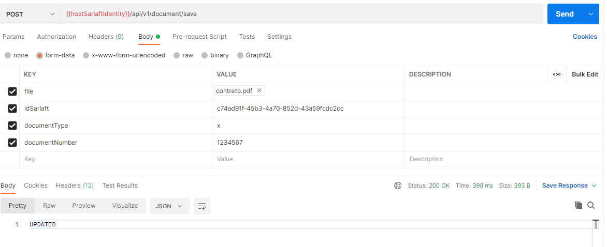

# Validar identidad por cargue de soporte a P8

> **Fuente Confluence:** [Validar identidad por cargue de soporte a P8](https://segurosti.atlassian.net/wiki/spaces/EPA/pages/2619015170/Validar+identidad+por+cargue+de+soporte+a+P8)
> **Última modificación:** 2022-02-25 — juan camilo muñoz burgos · versión 4
> **Sección:** [Servicios Web](../index.md)

- **Objetivo:** Permite validar la identidad de una persona, cargando un soporte de su documento de identidad.
- **Endpoint:** `/api/v1/document/save`
- **Ejemplo Request:**

**Parámetros:**

1). `file`: Documento a subir no debe superar los 2MB y se aceptan los siguientes tipos: **(pdf,jpg).**

2). `idSarlaft`= c74ad91f-45b3-4a70-852d-43a59fcdc2cc

3). `documentType`= x, **(pasaporte (P), carnet diplomático (D), tarjeta de identidad (T), permiso especial de permanencia (TE) y documento de identidad de extranjeros ( x))**

4). `documentNumber`= 1234567

- **Dependencias:**
  - Base de Datos Sarlaft.
  - Azure Storage Account.
  - Azure Cache Redis.
  - Azure Services Bus.
  - Rabbit MQ.

## Páginas hijas

- [Comunicación P8 Flujo externo de Validación de Identidad](./ComunicacionP8FlujoExterno.md)
