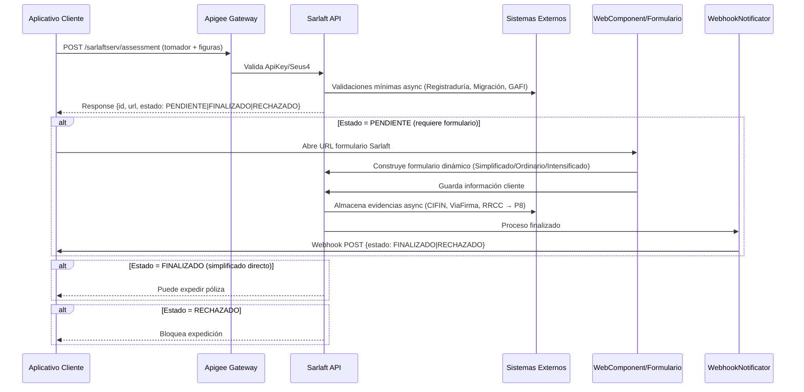
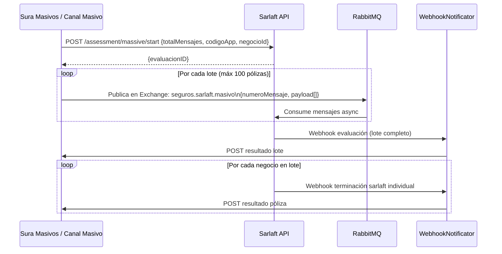
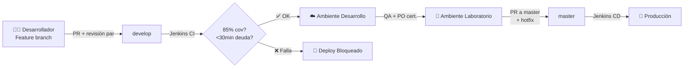

# Arquitectura del Sistema - GPS Principal
## Sarlaft 4.0 — Plataforma de Gestión de Riesgos LAFT

> **Generado:** 27 de Marzo de 2026  
> **Modo:** Inferencia — análisis exhaustivo de documentación local y Confluence  
> **Versión documentación base analizada:** 1.8.x

---

## 🎯 Resumen Ejecutivo

### Propósito y alcance del sistema

**Sarlaft 4.0** es la plataforma centralizada de Seguros Sura para cumplir la **Circular Básica 027 del 2020 (SARLAFT 4.0)** emitida el 02 de septiembre de 2020 por la **Superintendencia Financiera de Colombia**, que establece nuevos mecanismos de Prevención de Lavado de Activos y de la Financiación del Terrorismo (LAFT).

**Responsabilidades core del sistema:**
- Centralizar la evaluación del riesgo y captura de información SARLAFT de cada cliente
- Clasificar al cliente en nivel de riesgo: **Simplificado**, **Ordinario** o **Intensificado**
- Almacenar evidencias, trazabilidad de validaciones y cambios en datos
- Notificar a los aplicativos cliente el resultado del proceso (webhook/RabbitMQ)
- Mantener la información actualizada según vigencia (1-3 años según nivel de riesgo)
- Establecer mecanismos de monitoreo para alertas de prevención

**Alcance obligatorio:** Aplica para **todos los clientes** que adquieran cualquier producto por cualquier canal de Sura — negocio nuevo, modificaciones valorables y renovaciones.

### Dominios y repositorios críticos

| Dominio | Repositorio | Descripción |
|---|---|---|
| **API Core** | `adm_y_fin-sarlaft-api-ms` | Microservicio principal — evaluación, formularios, webhook |
| **PEPS** | `adm_y_fin-sarlaft-peps-ms` | Microservicio de validación Personas Expuestas Políticamente |
| **Pruebas Automatizadas** | `adm_y_fin-sarlaft-pa` | SoapUI + JMeter (branches: dev, lab, master) |
| **Infraestructura** | `adm_y_fin-sarlaft-iac` | Terraform IaC para Azure |
| **Config API** | `adm_y_fin-sarlaft-api-conf` | Configuración por ambiente del API |
| **Config PEPS** | `adm_y_fin-sarlaft-peps-conf` | Configuración por ambiente de PEPS |

**Límites del sistema:**
- ✅ Incluye: evaluación de riesgo, formularios dinámicos, almacenamiento de evidencias, notificaciones callback, procesos masivos
- ❌ Excluye: expedición de pólizas (responsabilidad del aplicativo cliente), validaciones de identidad externas directas (Registraduría, CIFIN/Experian — delegadas a servicios externos)

---

## 🧭 Arquitectura de Alto Nivel

### Diagrama principal del ecosistema

```mermaid
graph TB
    subgraph "Canales de Entrada — Aplicativos Cliente"
        WEB["🌐 Cotizadores Web\n(Salud, Autos, SOAT, Viajes,\nHogar, Vida, Pensión, Educación)"]
        SEL["📱 SuraEnLínea / WeSura\n(WebComponent JWT)"]
        PC["🏢 Policy Center\nGroup Center\nClaim Center"]
        SM["📦 Sura Masivos\n(Canales Masivos / SIS)"]
        OTH["🔧 Otros\n(PYME, ARL, Cumplimiento Web,\nATR Reclamaciones)"]
    end

    subgraph "API Gateway"
        AG["🔒 Apigee API Gateway\n(ApiKey + HTTPS)\nURL Externa: CDN\nURL Interna: App Gateway"]
    end

    subgraph "Plataforma Sarlaft 4.0 — Azure AKS"
        API["⚙️ sarlaft-api-ms\n(Spring Boot / Reactive)\nPrincipal: evaluación,\nformularios, modelos"]
        PEPS["👤 sarlaft-peps-ms\n(Validación PEP)"]
        FC["🌐 Frontend / WebComponent\n(Angular)\nFormularios dinámicos"]
        CACHE["⚡ Cache Layer\nOptimización integraciones"]
        WHNOT["📢 WebhookNotificator\nCallback a aplicativos cliente"]
        BROKER["📨 Event Hub / Broker Interno\nRecolección evidencias async"]
    end

    subgraph "Mensajería — RabbitMQ"
        MQ_DLLO["DLLO: msgdllo.suramericana.com.co"]
        MQ_LAB["LAB: msglab.suramericana.com.co"]
        MQ_PDN["PDN: msg.suramericana.com.co"]
        EX_SAR["Exchange: seguros.sarlaft.masivo\nRoutingKey: seguros.sarlaft.masivo.assessment"]
        EX_COT["Exchange: seguros.cotizador.sarlaft.evaluacion\nQueue: *.sarlaft.evaluacionRecibida"]
    end

    subgraph "Persistencia"
        DB["🗄️ Modelo Sarlaft\n(Base de datos — Sarlaft diligenciados,\nevidencias, trazabilidad)"]
        P8["📁 P8\n(Almacenamiento evidencias documentales)"]
    end

    subgraph "Sistemas Externos"
        REG["🏛️ Registraduría Nacional\n(Validación CC)"]
        MIG["🏛️ Migración Colombia\n(Validación CE, PPT, PEP)"]
        CIFIN["🔍 CIFIN / Experian\n(Validación Identidad: OTP + Cuestionario)"]
        VIAF["✍️ ViaFirma\n(Firma Remota)"]
        RRCC["📋 Riesgos Consultables\n(RRCC)"]
        CAM["🏢 Cámara de Comercio\n(Validación Persona Jurídica)"]
        MOD_CLI["👥 Modelo de Clientes Sura\n(Pre-diligenciamiento datos)"]
    end

    subgraph "Observabilidad"
        SONAR["📊 SonarQube\nhttps://sonar.suramericana.com.co\ndebt < 30min, cov ≥ 85%"]
        JENKINS["🔁 Jenkins CI/CD\n(Azure DevOps + GitFlow)"]
    end

    WEB -->|"REST + Seus4"| AG
    SEL -->|"REST + JWT"| AG
    PC -->|"REST + Seus4"| AG
    SM -->|"REST/RabbitMQ + Seus4"| AG
    OTH -->|"REST + Seus4"| AG

    AG --> API
    API --> PEPS
    API --> FC
    API --> CACHE
    API --> BROKER
    API --> WHNOT
    API --> DB
    API --> P8

    BROKER --> EX_SAR
    EX_COT --> WEB
    WHNOT -->|"Webhook POST"| WEB
    WHNOT -->|"Webhook POST"| SM

    API -->|async| REG
    API -->|async| MIG
    API -->|async| CIFIN
    API -->|async| VIAF
    API -->|async| RRCC
    API -->|async| CAM
    API -->|read| MOD_CLI
```

### Diagrama del proceso de evaluación Sarlaft (Flujo principal)

### Diagrama de proceso masivo (Canales Masivos / Sura Masivos)

---

## ⚙️ Stack y Patrones Clave

### Tecnologías que condicionan la arquitectura

| Capa | Tecnología | Rol Arquitectónico |
|---|---|---|
| **Backend Core** | Spring Boot / Java (Reactive) | Microservicios principal y PEPS |
| **Build** | Gradle | Build y cobertura de pruebas unitarias |
| **Frontend** | Angular (WebComponent) | Formularios dinámicos embebibles en apps cliente |
| **Mensajería** | RabbitMQ | Comunicación asíncrona masiva y notificaciones |
| **API Gateway** | Apigee | Exposición segura del API, ApiKey, rate limiting |
| **Cloud** | Azure (AKS) | Orquestación de contenedores, despliegue |
| **IaC** | Terraform + Lego Sura | Infraestructura como código sobre Azure |
| **Networking** | Azure ExpressRoute + App Gateway + CDN | Conectividad segura, DNS interno/externo |
| **CI/CD** | Azure DevOps + Jenkins + GitFlow | Pipeline automatizado, umbral de calidad |
| **Calidad** | SonarQube | Deuda técnica, cobertura continua |
| **Pruebas** | SoapUI + JMeter | Integración y desempeño por servicio |
| **Monitoreo** | CloudWatch AWS (cotizadores AWS) / Azure Monitor | Observabilidad de logs |

### Patrones arquitectónicos relevantes

| Patrón | Aplicación | Impacto |
|---|---|---|
| **Microservicios** | sarlaft-api-ms + sarlaft-peps-ms desacoplados | Escalabilidad independiente, modularidad ante cambios regulatorios |
| **API Gateway** | Apigee como punto de entrada único | Seguridad centralizada, desacoplamiento entre clientes y servicios internos |
| **Event-Driven / Async** | RabbitMQ + Event Hub + WebhookNotificator | No bloquea los procesos de negocio de los aplicativos cliente |
| **WebComponent** | Formulario Sarlaft embebible | Reuso de experiencia en múltiples canales sin duplicar lógica de UI |
| **Cache** | Capa de caché para integraciones externas | Reduce latencia y dependencia de sistemas externos en el flujo crítico |
| **Callback/Webhook** | Notificación activa al aplicativo cliente | Desacopla el tiempo de espera del proceso Sarlaft del flujo de expedición |
| **GitFlow** | Feature → develop → master | Control de cambios ordenado, bloqueo por calidad en Jenkins |

---

## 🔗 Integraciones Críticas

### Integraciones con aplicativos cliente (consumidores de Sarlaft)

| Canal / Aplicativo | Tipo Negocio | Protocolo | Notas |
|---|---|---|---|
| Cotizador Salud (AyV + PAC) | Negocio Nuevo | REST + RabbitMQ async | Usa infoPendiente para envío en pasos |
| Cotizador Autos | Negocio Nuevo | REST + Webhook | 3 escenarios críticos de regresión validados |
| Cotizador Viajes / SOAT / Hogar / Vida / Educación / Pensión | Negocio Nuevo | REST + Webhook | Integración estándar |
| SuraEnLínea / WeSura | Negocio Nuevo | REST + WebComponent (JWT) | Sin Seus4 — usa JWT propio |
| Policy Center / Group Center / Claim Center | Expedición / Reclamaciones | REST + Seus4 | Claim Center: proceso reclamante específico |
| Sura Masivos / SIS Bancaseguros | Expedición masiva | REST /massive + RabbitMQ | Lotes hasta 100 pólizas, proceso 100% async |
| PYME / ARL / Cumplimiento Web | Varios | REST + Seus4 | En cobertura de regresión Jun-2024 |
| ATR Reclamaciones Vida | Reclamaciones | REST + Seus4 | Figura reclamante por separado |
| Global Web | Varios | REST + Seus4 | Evidencias PDF disponibles |

### Integraciones con sistemas externos (Sarlaft como consumidor)

| Sistema Externo | Propósito | Modalidad | Criticidad |
|---|---|---|---|
| **Registraduría Nacional** | Validación documento CC — nombre vs documento | Async (no bloquea disponibilidad) | Alta — rechazo si apellido errado |
| **Migración Colombia** | Validación CE, PPT, Permiso Protección Temporal | Async | Alta — falla técnica manejada gracefully |
| **CIFIN / Experian** | Validación de identidad (OTP + cuestionario) | Async | Alta — levanta control identidad |
| **ViaFirma** | Firma remota para validación de identidad | Async | Alta — alternativa a Experian |
| **RRCC (Riesgos Consultables)** | Validación listas vinculantes | Async | Alta — validación sobre DNI + nombres |
| **Cámara de Comercio** | Validación persona jurídica | Async | Media |
| **Listas GAFI** | Validación país de nacimiento/constitución | Interno (motor reglas) | Alta — rechazo país en lista GAFI |
| **Listas PEP** | Personas Expuestas Políticamente | Interno (motor reglas) | Alta — controles especiales |
| **Modelo de Clientes Sura** | Pre-diligenciamiento datos del cliente | Lectura síncrona | Media — mejora UX del formulario |
| **P8** | Almacenamiento de evidencias documentales | Async | Alta — trazabilidad normativa |

### Seguridad de integración (Auth/Authz)

| Mecanismo | Dónde Aplica | Notas |
|---|---|---|
| **Seus4 (ApiKey básica)** | Todos los aplicativos Sura (excepto WeSura/SuraEnLínea) | Perfil: `PF_CONSUMSERVSARLAFTAPI` del SP Sarlaft4 |
| **JWT** | WeSura, SuraEnLínea, WebComponent | No tienen Seus4; autenticación propia |
| **ApiKey Apigee** | Capa de API Gateway | Solicitada en Apigee para cada consumidor |
| **HTTPS** | Todas las comunicaciones externas | Obligatorio por norma |
| **Cifrado en reposo** | Base de datos Sarlaft (datos sensibles PII) | Requisito regulatorio Superintendencia |
| **Private Endpoint** | Servicios internos en Azure | `private-is-main = true` en Terraform |

---

## 📦 Dependencias Externas Estratégicas

| Servicio | Rol Arquitectónico | Impacto si falla/cambia |
|---|---|---|
| **Superintendencia Financiera** | Ente regulador — define el modelo de datos y flujos | Cambio normativo → modificación obligatoria del sistema |
| **Azure Cloud (AKS, App Gateway, CDN, ExpressRoute)** | Infraestructura de despliegue completa | Indisponibilidad impacta 100% del ecosistema integrado |
| **RabbitMQ Sura** | Mensajería para masivos y notificaciones | Sin MQ: procesos masivos y algunos webhooks no funcionan |
| **Apigee** | Punto de entrada y control de acceso | Sin AG: todos los canales pierden acceso |
| **Registraduría / Migración Colombia** | Validación identidad — falla manejada gracefully | Falla técnica → proceso continúa con estado especial |
| **CIFIN / Experian** | Levantamiento de controles de identidad | Sin Experian: solo ViaFirma disponible como alternativa |
| **P8** | Almacenamiento evidencias para auditoría | Sin P8: evidencias no almacenadas — riesgo regulatorio alto |
| **Modelo de Clientes Sura** | Pre-diligenciamiento formulario | Sin acceso: usuario debe ingresar todos los datos manualmente |
| **SonarQube** | Control de calidad en pipeline | Jenkins bloquea deploy si cobertura < 85% o deuda > 30min |
| **Artifactory Sura** | Repositorio de artefactos (Lego IaC) | Sin Artifactory: no se puede generar nueva infraestructura |

---

## 🌍 Ambientes y URLs

| Ambiente | API Base URL | Integrador Cotizadores | RabbitMQ |
|---|---|---|---|
| **Desarrollo** | `https://sarlaftapi.dllosura.com` | `https://apiinternal.dllosura.com/sarlaft/v1/evaluaciones` | `msgdllo.suramericana.com.co` |
| **Laboratorio** | `http://sarlaftapi.labsura.com` | `https://apisarlaftcotizadoreslab.suranet.com/sarcot/validarSarlaft` | `msglab.suramericana.com.co` |
| **Producción** | *(interno — ver Confluence EPA)* | `https://apisarlaftcotizadores.suranet.com/sarcot/validarSarlaft` | `msg.suramericana.com.co` |

### Servicios REST expuestos

| Endpoint | Método | Descripción |
|---|---|---|
| `/sarlaftserv/assessment` | POST | Validar Sarlaft — evaluación individual (sincrónico + async webhook) |
| `/sarlaftserv/assessment/checkStatus` | GET | Consultar estado Sarlaft (alternativa a webhook) |
| `/sarlaftserv/assessment/massive` | POST | Validar Sarlaft masivo (hasta 100 pólizas, async) |
| `/sarlaftserv/assessment/massive/start` | POST | Iniciar proceso masivo en lotes (cuando se requieren múltiples mensajes) |

---

## 📋 Atributos de Calidad (NFRs)

| Atributo | Clasificación | Requisito |
|---|---|---|
| **Escalabilidad** | Crítico | Atender todas las solicitudes de todos los canales integrados (24/7) |
| **Disponibilidad** | Crítico | 24/7 — alineado con disponibilidad de los aplicativos de negocio |
| **Interoperabilidad** | Crítico | API REST + WebComponent + Webhook + RabbitMQ para todos los canales |
| **Seguridad** | Crítico | Control de acceso, cifrado en tránsito (HTTPS) y en reposo |
| **Integridad de Información** | Crítico | Consistencia normativa — auditable por Superintendencia |
| **Modularidad** | Crítico | Protección contra cambios externos de la Superintendencia |
| **Operabilidad** | No Crítico | ≥90% tareas de mantenimiento vía parametrización funcional |
| **Auditabilidad** | No Crítico | 100% transacciones auditadas: fecha, tipo, usuario |
| **Cobertura de Pruebas** | Estándar | Mínimo 85% cobertura unitaria; SoapUI + JMeter por servicio |
| **Deuda Técnica** | Estándar | Máximo 30 minutos (SonarQube) — Jenkins bloquea si supera |

---

## 🔄 CI/CD y Gestión de Configuración

**Convenciones de nombre:**
- Back: `[HU/Bug]-[Nombre]` → ej: `TSTAR-32-WSConsultaClientes`
- Front: `[HU/Bug]-[App]-[Nombre]` → ej: `TSTAR-31-Redirect-FormularioPN`

**Herramientas:** Sourcetree (cliente Git), Azure DevOps, Jenkins, SonarQube (`https://sonar.suramericana.com.co/dashboard?id=sarlaftapi`)

---

## 📌 Canales de Regresión Cubiertos (Junio 2024)

Los siguientes canales fueron validados en pruebas de regresión frente a la iniciativa SOAT Orden Administrativa:

| Canal | Archivo Evidencia Local |
|---|---|
| Cotizadores (Salud, PAC, Pensión, Hogar, Vida, Autos, Educación) | `../Regresion_CotizadorAutos.md` |
| Global Web | `../pdf/Evidencia_Global_Web_regresión.pdf` |
| Policy Center | `../Regresion_EvidenciasEscenarios.md` |
| GW Autos Colectivo | `../Regresion_EvidenciasEscenarios.md` |
| Reclamaciones Autos | `../Regresion_EvidenciasEscenarios.md` |
| ARL, PYME, ATR Reclamaciones Vida | `../Regresion_EvidenciasEscenarios.md` |
| Core Empresariales, Cumplimiento Web | `../Regresion_EvidenciasEscenarios.md` |
| SuraEnLínea (distinto a SOAT) | `../Regresion_SEL_SOAT.md` |
| SIS Bancaseguros / Sura Masivos | `../Regresion_SIS_Suramasivos.md` |
| C/S Vida | `../Regresion_EvidenciasEscenarios.md` |

**Tarea Azure de regresión:** [538482](https://dev.azure.com/SuraColombia/Portafolios/_workitems/edit/538482) | Evidencias adicionales: [546392](https://dev.azure.com/SuraColombia/Portafolios/_workitems/edit/546392)

---

## 📋 Referencias Base

### Documentación local analizada (17 archivos)

| Archivo | Contenido |
|---|---|
| `../DocumentacionTecnicaSarlaft.md` | Arquitectura general, interfaces de servicio, campos API v1.8 |
| `../ConfiguracionInfraestructura.md` | Azure, Terraform IaC, networking, ambientes |
| `../GestionConfiguracion.md` | Repositorios Azure DevOps, GitFlow, CI/CD lineamientos |
| `../AtributosCalidadDesarrollo.md` | NFRs de desarrollo, acuerdos equipo, entregables HU |
| `../InterfazConsultaEstadoSarlaft.md` | Servicio checkStatus — alternativa a webhook |
| `../InterfazProcesosMasivos.md` | Servicios masivos — REST + RabbitMQ, payloads y flujos |
| `../EscenarioValidacion_WeSuraSuraEnLinea.md` | Flujo especial infoPendiente para WeSura/SuraEnLínea/Salud |
| `../EvaluacionReclamaciones.md` | Proceso de evaluación para reclamaciones — figura reclamante |
| `../PruebasIntegracionSoapUI.md` | Guía SoapUI — repositorio pa, branches, assertions |
| `../PruebasDesempenoJMeter.md` | Guía JMeter — rendimiento_SarlaftAPI.jmx, Thread Groups |
| `../PruebasRegresionSOAT.md` | Índice de regresión Jun-2024, aplicativos cubiertos |
| `../Regresion_CotizadorAutos.md` | Escenarios Cotizador Autos (Registraduría, PEP, INTENSIFICADO) |
| `../Regresion_SEL_SOAT.md` | Escenarios SEL distinto a SOAT (Migración, Experian, PEPS) |
| `../Regresion_SIS_Suramasivos.md` | Escenarios SIS y Suramasivos (GAFI, PEP, Registraduría) |
| `../docx/DocumentacionTecnicaSarlaft_1.8.4.docx` | Versión Word de la doc técnica — ⚠️ requiere revisión manual |
| `../pdf/SERVICIO CONSULTAR ESTADO SARLAFT.pdf` | Spec PDF del servicio checkStatus |
| `../pdf/SERVICIO_DE_VALIDAR_SARLAFT_MASIVO.pdf` | Spec PDF del servicio masivo |
| `../pdf/SERVICIO DE VALIDAR SARLAFT_WeSuraSuraEnLinea.pdf` | Spec PDF WeSura/SuraEnLínea |
| `../pdf/ServicioReclamaciones_1.0.pdf` | Spec PDF Reclamaciones |

### 🔗 Hipervínculos documentados (requieren acceso Sura)

> Los siguientes links fueron encontrados en la documentación. No fue posible acceder a todos en el momento del análisis. Se dejan como referencia para investigación posterior.

| URL / Referencia | Origen | Descripción |
|---|---|---|
| `https://segurosti.atlassian.net/wiki/spaces/EPA/pages/1955070150` | `../DocumentacionTecnicaSarlaft.md` | **📌 Página principal** — Descripción de Interfaces Principales Sarlaft |
| `https://segurosti.atlassian.net/wiki/spaces/EPA/pages/1750892627` | Confluence / Integración Sarlaft 4.0 | Sarlaft 4.0 — Tecnologías y componentes del equipo EPA |
| `https://segurosti.atlassian.net/wiki/spaces/EPA/pages/3228270786` | Confluence EPA | Guía de Aprendizaje Sarlaft 4.0 — Desarrollo |
| `https://segurosti.atlassian.net/wiki/spaces/EPA/pages/2071921548` | Confluence EPA | Documentación Técnica Integrador C/S Sarlaft 4.0 |
| `https://segurosti.atlassian.net/wiki/spaces/EPA/pages/2071823922` | Confluence EPA | Procesos de negocio Integrador C/S Sarlaft 4.0 |
| `https://segurosti.atlassian.net/wiki/spaces/EPA/pages/2077589537` | Confluence EPA | API Sarlaft 4.0 |
| `https://segurosti.atlassian.net/wiki/spaces/ECYM/pages/4257841176` | Confluence ECYM | Integración Sarlaft 4.0 — Cotizador Salud detallado |
| `https://segurosti.atlassian.net/wiki/spaces/EDM/pages/3377037350` | Confluence EDM | Sarlaft 4.0 V2 – Colectivo e Individuales (EGV Movilidad) |
| `https://segurosti.atlassian.net/wiki/spaces/ban/pages/3420030796` | Confluence ban | SARLAFT 4.0 — Plataforma Canales Masivos (doc técnica + pptx) |
| `https://segurosti.atlassian.net/wiki/spaces/EDO/pages/3570237602` | Confluence EDO | Sarlaft 4.0 — Equipos de Operación |
| `https://segurosti.atlassian.net/wiki/spaces/EDM/pages/5150441473` | Confluence EDM | Aseguramiento de la calidad QA SARLAFT 4.0 |
| `https://segurosti.atlassian.net/wiki/spaces/AR/pages/799015790` | `../ConfiguracionInfraestructura.md` | Infraestructura como código en Azure — guía Terraform |
| `https://artifactory.suramericana.com.co/ui/repos/tree/General/sura-share%2Fsura%2Flnf%2Flegoapp` | `../ConfiguracionInfraestructura.md` | Lego Sura — herramienta IaC (última versión) |
| `https://appadminip.suramericana.com.co` | `../ConfiguracionInfraestructura.md` | Administración de IPs para Azure |
| `https://suramericana.sharepoint.com/sites/INGENIERIATELCO/...` | `../ConfiguracionInfraestructura.md` | Solicitud conexión ExpressRoute |
| `https://releases.hashicorp.com/terraform/0.13.7/` | `../ConfiguracionInfraestructura.md` | Terraform v0.13.7 (versión recomendada para el proyecto) |
| `https://sonar.suramericana.com.co/dashboard?id=sarlaftapi` | `../GestionConfiguracion.md` / `../AtributosCalidadDesarrollo.md` | Dashboard SonarQube del proyecto Sarlaft API |
| `https://dev.azure.com/SuraColombia/Gerencia_Tecnologia/_git/adm_y_fin-sarlaft-api-ms` | `../GestionConfiguracion.md` | Repositorio principal API microservicio |
| `https://dev.azure.com/SuraColombia/Gerencia_Tecnologia/_git/adm_y_fin-sarlaft-peps-ms` | `../GestionConfiguracion.md` | Repositorio PEPS microservicio |
| `https://dev.azure.com/SuraColombia/Gerencia_Tecnologia/_git/adm_y_fin-sarlaft-pa` | `../GestionConfiguracion.md` / `../PruebasIntegracionSoapUI.md` | Repositorio pruebas automatizadas (SoapUI + JMeter) |
| `https://dev.azure.com/SuraColombia/Gerencia_Tecnologia/_git/adm_y_fin-sarlaft-iac` | `../GestionConfiguracion.md` | Repositorio IaC Terraform |
| `https://dev.azure.com/SuraColombia/Portafolios/_workitems/edit/538482` | `../PruebasRegresionSOAT.md` | Tarea Azure — Pruebas sistema SARLAFT sin SOAT |
| `https://dev.azure.com/SuraColombia/Portafolios/_workitems/edit/546392` | `../PruebasRegresionSOAT.md` | Tarea Azure — Evidencias adicionales regresión |

---

**📌 Este GPS es una vista arquitectónica ejecutiva para orientar decisiones y priorizar la evolución del sistema Sarlaft 4.0. Para detalle transaccional de cada servicio, referirse a los documentos fuente listados en la sección de referencias.**
